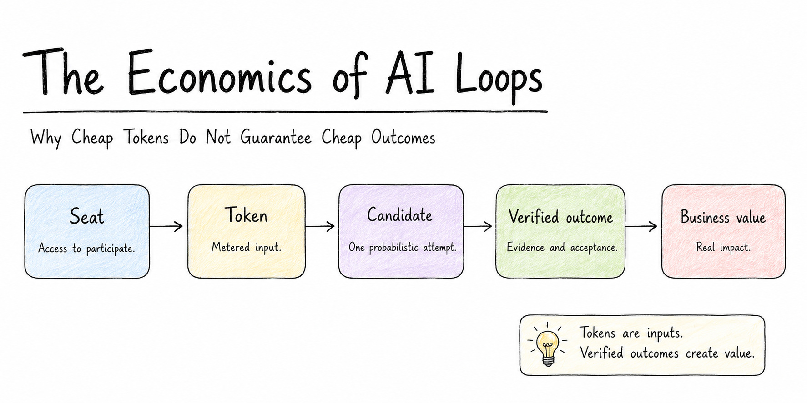

# The Economics of AI Loops

## Why Cheap Tokens Do Not Guarantee Cheap Outcomes

**Enrico Papalini**  
*Version 2.0 — data snapshot: 24 July 2026*

## Abstract

The first generation of AI economics treated generative AI as a software feature: buy a seat, measure token consumption, and compare model prices. That framing becomes incomplete when an assistant turns into a loop that reads a specification, invokes tools, modifies a system, runs checks, interprets failure, retries, and escalates. The organization is no longer buying text generation. It is operating a probabilistic production process.

This article proposes a new unit of account: the independently verified outcome. It connects context growth, model and infrastructure costs, tools, verification, human review, rework, failure exposure, retry policy, local-versus-cloud routing, and organizational bottlenecks. A reproducible regulated-maintenance case shows why a cheap attempt can be expensive, why a frontier model can be cheaper than a weak one after review, and why the strongest design is often a cascade that starts locally or inexpensively and escalates only when evidence justifies it. The central result is simple: tokens are an input; verified flow is the product.

> **Thesis.** The next economic unit of generative AI is not the seat, request, or token. It is the verified, deployable, economically useful outcome. Falling model prices expand feasible demand, but they do not guarantee falling outcome cost because loops also consume context, tools, environments, verification, human attention, integration capacity, and risk budget.

## The first AI economy was built around the wrong unit

The first version of this analysis focused on a real transition: AI products were moving from flat subscriptions toward metered consumption, while agentic software workflows were creating much larger and more variable token bills than autocomplete or short chat sessions [1](#reference-1). That transition is now visible in commercial product design. GitHub moved Copilot to usage-based AI Credits in June 2026, while preserving a base seat price and included allowance. GitHub explicitly noted that a quick question and a multi-hour autonomous coding session could previously cost the user the same, leaving the platform to absorb the difference [2](#reference-2), [3](#reference-3).

That development validates the token-economics argument, but it also reveals its limit. Metering tokens makes consumption visible; it does not tell the buyer whether the consumption created value. A model may produce a low-cost candidate that fails tests, requires extensive review, destabilizes a release, or never reaches production. Conversely, a relatively expensive run may be highly profitable when it resolves a valuable problem with strong evidence and little rework.

The unit of account therefore has to move again.

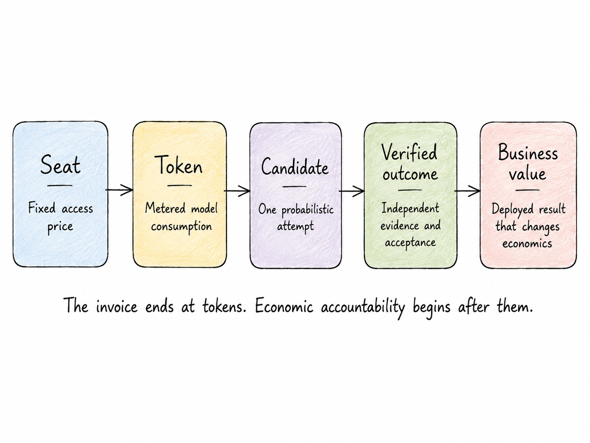

*Figure 1. The economic unit evolves from access, to consumption, to a complete production outcome.*

The economic chain in Figure 1 contains five distinct objects:

- **Seat:** The right to use a product during a billing period.

- **Token:** A metered unit of model input, cache activity, or output.

- **Candidate:** One stochastic attempt to produce a result.

- **Verified outcome:** A candidate that passes an independent evidence and authority boundary.

- **Business value:** The effect after integration, deployment, operation, and customer or organizational use.

A token belongs to the vendor invoice. A verified outcome belongs to the production system. Business value belongs to the enterprise. Confusing these layers creates predictable errors: maximizing usage, celebrating generated output, comparing models by price alone, or declaring return on investment before the output has survived verification and deployment.

## Why loops create a different cost structure

A conventional software feature has largely fixed development cost and near-zero marginal execution cost. A model API reverses part of that structure: each execution consumes variable resources. A loop adds another change. The execution path is not predetermined. It can branch, call tools, read more context, fail, retry, compact its history, switch model, or ask a human.

Recent empirical work on coding agents makes this variance concrete. Bai and colleagues studied eight frontier models on agentic coding tasks and found that agentic work consumed roughly three orders of magnitude more tokens than simpler coding paradigms, that repeated runs of the same task could differ by up to 30 times in token use, and that greater consumption did not monotonically improve accuracy [4](#reference-4). Models also predicted their own future token consumption poorly. A budget based on the agent’s estimate is therefore not a control system.

At the same time, the cost of reaching a given capability level has fallen dramatically. Stanford’s 2025 AI Index reported a more than 280-fold reduction in the inference price of systems performing around the GPT-3.5 level between late 2022 and late 2024 [5](#reference-5). This is the setting for a Jevons-style rebound: cheaper units make more use cases economical, total use expands, and aggregate expenditure can rise even while unit prices fall [6](#reference-6).

The correct economic question is not whether tokens are becoming cheaper. It is whether the complete system is becoming better at converting stochastic compute into accepted value.

### Context architecture is an economic control

Suppose a loop performs $N$ model turns. Let $S$ be the static prompt and tool-definition context, $T$ the average new history added per turn, and $\bar{o}$ the average output per turn. If the full history is retransmitted every time, cumulative input and output are approximately

*Equation 1. Context accumulation under full-history replay.*

For input and output prices $p_i$ and $p_o$, model cost is

*Equation 2. Model cost.*

The quadratic term is not a law of agents. It is a consequence of one context architecture. A compacted loop that retains $R_c$ tokens per turn has approximately

*Equation 3. Compacted-context input.*

while a fresh-context loop that reconstructs state from a concise external record $R_e$ has

*Equation 4. Fresh-context input.*

For the article’s 40-turn workload—18,000 static tokens, 3,000 new history tokens per turn, and 900 output tokens per turn—full replay processes 3.06 million input tokens. Compaction processes 960,000; fresh context with external state processes 800,000. At the current promotional Claude Sonnet 5 price, the corresponding model costs are \$6.48, \$2.28, and \$1.96.

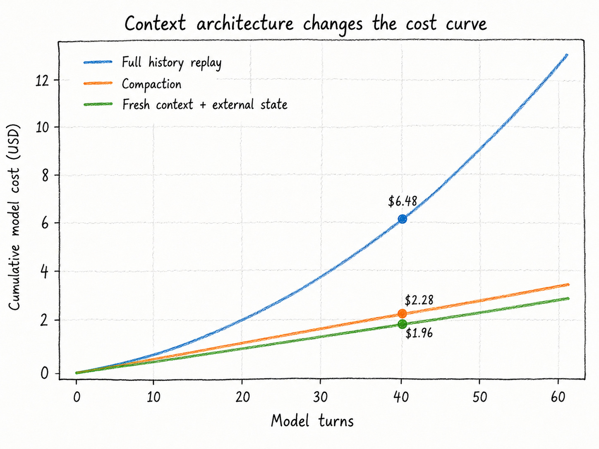

*Figure 2. Full replay creates a quadratic component; compaction and fresh state keep the workload approximately linear. Prices are a dated example, not a permanent forecast.*

This calculation changes the role of memory design. External state, stable prompt prefixes, cacheable instructions, retrieval, compaction, and checkpoints are not prompt-engineering decoration. They are production controls. Yet the cheapest context policy is not automatically the best one: removing evidence can reduce the model invoice while lowering acceptance and raising rework. Every context optimization must therefore be evaluated against outcome quality.

## The complete cost of a candidate

A model response is not an outcome. It is a candidate. The candidate ledger should include every resource consumed before the organization can rationally accept it:

*Equation 5. Complete candidate cost.*

The last term is expected loss, not the worst conceivable loss. It can include escaped-defect probability, rollback, compliance remediation, service interruption, or an irreversible external action. The value is necessarily uncertain, but omitting it does not make the risk disappear; it silently prices the risk at zero.

Table 1 gives a current price snapshot for selected cloud routes. The same fresh-context 40-turn workload costs from tens of cents to almost ten dollars in model fees, depending on the model. These are material differences at scale, but they remain small compared with even a few minutes of senior review.

, [8](#reference-8), [9](#reference-9).](assets/table_01.jpg)

*Table 1. Official API prices per million tokens, snapshotted on 24 July 2026. Sonnet 5's introductory price runs through 31 August 2026; OpenAI long-context prices can be higher. Cache-write and cache-storage fees differ by provider and are excluded from this compact table. Sources: provider pricing pages [7](#reference-7), [8](#reference-8), [9](#reference-9).*

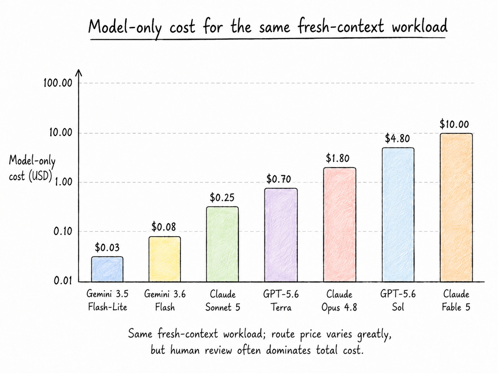

*Figure 3. Model-only cost for the same fresh-context workload. The route price varies by roughly thirtyfold, but all values remain modest relative to human review and failure exposure.*

This is where simple model-price comparisons can reverse. A stronger model may cost several dollars more in inference but save twenty minutes of review, one failed retry, or a production rollback. When the human and risk components dominate, the expensive model may produce the cheaper candidate.

Figure 4 applies a transparent scenario ledger to four routes. The acceptance probabilities, review times, and risk allowances are not benchmark claims. They are case assumptions intended to show the arithmetic that a real pilot must replace with telemetry. The important result is structural: the model or local-infrastructure component is the thinnest layer in every bar.

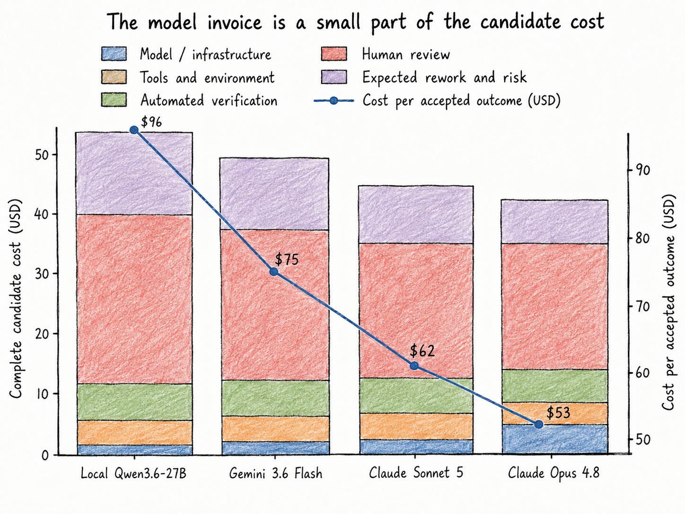

*Figure 4. Illustrative complete candidate ledgers. The line reports cost per independently accepted outcome. Production values must be estimated by task class rather than copied from this example.*

## The central metric: cost per accepted outcome

Let $P_a$ be the probability that a candidate from a defined route is independently accepted. A route includes the model, executor, context policy, tools, verifier, risk tier, and reviewer policy. The basic planning metric is

*Equation 6. Cost per accepted outcome.*

This ratio is a planning heuristic, not a universal identity. It is valid only for a sufficiently homogeneous task cohort and a candidate ledger that accounts consistently for the work generated by unsuccessful candidates. When failures have different costs, retries are resumable, or review occurs only after a gate passes, the attempt-level policy model below is preferable.

For an observed homogeneous cohort, the more robust estimator is even simpler:

*Equation 7. Observed cohort estimator.*

The estimator should be reported with sample size, median, mean, p90, acceptance rate, escaped defects, and reviewer time. It should be segmented by task class, repository, executor, model, verifier, and risk tier. A company-wide average can hide a route that is excellent for bounded migrations and dangerous for security-sensitive architectural work.

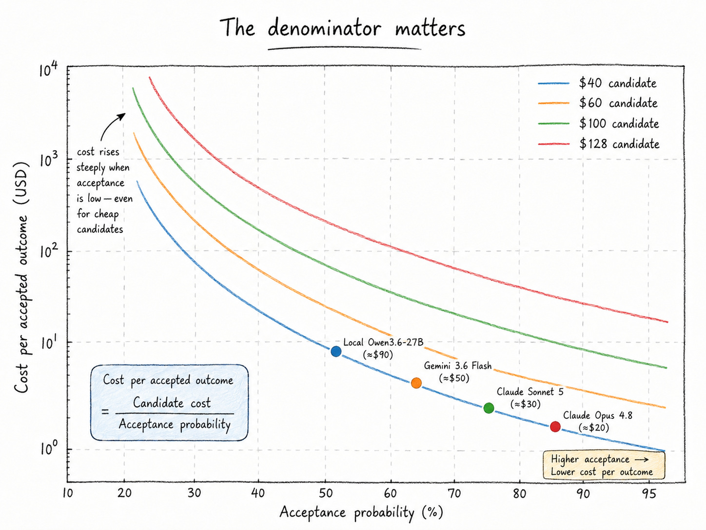

*Figure 5. The denominator matters. At low acceptance, even an inexpensive candidate becomes an expensive production route.*

### Why public benchmarks are priors, not acceptance rates

The first version of this article divided projected monthly bills by public SWE-bench scores. That was a useful intuition but an invalid production identity. A public score measures a model together with a scaffold, task set, prompt, tool environment, and evaluation protocol. It does not measure the organization’s repository, local quantization, test quality, security policy, or definition of acceptance.

The benchmark problem became more explicit in 2026. OpenAI argued that SWE-bench Verified had become contaminated and contained test problems that rejected functionally correct solutions, recommending newer evaluations such as SWE-bench Pro [10](#reference-10). This does not make benchmarks useless. It makes their role clearer: they are capability priors and screening instruments. After a pilot, production telemetry must replace them.

Equation 6 also has limits. Attempts may be correlated, tasks heterogeneous, and failures resumable. A route that fails because of an infrastructure timeout is different from one that repeats the same incorrect plan. This leads to the next model.

## Retries are options, not rituals

Let attempt $k$ have automatic incremental cost $a_k$, conditional success probability $p_k$, and an additional success cost $s_k$ for final review and residual risk. Let $C_H$ be the cost of human escalation after the machine route is exhausted. The expected cost of a $K$-stage policy is

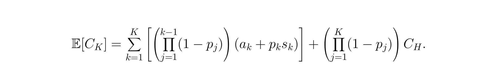

*Equation 8. Expected cost of a retry-and-escalation policy.*

This formulation separates cheap automatic rejection from expensive human review. A failed local attempt can be economical when deterministic checks reject it before a human reads it. A local-first cascade therefore does not require the local model to outperform a frontier model on every task. It needs to solve enough easy tasks cheaply and fail safely on the rest.

FrugalGPT established the broader cost-quality logic of learned model cascades: inexpensive models can handle suitable queries first, with escalation preserving quality under the right conditions [11](#reference-11). Loop Engineering extends this idea by placing executable evidence, state recovery, and risk policy between stages.

The regulated-maintenance scenario uses a local attempt, a verifier-guided local retry, an Opus escalation, and then human completion. The expected cost is \$62.53 per completed outcome, compared with a human-only baseline of \$720.00. Adding a fourth blind retry increases expected cost because the retry is expensive and changes the success distribution too little.

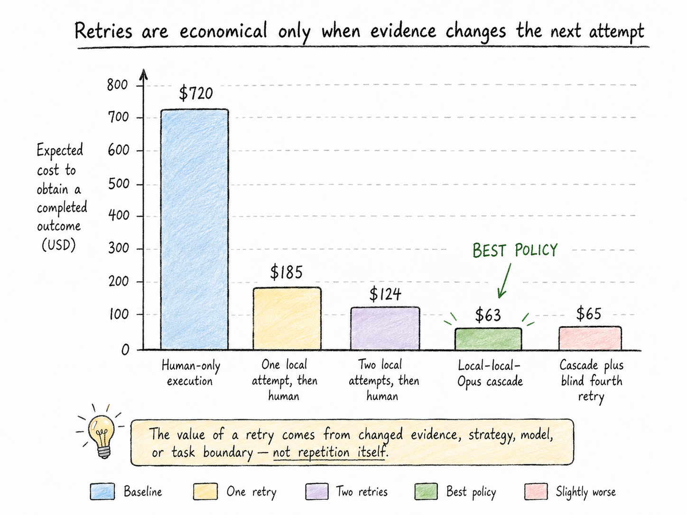

*Figure 6. The value of a retry comes from changed evidence, strategy, model, or task boundary---not from repetition itself.*

The base scenario implies a 91.3% reduction relative to the stated human baseline. That number is not a forecast for software development in general. It is the result of a narrow case with strong tests, bounded tasks, inexpensive automated rejection, and a reduced-cost human fallback after the loop has already produced diagnostics. The reproducible Monte Carlo sensitivity analysis, using beta posteriors around the illustrative pilot counts and uncertainty around costs, yields a median of \$62.96 and a 10th–90th percentile range of \$53.96–\$75.41.

> A retry policy is economically valid only if the next attempt is materially different. Repeating the same prompt, context, model, and plan after the same failure should be assigned a very low conditional success probability. Correlated failure is the enemy of the geometric-retry fantasy.

## Local, cloud, and hybrid economics

Local inference is often described as free because it has no per-token API invoice. That is incorrect. It replaces a variable provider charge with hardware amortization, electricity, maintenance, idle capacity, operational ownership, and a task-specific acceptance rate.

For a local workstation,

*Equation 9. Local fixed cost.*

For $V$ candidates per month, local infrastructure cost per accepted outcome is approximately

*Equation 10. Local infrastructure cost per accepted outcome.*

The companion telemetry for the author’s Kowalski stack recorded 4,936 power samples over about 2.95 hours, 0.0245 kWh of measured energy, a peak of 54.04 W, 421,025,723 accounted token events, and 186,646 accepted output tokens [12](#reference-12). “Accounted token events” includes replay and cache-accounted activity, so it must not be compared directly with unique API-billed tokens. The implied run-average power is about 8.3 W because the workload alternated bursts and idle periods. In this measurement, electricity is economically tiny; amortization and human work matter far more.

With a \$2,500 workstation amortized over 36 months, \$15 monthly maintenance, the measured energy profile, and the case acceptance assumptions, local model/infrastructure cost becomes cheaper than the cloud model fee at approximately 68 tasks per month versus Gemini 3.6 Flash, 56 versus Sonnet 5, and 25 versus Opus 4.8. These are infrastructure-only break-even points. They do not prove that the complete local route is cheaper after review and rework.

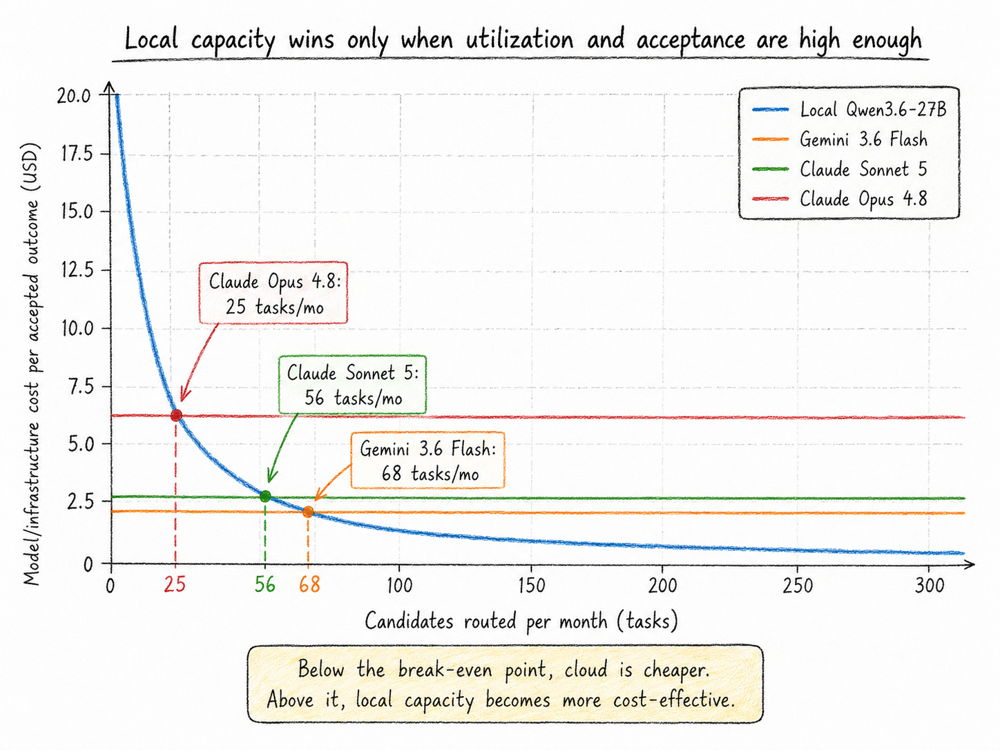

*Figure 7. Local capacity has a utilization threshold. The figure adjusts model or infrastructure cost by scenario acceptance but excludes human review, which must be added for a complete decision.*

The strongest architecture is often hybrid:

1.  route routine, privacy-sensitive, and strongly verifiable work to a local or efficient model;

2.  use protected deterministic checks to reject failures cheaply;

3.  escalate on evidence to a stronger cloud model;

4.  escalate to a human when the task becomes ambiguous, high-risk, or uneconomic.

This architecture treats routing as both a capability control and a financial control. It also avoids two opposite mistakes: using the weakest model everywhere in the name of thrift, and using the strongest model for formatting, retrieval, and deterministic transformations.

## The organizational bottleneck moves downstream

Individual task economics do not automatically become enterprise throughput. Software delivery is a flow system. Let $C_s$, $C_g$, $C_v$, $C_i$, $C_r$, and $C_o$ be sustainable monthly capacity in specification, generation, verification, integration, release, and operational absorption, all measured in comparable accepted-change units. A first approximation is

*Equation 11. Organizational bottleneck capacity.*

Loop Engineering directly expands generation capacity. If verification remains fixed, generated work becomes work in progress rather than value. DORA’s 2024 research found that greater AI adoption was associated with lower delivery throughput and stability in the observed sample, with larger generated batches offered as a mechanism [13](#reference-13). DORA’s 2025 conclusion was broader: AI acts as an amplifier of the surrounding socio-technical system, magnifying both strengths and weaknesses [14](#reference-14).

In the case model, monthly capacities before investment are 85 for specification, 110 for generation, 52 for verification, 70 for integration, 64 for release, and 75 for operations. The system therefore produces at most 52 accepted changes per month. Raising verification to 82 does not produce 82 outcomes; it moves the constraint to release and increases sustainable throughput to 64.

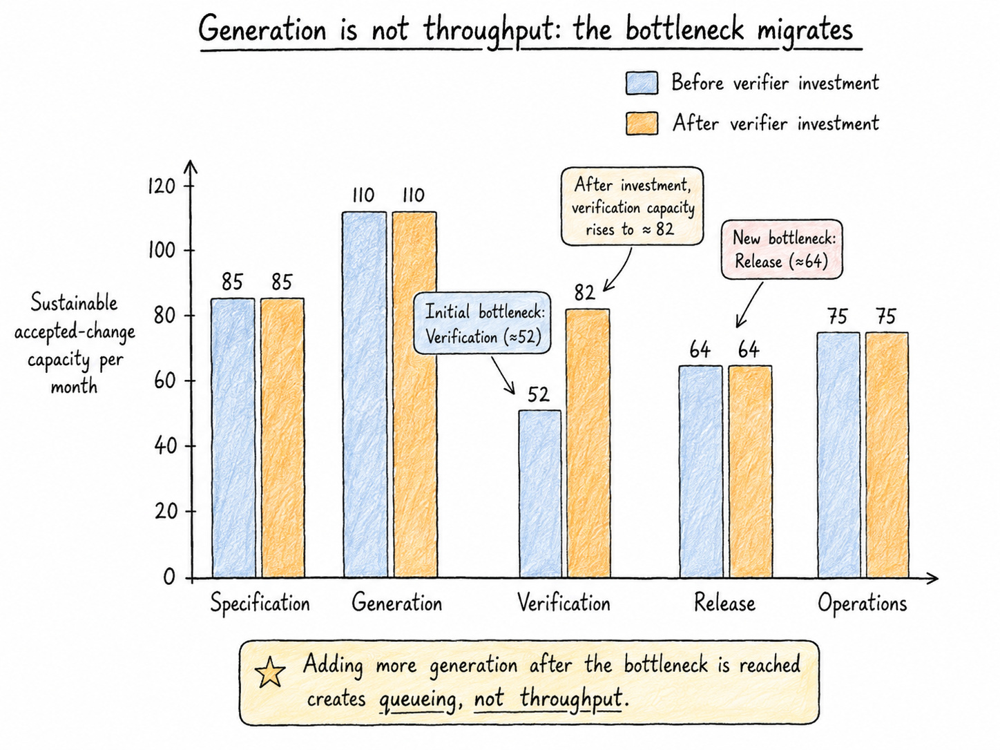

*Figure 8. The correct investment is in the constraint. More generation after verification reaches capacity creates a queue, not throughput.*

Near-full utilization also creates nonlinear queueing delay, so the practical target is not to make every stage exactly equal. The constrained stage needs headroom for variability, urgent work, and failed candidates.

### Verification as productive capital

Verification is often classified as overhead because it adds cost to an attempt. That view ignores avoided rework and failure. Let $\Delta C_w$ be measured rework reduction, $\Delta C_f$ the reduction in expected failure cost, and $C_v$ the complete verifier cost. Define

*Equation 12. Verification leverage.*

In the scenario, a \$20,000 quarterly verifier investment avoids \$28,000 of rework and \$52,000 of expected failure cost, producing direct leverage of 4.0$\times$. The calculation excludes additional auditability, trust, and learning benefits, but it must include verifier maintenance, false positives, latency, and defects that still escape.

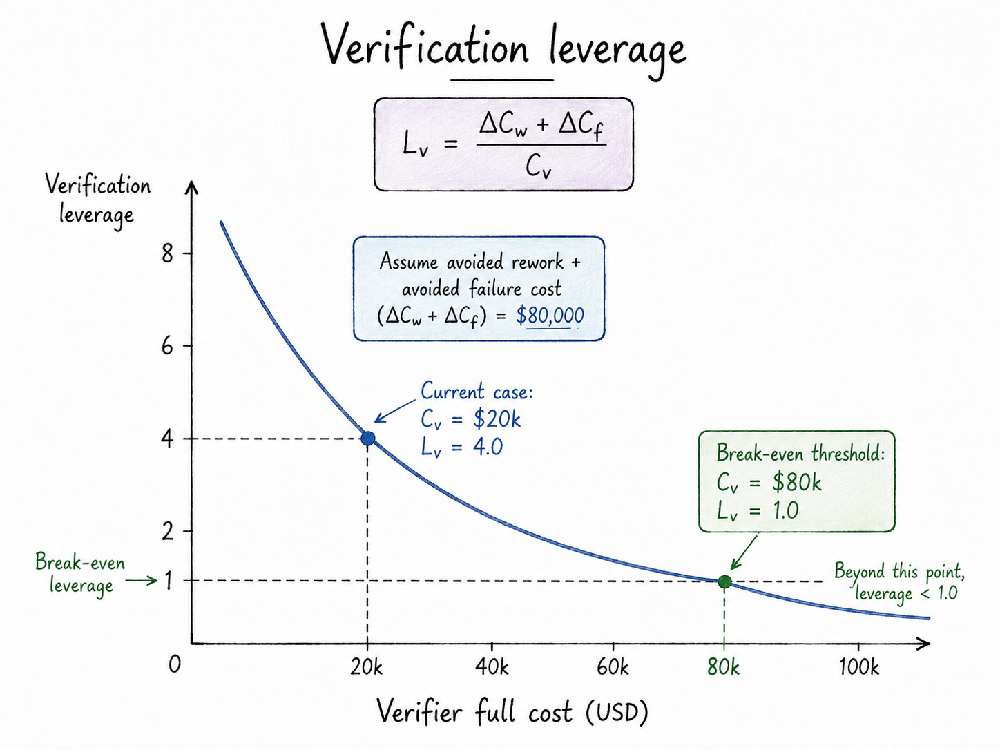

*Figure 9. A verifier is economically accretive when the loss it prevents exceeds its full cost.*

As generation becomes abundant, independent verification becomes scarce productive capital. Tests, static analysis, policy engines, simulations, differential checks, protected evaluation datasets, and independent model review all increase the organization’s ability to use cheaper or more autonomous generators safely.

## Individual productivity is a distribution, not a multiplier

The economics of an individual contributor cannot be represented by one universal percentage. Evidence varies strongly with task, experience, codebase familiarity, and verification burden.

A large customer-support study found an average productivity improvement of about 15%, with greater gains among less-experienced workers and evidence of knowledge transfer [15](#reference-15). Three field experiments involving nearly 4,900 software developers found a 26.08% increase in completed tasks, again with larger gains among less-experienced developers [16](#reference-16). The BCG “jagged technological frontier” study found substantial gains on tasks inside the model’s practical frontier but worse correctness outside it [17](#reference-17).

The opposite result is possible. METR’s early-2025 randomized study found that experienced open-source developers working in familiar repositories took 19% longer with the available AI tools, despite believing that they were faster [18](#reference-18). METR subsequently reported newer, more uncertain evidence suggesting that the frontier was changing, reinforcing the need to timestamp productivity claims rather than turn one study into a permanent law [19](#reference-19).

The correct contributor scorecard should therefore keep several dimensions separate:

- end-to-end time to independent acceptance, including prompting, waiting, review, correction, and integration;

- defects, maintainability, and evidence strength;

- learning and transfer of repository knowledge;

- review burden, interruptions, and cognitive switching;

- autonomy, compensation, career capital, and sustainable workload.

Do not add money, autonomy, learning, burnout, and career mobility into one pseudo-precise function. Report organizational economics and contributor economics in parallel. An adoption can improve margin while degrading the worker outcome; resistance may then be economically rational rather than a failure of culture.

A related risk is apprenticeship. Stanford’s 2026 AI Index reports a sharp decline in employment among the youngest US software developers while employment among older developers grew, but it does not establish that AI alone caused the change [20](#reference-20). The strategic concern is still real: if the loop absorbs the bounded tasks through which novices learn, an organization may reduce today’s labor cost by liquidating tomorrow’s senior capability.

## The regulated-maintenance case

The quantitative case is a bounded dependency-upgrade and compatibility-repair loop in a regulated financial platform. The task class has strong automated tests, protected verification, a human owner for final merge, and a human fallback. The case is deliberately narrow because economic models become misleading when heterogeneous work is averaged together.

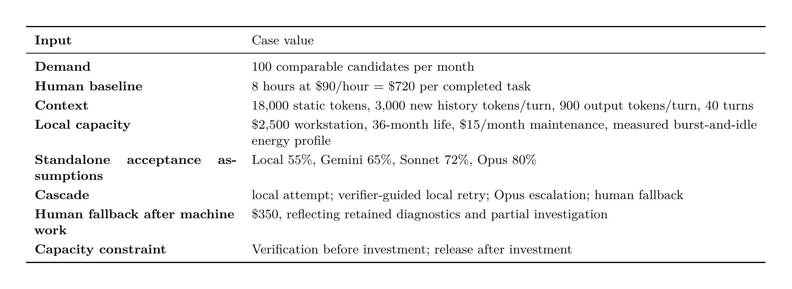

*Table 2. Transparent scenario assumptions. Current provider prices and local measurements are sourced observations; acceptance, review, and risk values are case assumptions to be replaced by pilot telemetry.*

The model produces six operational decisions.

##### 1. Reject unbounded replay.

The full-history route costs more than three times the fresh-state route at 40 turns and diverges further as the horizon grows. Fresh contexts with external state are selected unless measured acceptance deteriorates; compaction is retained as a fallback.

##### 2. Measure the complete candidate.

In the standalone route assumptions, complete costs per accepted outcome are \$96.08 for local Qwen, \$74.88 for Gemini 3.6 Flash, \$61.75 for Sonnet 5, and \$53.38 for Opus 4.8. The example intentionally shows that the frontier model can be the cheapest standalone route after review and risk are included.

##### 3. Prefer the cascade over the frontier default.

Opus is the best standalone route in the case, but Opus-first is not the best policy. Automatic gates allow local attempts to solve easy tasks or fail cheaply. The local-local-Opus cascade lowers expected completion cost to \$62.53.

##### 4. Stop before a blind retry.

The fourth attempt repeats expensive work with low conditional success. It raises rather than lowers expected cost. The loop stops and preserves evidence for the human.

##### 5. Invest in verification, then release.

Verification investment raises the system constraint from 52 to 64 outcomes per month. Release becomes the next constraint, so the next dollar should not buy more generation.

##### 6. Keep the case falsifiable.

The route should be paused if acceptance falls, human review becomes the constraint, escaped defects exceed the risk allowance, or maker and verifier share a specification blind spot. The stop condition is part of the economic model, not merely a safety appendix.

## A closed economic control loop

A mature organization does not optimize one model call. It operates a learning system that connects task selection, routing, evidence, production outcomes, and portfolio allocation.

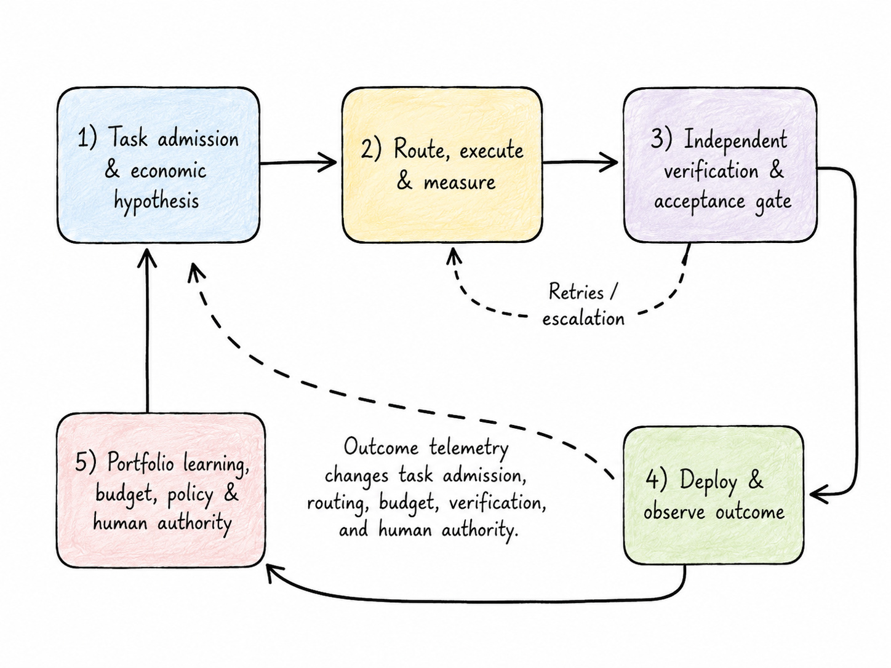

*Figure 10. The economic control loop. Outcome telemetry changes task admission, routing, budget, verification, and human authority.*

The operating record for each task should link:

- task class, value hypothesis, risk tier, and evidence contract;

- model, executor, context policy, cache behavior, tools, and environment;

- every attempt, failure category, checkpoint, and escalation;

- automated gate results, reviewer time, final deployment, and escaped defects;

- complete cost and observed business effect.

This is AI FinOps only in part. Traditional FinOps seeks visibility, allocation, and efficient consumption. Loop economics adds stochastic acceptance, evidence quality, workflow capacity, and human authority. A dashboard that reports tokens without outcomes can create blame but cannot create learning.

## Management principles for AI Loop Economics

The analysis can be reduced to ten operating rules.

1.  **Price the verified outcome, not the token.**

2.  **Measure end-to-end accepted completion, not local generation speed.**

3.  **Treat context architecture as a production control.**

4.  **Use benchmarks as priors and production cohorts as evidence.**

5.  **Use the cheapest route that can reliably pass the required verifier.**

6.  **Retry only when evidence changes the probability distribution.**

7.  **Invest in the bottleneck that follows generation.**

8.  **Measure verification as productive capital.**

9.  **Keep organizational value and contributor sustainability as parallel scorecards.**

10. **Publish assumptions, source dates, code, and stop conditions.**

## Conclusion: tokens are an input; verified flow is the product

The token remains an important unit. It determines part of the invoice, explains context-related cost, and enables useful controls such as caching, compaction, batching, and routing. But it is no longer a sufficient economic object.

An AI loop is a probabilistic worker embedded in a socio-technical production system. It consumes model inference, tools, test infrastructure, human attention, organizational capacity, and risk. Its outputs become economically meaningful only after evidence, authorization, integration, deployment, and use. This is why cheap generation can coexist with expensive delivery, why local productivity can coexist with slower enterprise flow, and why a stronger model can be cheaper after review.

The durable competitive advantage is not unlimited access to intelligence. Model access will continue to commoditize and prices will continue to move. The durable asset is an operating system that can decompose intent, preserve state, route work, verify independently, stop bad trajectories, learn from outcomes, and allocate the resulting surplus deliberately.

> **The invoice ends at tokens. Economics begins with what the loop can prove.**

## Appendix: Reproducibility and interpretation

The companion package contains:

- `data/model_prices_2026-07-24.csv`: official price snapshot with source URLs and notes;

- `data/local_runtime_telemetry_summary.csv`: author-supplied local measurement summary used by the model;

- `data/assumptions.json`: all case, local-runtime, capacity, and uncertainty assumptions;

- `src/ai_economics_model.py`: formulas, simulations, tables, and figure generation;

- `output/*.csv` and `output/results_summary.json`: calculated results;

- `figures/*.png` and `figures/*.pdf`: publication graphics;

- `src/generated_values.tex`: calculated LaTeX macros used by the article;

- this LaTeX source and compiled PDF.

Three evidence classes are intentionally kept separate:

- **Sourced observations:** Provider list prices, research findings, GitHub billing changes, and local telemetry supplied by the author.

- **Scenario assumptions:** Acceptance rates, reviewer time, risk allowances, stage costs, and capacity changes in the regulated-maintenance case.

- **Calculated results:** Context costs, candidate and accepted costs, policy expectations, break-even points, bottleneck output, verifier leverage, and uncertainty ranges.

The scenario is designed to be replaced, not believed. A production team should preserve the model structure while substituting its own task cohorts, complete costs, gate outcomes, review minutes, defect history, and operational capacity.

## References

1. E. Papalini (2026). *The Economics of Generative AI: From Subsidy Crisis to Agentic Workflow Sustainability*. [Source](https://github.com/popoloni/articles/blob/main/Medium/20260525_TheEconomicsofGenerativeAIFromSubsidyCrisistoAgenticWorkflowSustainability/medium.md)

2. GitHub (2026). *GitHub Copilot is moving to usage-based billing*. [Source](https://github.blog/news-insights/company-news/github-copilot-is-moving-to-usage-based-billing/)

3. GitHub Docs (2026). *Usage-based billing for organizations and enterprises*. [Source](https://docs.github.com/copilot/concepts/billing/usage-based-billing-for-organizations-and-enterprises)

4. L. Bai, Z. Huang, X. Wang, J. Sun, R. Mihalcea, E. Brynjolfsson, A. Pentland, and J. Pei (2026). *How Do AI Agents Spend Your Money? Analyzing and Predicting Token Consumption in Agentic Coding Tasks*. [Source](https://arxiv.org/abs/2604.22750)

5. Stanford Institute for Human-Centered AI (2025). *The 2025 AI Index Report*. [Source](https://hai.stanford.edu/ai-index/2025-ai-index-report)

6. W. S. Jevons (1866). *The Coal Question*, second edition. Macmillan.

7. Anthropic (2026). *Claude Platform Pricing*. [Source](https://platform.claude.com/docs/en/about-claude/pricing)

8. OpenAI (2026). *API Pricing*. [Source](https://developers.openai.com/api/docs/pricing)

9. Google (2026). *Gemini Developer API Pricing*. [Source](https://ai.google.dev/gemini-api/docs/pricing)

10. OpenAI (2026). *Why SWE-bench Verified no longer measures frontier coding capabilities*. [Source](https://openai.com/index/why-we-no-longer-evaluate-swe-bench-verified/)

11. L. Chen, M. Zaharia, and J. Zou (2023). *FrugalGPT: How to Use Large Language Models While Reducing Cost and Improving Performance*. [Source](https://arxiv.org/abs/2305.05176)

12. E. Papalini (2026). *Kowalski local-loop power and token telemetry*. Author-supplied measurement notes reproduced in the companion dataset to this article.

13. DORA / Google Cloud (2024). *Impact of Generative AI in Software Development*. [Source](https://dora.dev/ai/gen-ai-report/)

14. DORA / Google Cloud (2025). *State of AI-assisted Software Development*. [Source](https://dora.dev/dora-report-2025/)

15. E. Brynjolfsson, D. Li, and L. Raymond (2025). *Generative AI at Work*. Quarterly Journal of Economics, 140(2), 889–942. [Source](https://academic.oup.com/qje/article/140/2/889/7990658)

16. K. Z. Cui, M. Demirer, S. Jaffe, L. Musolff, S. Peng, and T. Salz (2025). *The Effects of Generative AI on High-Skilled Work: Evidence from Three Field Experiments with Software Developers*. [Source](https://www.microsoft.com/en-us/research/publication/the-effects-of-generative-ai-on-high-skilled-work-evidence-from-three-field-experiments-with-software-developers/)

17. F. Dell'Acqua et al. (2023). *Navigating the Jagged Technological Frontier: Field Experimental Evidence of the Effects of AI on Knowledge Worker Productivity and Quality*. [Source](https://www.hbs.edu/faculty/Pages/item.aspx?num=64700)

18. METR (2025). *Measuring the Impact of Early-2025 AI on Experienced Open-Source Developer Productivity*. [Source](https://metr.org/blog/2025-07-10-early-2025-ai-experienced-os-dev-study/)

19. METR (2026). *We are Changing our Developer Productivity Experiment Design*. [Source](https://metr.org/blog/2026-02-24-uplift-update/)

20. Stanford Institute for Human-Centered AI (2026). *The 2026 AI Index Report: Economy*. [Source](https://hai.stanford.edu/ai-index/2026-ai-index-report/economy)
