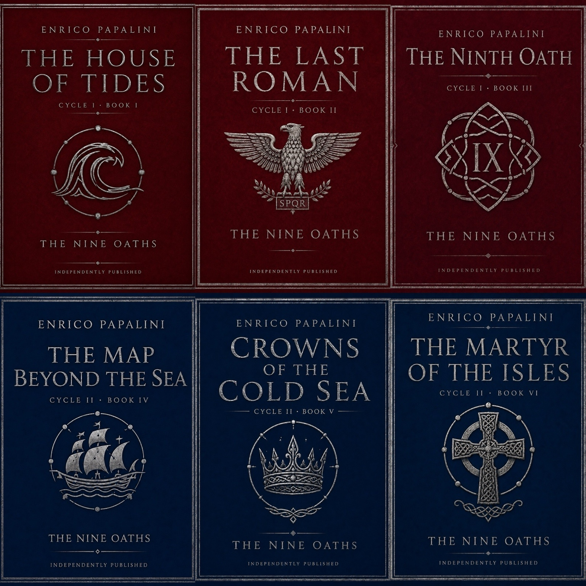
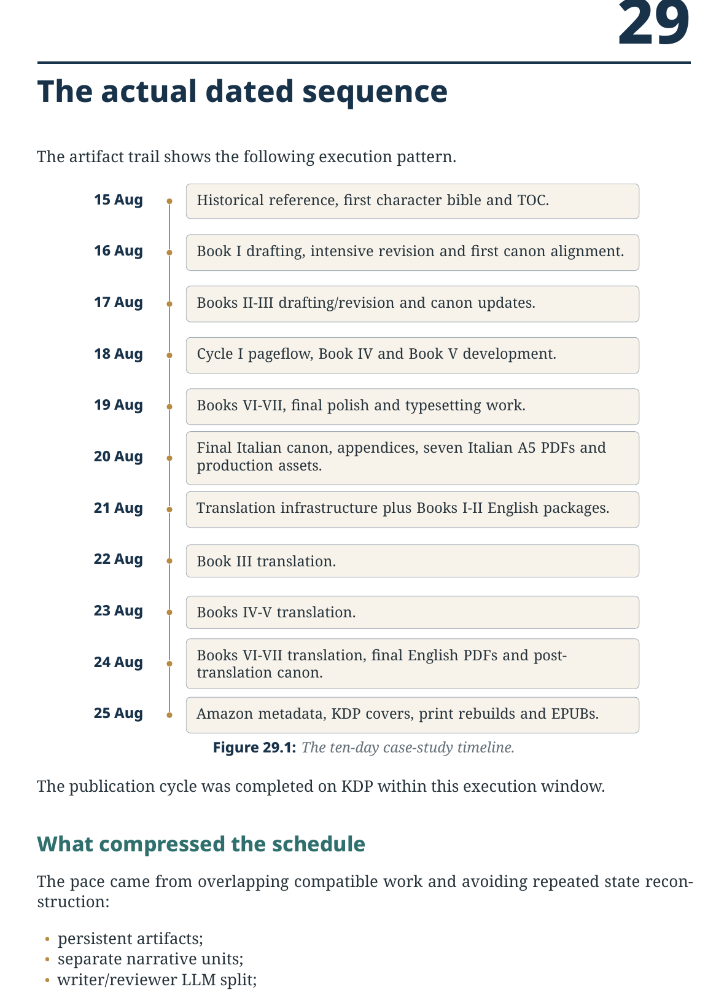
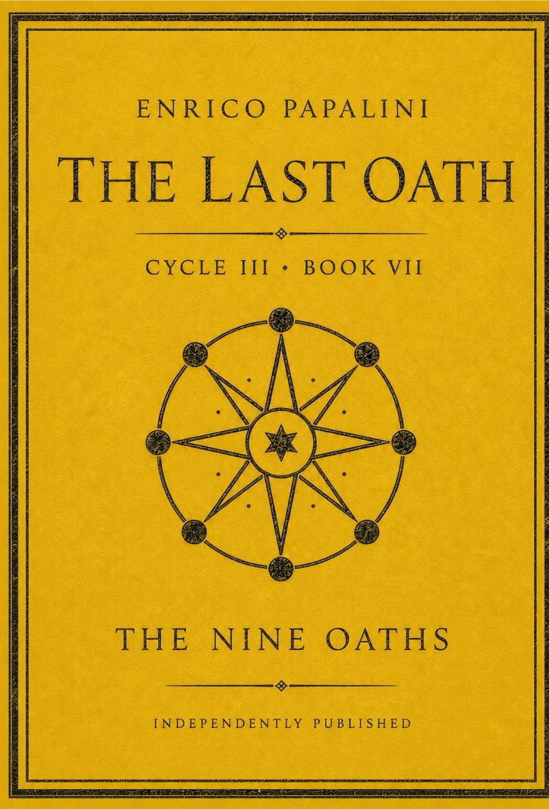

# My Summer Assignment: Use AI Beyond Software Development

## I spend most of my time exploring how AI changes software engineering. This summer I gave myself a different assignment: use the same discipline to design, write, translate, validate, and publish a seven-book historical fantasy saga.

For the last two years, most of my serious experiments with generative AI have begun in a software repository.

There is usually a specification, a codebase, a set of tests, a build pipeline, and some form of external evidence. The model proposes a change. The surrounding engineering system decides whether that change deserves to survive.

This summer I wanted to remove the familiar environment.

I gave myself a simple assignment:

> **Use AI to build something complete in a domain far from software development, then carry it all the way to publication.**

The chosen domain was historical fiction.

The result was *The Nine Oaths*, a seven-book saga inspired by the world of the *Orkneyinga Saga*. The complete path covered series architecture, character development, seven Italian novels, English translation, editorial review, continuity repair, typesetting, covers, metadata, EPUBs, and KDP publication.

The elapsed time was ten days.

That number attracts attention. The process behind it is more useful.



*Cycle I and Cycle II of* The Nine Oaths. *The visual identity also became part of the publication workflow: final interiors, page counts, KDP covers, and metadata all had to converge.*

## Why leave software development?

Software engineering gives AI a generous environment.

A compiler can reject invalid syntax. Tests can reveal regressions. Static analysis can identify defects. A version-control system records the change. A deployment pipeline creates explicit gates.

Fiction offers weaker signals.

A chapter can be grammatically correct and still damage the novel. A character can speak convincingly while revealing information they have never received. An object can move from one room to another without an action. Two versions of the same scene can survive because each reads well in isolation. A final volume can answer the plot and betray the theme.

The absence of executable tests made the experiment interesting.

I wanted to understand whether the engineering principles I use around AI could survive in a domain where quality depends on continuity, voice, structure, memory, interpretation, and editorial judgment.

The answer was yes, provided that those principles were translated into the new domain.

## The assignment

I imposed a complete outcome rather than an open-ended creative exercise.

The project had to produce:

- a coherent seven-book architecture;
- a character and relationship bible;
- a historical frame;
- a finished source-language saga;
- an English edition;
- chapter-level review evidence;
- corrected source masters;
- reader PDFs;
- KDP print interiors;
- covers based on final page counts;
- metadata;
- EPUBs;
- a reproducible guide explaining the workflow.

The project also needed a stopping point.

Without one, generative AI can keep producing alternatives forever. Another chapter can always be expanded. Another character can always be deepened. Another version can always sound slightly better.

Publication became the terminal condition.

## The historical matrix

The original reference was Joseph Anderson’s 1873 edition of *The Orkneyinga Saga*, translated by Jón A. Hjaltalin and Gilbert Goudie.

It supplied more than names and locations.

It provided Orkney and Caithness, the earldom, assemblies, kinship, reputation, martyrdom, ecclesiastical memory, political succession, and the relationship between deeds and the stories later told about them.

It also provided a deeper theme.

The medieval saga reaches us through manuscripts, excerpts, incorporation into other works, later compilations, historical interpretation, and editorial reconstruction. A topographical detail may be strong while a date remains uncertain. A genealogy may preserve memory and serve a political claim at the same time.

That textual history became part of the fictional architecture.

The novels gradually move from a child asking what happened to adults asking who should control the records from which other people make decisions.

The historical source became a matrix, while the fictional canon determined what happened inside the novels.

Leif remained a fictional character with structural echoes of Magnus. Sigurd remained distinct from Hákon. The House of Tides, the Custodians, the Nine Marks, and the Echoes belonged to the invented world.

This separation protected both history and fiction.

## The real architecture of the work

The decisive capability came from the workbench around the model.

GPT-5.6 Sol acted as the principal reasoning and orchestration layer. ChatGPT Library held the evolving artifacts. Retrieval brought the relevant files back into context. The development environment ran deterministic scripts. A different LLM reviewed the writer model’s output. I decided which changes became canonical.

The division of responsibility was clear:

```text
The model reasons.
The tools execute.
The Library preserves state.
The author decides.
```

This changed the nature of the project.

The saga did not live inside one long conversation. It lived in files:

- canonical TOCs;
- character bibles;
- separate chapter units;
- concatenated masters;
- revision reports;
- translation source locks;
- decision logs;
- correction registers;
- QA reports;
- scripts;
- manifests;
- PDFs;
- cover assets;
- EPUBs.

A new session could recover the current state by retrieving the relevant artifacts.

The active context remained small enough to reason over carefully:

```text
current chapter
+ relevant canon
+ previous state
+ character voice rules
+ correction history
```

This is the same principle used in reliable AI software workflows. State belongs outside the model’s temporary context.

## One writer, one reviewer, one authority

The principal LLM acted as the writer.

A different LLM acted as the reviewer.

Both worked from the same stored evidence.

The reviewer could compare a chapter against the canonical TOC, character bible, previous chapter, current knowledge state, and requested revision objective. It did not need to trust the writer’s summary.

The author remained the final authority.

This created a simple loop:

```text
write
→ review
→ accept or reject findings
→ revise
→ validate
→ promote
```

The separation reduced self-confirmation. The writer generated a plausible scene. The reviewer tried to break it.

The reviewer looked for concrete failures:

- repeated scene variants;
- displaced chronology;
- impossible character presence;
- object-custody errors;
- knowledge appearing too early;
- weakened or strengthened certainty;
- voice drift;
- obsolete planning residue.

Creative disagreement remained possible. The canon and the author resolved it.

## Different books needed different revision passes

A seven-book series does not benefit from one universal editing ladder.

The first book went through a second draft, two clean-draft passes, prose revision, structural balance, mount cleanup, and pageflow.

The second book required a clean/balance pass and a stronger final editorial pass because alternative versions of important scenes remained in the manuscript.

Later books followed shorter paths. Some needed expansion, some needed final polish, and one needed a second pageflow pass to repair continuity and prepare the final cycle.

The pass name expressed the problem being solved.

This prevented the workflow from turning into a ritual where every book received the same treatment regardless of need.

The general rule was simple:

> **Name the defect. Run the pass that addresses it. Keep closed dimensions closed.**

## Translation became the strongest editorial audit

I expected translation to be a production phase.

It became one of the most valuable editorial phases.

Every chapter was processed individually through translation, naturalisation, voice revision, source-to-target fidelity review, and a monolingual English read.

That close comparison exposed source-language defects that had survived previous revisions.

Across Books II to VII, the correction registers contain 64 numbered confirmed Italian-source corrections. Book I had additional repairs recorded through its own decision and correction process.

The issues included:

- duplicated rescues and funerals;
- departures narrated twice;
- a sealed packet opened twice;
- a character acting while absent;
- an object moving between a bag and a pocket without an action;
- a chest described as empty while contents remained;
- a lesson analyzed before it occurred;
- certainty about Astrid appearing one chapter too early;
- shipments narrated out of order;
- two versions of the same death surviving in one chapter.

These were source defects discovered through translation.

The original source locks remained unchanged. Each confirmed problem entered a correction register. At the end of the volume, approved corrections were written into coordinated Italian units and rebuilt masters.

The sequence was:

```text
locked source
→ translation
→ source/target comparison
→ correction register
→ controlled writeback
→ corrected source edition
```

The English edition improved the Italian edition.

That may be the most surprising result of the entire assignment.

## Fiction still benefits from deterministic tools

Creative work contains many semantic judgments. Production also contains exact questions.

Scripts handled:

- chapter counts;
- concatenation order;
- duplicate-block scans;
- source reconstruction;
- SHA-256 hashes;
- bilingual heading alignment;
- ZIP contents;
- PDF page sizes;
- embedded fonts;
- hidden attachments;
- KDP preflight;
- spine widths;
- full-cover geometry.

This exposed another useful principle.

A language model can judge whether two scenes feel like variants of the same event. A script can determine whether two paragraphs are identical. A model can evaluate whether a title fits the book. A script can check whether that title matches the canon, metadata, interior, cover, and KDP listing.

Creative systems still need exactness.

## The ten-day timeline matters

One of my favourite images from the complete guide is the dated chronology, because it makes the whole experiment tangible. It turns an abstract claim about “ten days” into a visible execution trace.



*The chronology from 15 to 25 August. Once the project state was externalized, each stage could start as soon as its dependencies were stable.*

The timeline also explains why the result looks improbable at first glance. The speed did not come from asking one model to improvise seven books in a single stream. It came from overlapping compatible stages, preserving state in files, and keeping the review and production loops short.

## Publication revealed defects that reading could not

The KDP phase produced its own failures.

Several PDFs looked correct and still contained structural elements that required a rebuild, including content-credential attachments and problematic embedded font objects.

A title discrepancy also survived across production artifacts: one asset used *The Martyr of the Isles* while the canon and reader edition used *The Martyr of the Islands*.

These failures were valuable because they occurred after the writing was complete.

They showed that publication has its own definition of correctness.

A valid novel, translation, PDF, and KDP package each represent a different state. Each needs its own acceptance evidence.

## What this experiment changed for me

The assignment began as a way to use AI outside software development.

It ended by reinforcing several ideas from software engineering.

### External state is the real memory

The model’s context is temporary. Canon, decisions, corrections, and current masters need persistent storage.

### Verification must fit the domain

A compiler helps with code. Fiction needs continuity review, knowledge tracking, voice checks, and source comparison. Publishing needs PDF preflight and geometry.

### Independent review changes the quality of the loop

A writer and reviewer working from the same evidence create a stronger process than self-approval.

### Translation can serve as transformation testing

A disciplined change of representation reveals hidden inconsistencies. Software engineers already know this pattern from compilers, migrations, serialization, and cross-platform builds. Literary translation gave it a different form.

### AI generality depends on workflow design

The model can move across domains. Reliable work still depends on state, tools, review, gates, and human authority.

## The summer assignment I would give others

Choose a domain outside your professional default.

Create something complete enough to encounter the final mile.

A useful assignment has five properties:

1. **A real artifact.** Produce a book, course, research dossier, exhibition, documentary, board game, music project, or another finished work.
2. **A bounded outcome.** Define what completion means before generation begins.
3. **Persistent state.** Keep the evolving truth of the project in files.
4. **Independent review.** Give another model, another person, or both the authority to challenge the output.
5. **A release gate.** Publish, print, present, submit, or deliver the result.

The point is to test AI where your normal tools and habits provide less protection.

You learn more about a system when you remove its familiar environment.

## Why I am releasing the complete guide

I decided to make the full 72-page guide freely downloadable, without registration.

The article presents the experiment. The guide contains the operating detail:

- the full workflow;
- the role of the historical source;
- the writer and reviewer structure;
- the translation protocol;
- correction-register logic;
- deterministic checks;
- KDP production steps;
- reusable prompts;
- TikZ architecture diagrams;
- the ten-day chronology;
- adoption checklists.

A reproducibility claim deserves evidence.

The guide also works better as a free companion than as a compressed appendix inside the article. Readers who want the story can stop here. Readers who want to reproduce the method can inspect the complete process.

> **[Download the complete 72-page PDF guide](PUBLIC_PDF_URL)**

The link should point to a stable public file. I would use a direct, ungated download from a personal site, GitHub release, or public cloud folder.

## If you want to read the saga

For readers who are curious about the actual books, the saga is already live on Amazon:

> **[The Nine Oaths on Amazon.com](https://www.amazon.com/dp/B0HGGTW2LQ)**

And since every long project deserves a final image, here is the cover of Book VII, *The Last Oath*.



*Book VII closes the publication arc and makes the summer assignment feel satisfyingly concrete: the books exist, the editions exist, and the workflow now has a real published endpoint.*

## Final perspective

The seven books are the visible result.

The deeper result is a controlled creative system.

Historical research anchored the world. Canon carried the evolving truth of the fiction. Separate units made revision possible. A reviewer challenged the writer. Translation reread the source. Correction registers preserved provenance. Scripts handled exact checks. Library preserved state. KDP publication supplied the terminal condition.

The assignment changed the domain while preserving the engineering discipline.

That is the practical opportunity I see in generative AI.

We can use it to accelerate the work we already know.

We can also use it to enter a different field, build the missing controls, and learn which parts of our professional discipline were truly general.

My summer assignment produced seven novels.

The more durable outcome was a new way to think about AI-assisted work:

> **Externalize the state. Work in units. Review independently. Verify with evidence. Let the human decide what becomes final.**
