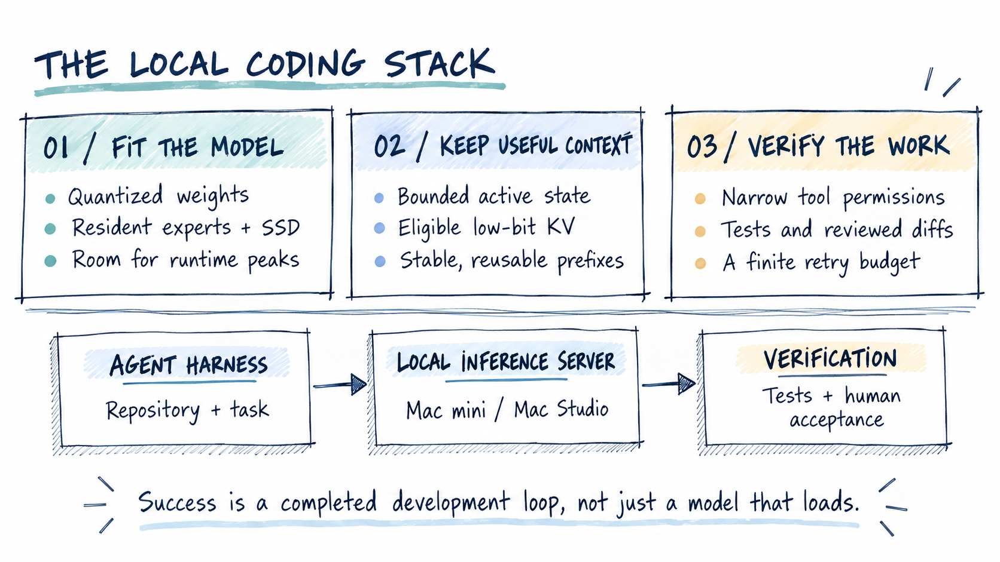
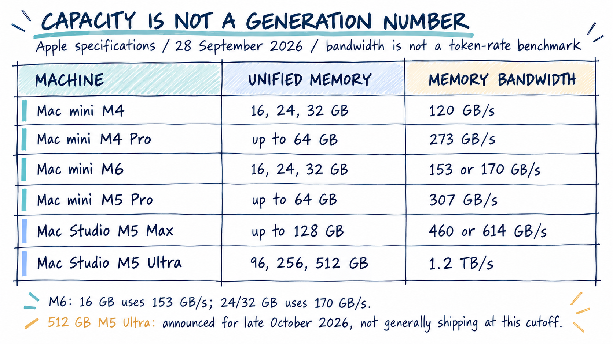
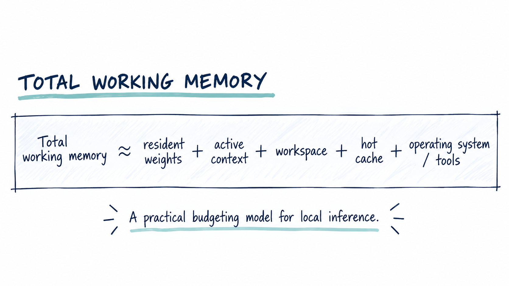
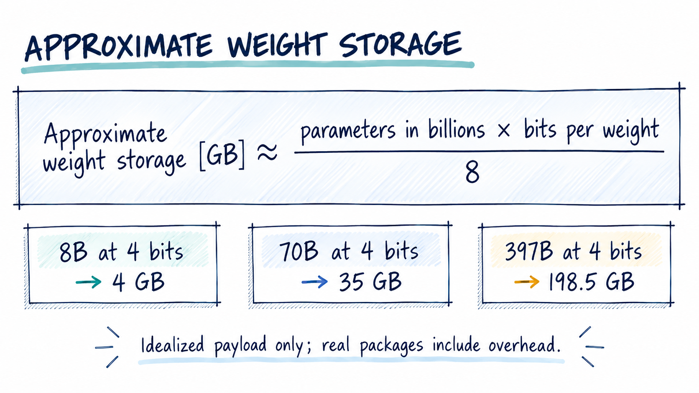
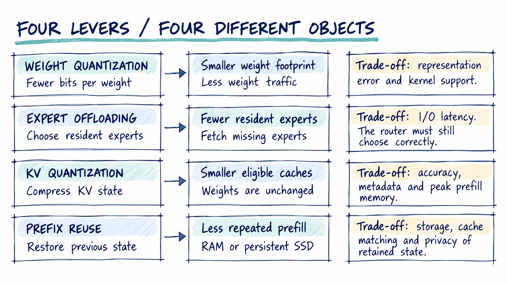
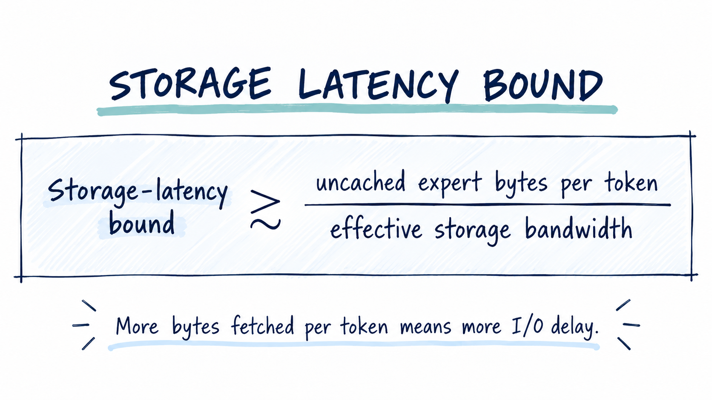
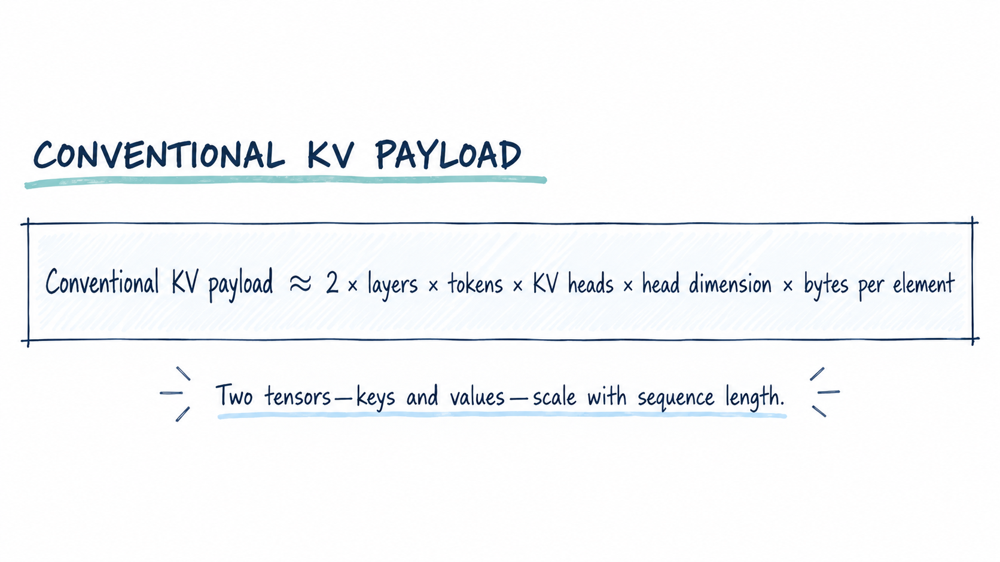
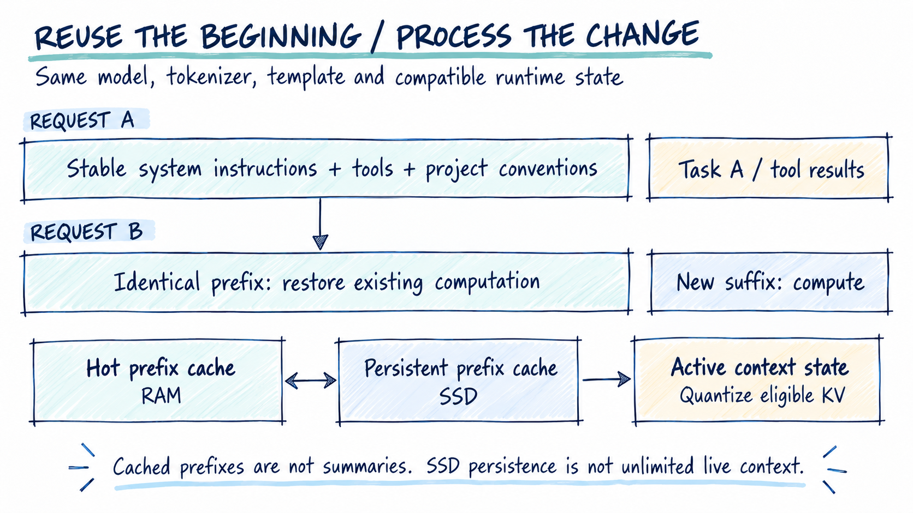
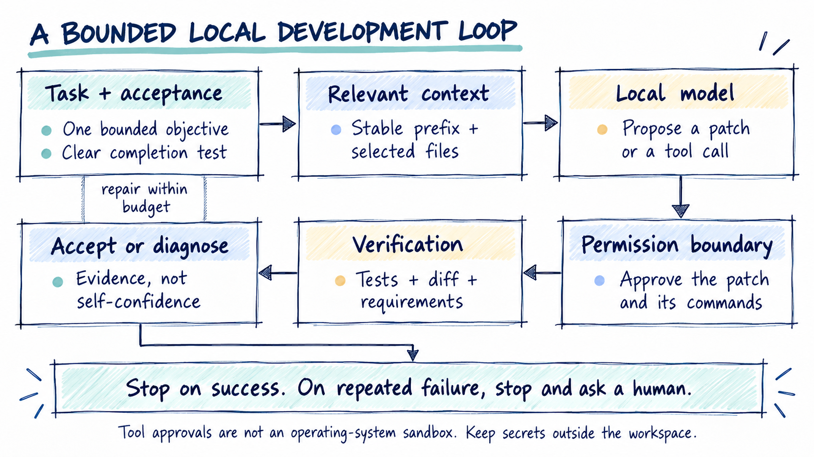
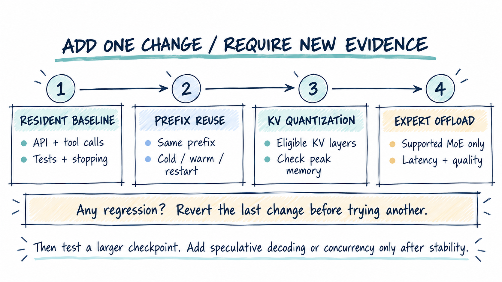

# Bigger Models, Smaller Macs

## A practical guide to local coding agents—from the M4 and M6 Mac mini to a 512 GB Mac Studio

*Enrico Papalini · 28 September 2026*

The interesting question is no longer whether a small computer can make a large language model produce a sentence. It is whether that computer can complete a useful development loop: inspect a repository, propose a change, edit a file, run a test, understand the failure, and stop when the job is done.

Those are different achievements. A model that barely loads may leave no room for the compiler. An impressive generation benchmark may hide a minute of prompt processing before every tool call. A dramatically compressed checkpoint may answer ordinary questions but become unreliable when asked to reason or emit structured arguments.

My goal here is therefore not the largest parameter count on a screenshot. It is **the largest useful model inside a reliable local coding system**. We will move from memory budgeting to quantization, expert offloading, reusable context and, finally, a working local-server-and-agent setup.

**Evidence snapshot.** Hardware specifications and implementation details were checked on 28 September 2026. The integrated-server examples target **oMLX v0.7.0rc1**, a release candidate. Published measurements below belong to their cited projects; this article does not present new Mac benchmarks. Capacity estimates and proposed settings are explicitly engineering starting points, not tested performance guarantees. [[14]](https://github.com/jundot/omlx/releases/tag/v0.7.0rc1)



## Start with the memory, not the chip name

Apple Silicon's shared CPU/GPU memory is particularly useful for local inference. MLX is designed around that unified-memory model, avoiding the assumption that every array must be copied between separate system RAM and discrete GPU memory. This does **not** make all installed memory available exclusively to an LLM: the operating system, editor, browser and development tools still need their share. [[6]](https://github.com/ml-explore/mlx)

The **M4 Mac mini** offers 16, 24 or 32 GB of unified memory and 120 GB/s of memory bandwidth. Its M4 Pro sibling reaches 64 GB and 273 GB/s. The **M6 Mac mini** also tops out at 32 GB: its 16 GB configurations have 153 GB/s bandwidth, while 24/32 GB configurations have 170 GB/s. In the current lineup, the larger-memory mini is the **M5 Pro**, not an “M6 Pro”: it reaches 64 GB and 307 GB/s. [[1]](https://support.apple.com/en-us/121555) [[2]](https://www.apple.com/mac-mini/specs/)

For this workload, a generation number is not a capacity measurement. An M6 mini with 16 GB has less room for weights and context than an older M4 Pro with 64 GB. More bandwidth may improve an eligible workload, but it cannot store a model that exceeds physical memory without some other intervention.

The **Mac Studio** changes the available capacity much more substantially. Apple's current M5 Max configurations reach 128 GB, with 460 or 614 GB/s bandwidth depending on the chip configuration. M5 Ultra configurations offer 96, 256 or 512 GB and 1.2 TB/s bandwidth. The crucial availability footnote: Apple says the **512 GB M5 Ultra configuration arrives in late October 2026**, so it is announced rather than generally shipping at this article's cutoff. The earlier M3 Ultra Studio also supported up to 512 GB. [[3]](https://www.apple.com/mac-studio/specs/) [[4]](https://www.apple.com/ie/newsroom/2026/08/apple-introduces-new-mac-studio-with-m5-max-and-m5-ultra/) [[5]](https://www.apple.com/newsroom/2025/03/apple-unveils-new-mac-studio-the-most-powerful-mac-ever/)



### A useful starting point for each size

The following are my workload-sizing recommendations, not model-fit certifications.

**A 16 GB mini:** begin with a 4–9B-class quantized model, one active request and an 8K context ceiling. Preserve enough room to run the repository's tests. A 27B ternary checkpoint can be an experiment here, but its attractive weight size is not permission to allocate a huge context.

**A 24–32 GB mini:** try a compact 27B ternary model or a roughly 30–35B MoE at ordinary low-bit precision. Prefer full residency when it leaves development headroom; use modest expert offloading when it does not. Treat 16K context as a subsequent test, not the initial default.

**A 48–64 GB Pro mini or Studio:** larger dense models become plausible, but a 70B-class model at four bits already represents about 35 GB of idealized weight payload before overhead. A smaller, faster model with more working room may still complete coding tasks sooner.

**A 96–128 GB Studio:** evaluate resident 70B/120B-class candidates or a much larger supported MoE with partial expert residency. Do not simultaneously pin every attractive model. A compiler, a long prompt and a second agent can turn a comfortable idle memory reading into a failed request.

**A 256–512 GB Ultra Studio:** first ask whether ordinary four-bit weights can stay resident. For example, the published MLX Qwen3.5-397B-A17B-4bit package is about **224 GB**. That is a natural candidate for a 512 GB machine, but an uncomfortably tight starting point for 256 GB once the rest of the workload is considered. Compatibility and runtime memory still need measurement. [[22]](https://huggingface.co/mlx-community/Qwen3.5-397B-A17B-4bit)

On a high-memory Studio, the best optimization may be to avoid unnecessary offloading and preserve more precision. Large RAM is valuable partly because it reduces the number of compromises required—not because it removes the need to measure them.

## The budgets behind one model download

A useful first approximation is:



Here weights means resident weights; the other terms cover active context, temporary workspace, reusable RAM cache, and the operating system plus development tools. This is an accounting model, not an instruction to sum overlapping counters from Activity Monitor. Shared allocations and file-backed pages can appear in several reports. The practical objective is headroom at the **peak of a real request**, especially during prompt processing.

For weights alone, the familiar estimate is:



Thus 8B at four bits is roughly 4 GB, 70B is 35 GB, and 397B is 198.5 GB. These are decimal gigabytes of idealized payload. Real packages also carry scales, metadata and tensors stored at different precisions. Compare the equation with the actual 224 GB checkpoint above rather than treating either number as a complete process-memory measurement. One GiB, meanwhile, is 1,073,741,824 bytes; do not silently mix GB and GiB.

A mixture-of-experts model introduces another distinction: **active parameters govern only part of its per-token computation; total parameters still matter for weight storage**. A “35B-A3B” name does not mean that the entire model occupies the space of a 3B model. Offloading is the separate mechanism that can avoid keeping all its experts resident. [[21]](https://huggingface.co/mlx-community/Qwen3.5-35B-A3B-4bit) [[12]](https://github.com/JustVugg/colibri)

## Technique one: use fewer bits without losing the job

Ordinary weight quantization replaces high-precision values with compact codes plus reconstruction information. It is the least disruptive place to begin: obtain a checkpoint already converted for the chosen runtime, rather than downloading full precision and hoping an arbitrary conversion command will preserve quality. MLX-LM and llama.cpp both provide quantization workflows, but their file formats and supported kernels are not interchangeable. [[34]](https://github.com/ml-explore/mlx-lm) [[26]](https://github.com/ggml-org/llama.cpp)

There is no universal “four bits good, two bits bad” rule. The LLaMA3 quantization study linked in the references makes that concrete. For LLaMA3-8B, Table 1 reports WikiText-2 perplexity of **6.1** in the original model, **6.5** for grouped four-bit GPTQ, **210** for two-bit GPTQ, and **13.6** for two-bit DB-LLM. The quantized examples retain 16-bit activations and use groups of 128 weights. Lower is better. The lesson is method sensitivity, not a verdict on every later model. [[7]](https://arxiv.org/abs/2404.14047)

For coding, I would compare checkpoints on the same small set of real tasks before choosing the most compressed one. Can it preserve a public interface? Does it emit valid tool arguments? Can it repair its first failed patch? Does it terminate? A slightly larger representation that passes these tests can be cheaper in both time and retries.

### Ternary is a representation, not a universal switch

Ternary weights use three levels, commonly expressed as scaled versions of −1, 0 and +1. The theoretical information content is about 1.585 bits per ternary value, but practical storage includes scales and packing overhead.

**PrismML's Ternary Bonsai 2 27B** is a concrete deployable example. Its MLX package is **8.60 GB**, including a vision tower; its language weights occupy about **2.25 bits per weight in the MLX container**. Matching Hadamard/sign transformations are required at inference. It is a dense hybrid-attention model, not an MoE whose experts can be streamed. Ternary model support therefore does not, by itself, demonstrate ternary expert offloading. [[8]](https://huggingface.co/prism-ml/Ternary-Bonsai-2-27B-mlx-2bit)

**Fucina** attacks a different target: existing large MoEs. Its reported 397B artifacts are **84.00 GiB** in a single-plane configuration and **88.17 GiB** with correction weights. Its method can approximate a weight block with a first ternary plane and a second corrective plane. This is a compelling capacity result. [[9]](https://raw.githubusercontent.com/Anjielon/fucina/master/docs/RESULTS.md)

It is not a plug-in Mac recipe. The documented forge requires CUDA or ROCm; the GGUF `TQ1_0` path and optional second-plane loader are distinct from an MLX Bonsai checkpoint. I found no documented, validated Fucina-to-oMLX deployment path. More importantly, the Fucina manuscript records nonterminating reasoning in some GPTQ-calibrated variants despite stronger non-thinking results. That is a checkpoint-specific warning, not a claim that all ternary models fail. [[10]](https://raw.githubusercontent.com/Anjielon/fucina/master/docs/USAGE.md) [[11]](https://raw.githubusercontent.com/Anjielon/fucina/refs/heads/master/paper/main.tex)

**Use supported ternary checkpoints where they pass your tests. Do not treat ternary as a checkbox that can safely shrink any model.**



## Technique two: keep the experts on SSD

An MoE router selects a subset of experts for each token. Expert offloading keeps shared components and some experts in memory, then retrieves nonresident experts when selected. The ideal contract is that placement changes latency, not which expert is chosen. Colibrì is explicitly designed around this memory hierarchy, with supported model-specific engines and an experimental Apple Metal backend. [[12]](https://github.com/JustVugg/colibri) [[13]](https://raw.githubusercontent.com/JustVugg/colibri/main/docs/metal.md)

This is not ordinary operating-system swap. Deliberate expert placement has model-level knowledge about what to fetch. Nor is it a free way to run a dense model as an MoE: if nearly every weight is needed repeatedly, the opportunity for sparse fetching disappears.

The basic latency constraint is unavoidable:



As an **illustration, not a benchmark**, fetching 0.5 GB of uncached weights per token at an effective 3 GB/s costs at least one sixth of a second. Six tokens per second is then an I/O-only ceiling before computation, synchronization and attention. Effective random-read behavior matters more than the SSD's advertising headline.

This leads to a practical order of operations. First reduce needless context. Then choose a reasonable weight representation. Offload only the amount necessary to preserve headroom. Keep the checkpoint on fast storage and reserve additional space for context-cache writes; a “256 GB SSD” is not 256 GB of spare model capacity.

Caching experts also creates benchmark traps. A repeated question can exercise a warm subset that is unusually cheap to retrieve. Test a changed prompt and another repository, not just the same synthetic sentence. Conversely, increasing explicit expert residency can consume RAM the operating system would otherwise use as a useful file cache. More pinned memory is not automatically faster.

## Technique three: make context smaller—and reusable

Weights are only one side of the problem. During generation, attention uses cached keys and values from previous tokens. For a conventional full-attention model with grouped-query attention, a simplified estimate is:



where the factor two represents keys and values, *L* is the number of relevant layers, *T* the stored tokens, *H_KV* the KV heads, *D* the head dimension and *s* the bytes per element. This estimate does not describe recurrent state, MLA or every hybrid architecture. KV-specific quantization methods such as KIVI address this growing inference state rather than model weights. [[25]](https://arxiv.org/abs/2402.02750)

Consider an illustrative configuration with 32 full-attention layers, eight KV heads, head dimension 128 and two-byte elements. At 32,768 tokens it uses **4 GiB of KV payload** for one sequence. At 131,072 tokens it uses 16 GiB. Four independent sequences multiply those payloads again unless the runtime actually shares their prefixes.

Moving eligible KV values from 16 to four bits gives an idealized fourfold payload reduction, not a fourfold reduction of the whole server. Scales, unquantized state and temporary buffers remain. TurboQuant is one family of vector-quantization techniques applicable here; its research results should not be read as a universal quality or speed guarantee for every local implementation. [[24]](https://arxiv.org/abs/2504.19874)

### Prefix caching saves work rather than parameters

Suppose each agent request begins with the same system instructions, tool definitions and project conventions. Prefix caching retains computation for that identical beginning. A subsequent request can restore it and process the changed suffix instead. oMLX persists such reusable state in RAM and on SSD, including restoration after restart. [[15]](https://raw.githubusercontent.com/jundot/omlx/v0.7.0rc1/README.md)

The engineering consequence is simple: put stable material first and append changing material later. Avoid a fresh timestamp, random identifier or reordered tool schema at the start of every request. Once a prefix changes, later identical prose is not automatically an interchangeable attention state.

This is not semantic memory. A summary, a retrieved code snippet and a cached prefix are different things. Summarization and retrieval reduce input content; KV quantization reduces the representation of retained state; prefix reuse avoids recomputing an exact beginning. Persisting that state to SSD does not grant unlimited active context.



For a coding agent, I would keep decisions, acceptance criteria and a compact project map outside the growing transcript. Retrieve the files relevant to the current task. Feed back concise test failures rather than megabytes of logs. Start a fresh bounded task when the conversation becomes mostly history. None of this requires silently changing the user's requirements.

## Which software actually combines the techniques?

**oMLX is my primary integration candidate for this guide.** Version 0.7.0rc1 adds Bonsai 2 text/vision support and prefix reuse. Its offload documentation includes compatible Qwen3.5/3.6 MoE layouts and several other families, with eligibility checked against the actual checkpoint. These capabilities exist in the same server, but not every model can use every capability. [[14]](https://github.com/jundot/omlx/releases/tag/v0.7.0rc1) [[16]](https://raw.githubusercontent.com/jundot/omlx/v0.7.0rc1/docs/MoE_Expert_Offload.md)

The cache implementation can serialize TurboQuant state. The scheduler, however, excludes MLA and unsupported attention-sink models; in hybrid architectures it can leave recurrent or rotating-cache components in their native form. Fresh prefill can also require full-precision state before conversion. Enable a setting, inspect what was actually activated, and measure the peak—not just the post-generation cache size. [[19]](https://raw.githubusercontent.com/jundot/omlx/v0.7.0rc1/omlx/cache/paged_ssd_cache.py) [[18]](https://raw.githubusercontent.com/jundot/omlx/v0.7.0rc1/omlx/scheduler.py)

There are therefore two useful tracks. **Bonsai plus prefix reuse** tests a supported compact ternary model. **A compatible ordinary low-bit MoE plus expert offloading, prefix reuse and eligible KV quantization** tests the large-model serving stack. A validated giant ternary MoE using all four remains a separate integration problem.

**Colibrì** is worth investigating when the overriding requirement is a supported giant model beyond RAM capacity. **llama.cpp** is a flexible choice for compatible GGUF checkpoints and Metal execution. **Ollama** and **LM Studio** remain convenient local entry points; this guide is not claiming that every specialized oMLX optimization exists in their current packaged backends. Matching the model format and tool interface matters more than the application icon. [[13]](https://raw.githubusercontent.com/JustVugg/colibri/main/docs/metal.md) [[26]](https://github.com/ggml-org/llama.cpp) [[27]](https://docs.ollama.com/context-length) [[28]](https://lmstudio.ai/docs/developer)

### What the available measurements actually show

The oMLX offload project reports a DeepSeek-V4.1-Flash-oQ3e-mtp experiment on an **M5 Max with 128 GB**, internal SSD and 12.5% expert residency. Two short server completions achieved **2.7 tokens/s with cold expert slots and 4.1 tokens/s afterward**. A standalone benchmark reached 5.6 tokens/s; it was not the same server workload. These are neither M4/M6 mini results nor proof of the ternary-plus-quantized-KV combination. [[16]](https://raw.githubusercontent.com/jundot/omlx/v0.7.0rc1/docs/MoE_Expert_Offload.md)

At four tokens per second, a 1,000-token answer takes over four minutes before counting other phases. That may be acceptable for an occasional difficult review and unacceptable for every edit-test cycle. There is no responsible conversion from a vendor's AI-performance multiplier to your coding-agent latency.

### Speculation comes after stability

Speculative decoding lets a cheaper draft mechanism propose tokens that the target model verifies. Correct implementations can preserve the target distribution, but draft memory, verification cost and acceptance rate determine whether it helps. It is a throughput technique, not a substitute for fitting the model. [[33]](https://arxiv.org/abs/2211.17192)

I would leave DFlash/MTP disabled initially. oMLX has model-specific compatibility rules around speculation and expert offloading; verification can also increase the set of experts that must be accessed. Add speculation only after measuring a stable baseline, and keep it only when verified tasks finish sooner. [[17]](https://raw.githubusercontent.com/jundot/omlx/v0.7.0rc1/omlx/model_settings.py)

## The agent is the system—not just the model

A useful local coding stack has three boundaries. The **inference server** owns weights, scheduling and cache state. The **agent harness** assembles prompts, calls tools and applies edits. The **verification layer** decides whether the result meets the task, using tests and human review rather than the model's self-assessment.

I recommend a bounded loop: one small objective, explicit acceptance criteria, a patch, a test run, and at most a small number of repair attempts. A model output is a proposal. A green test is evidence. Neither automatically authorizes deployment.

Local inference does not make shell access safe. Keep work in a disposable checkout or worktree, with no production credentials and no unrestricted access to the home directory. Review edits and commands. For untrusted code, use a separate account, container or VM appropriate to the project; interactive permission prompts are not an operating-system sandbox.

A Mac Studio can also serve the model while a mini runs the editor and tools. That is ordinary client/server separation, not transparent pooling of both machines' RAM. It can be a simpler design than distributed inference. Use an authenticated private connection; keep an API capable of reaching tools away from the public internet.



## The guide: assemble the “magic” in eight steps

### 1. Inspect the machine and reserve headroom

On the Mac, record the hardware and free storage before downloading anything:

```bash
system_profiler SPHardwareDataType SPSoftwareDataType
sysctl -n hw.memsize
sysctl vm.swapusage
df -h "$HOME"
```

Close unrelated memory-heavy applications for the first test. My initial server memory-guard settings are **11 for a 16 GB Mac, 17 for 24 GB, 24 for 32 GB, 48 for 64 GB, and 96 for 128 GB**. These are conservative starting values for `--memory-guard-gb`, not promises that every model below the ceiling will load. Adjust for the actual editor, compiler and peak prompt footprint. The server exposes configurable memory guards rather than requiring a global macOS memory-limit hack. [[36]](https://raw.githubusercontent.com/jundot/omlx/v0.7.0rc1/omlx/settings.py)

For a Studio with 256 or 512 GB, an initial guard around 192 or 384 respectively leaves substantial working room. Raise it only with evidence. Do not disable swap or raise system-wide GPU limits as a substitute for understanding the workload.

### 2. Install the documented runtime

Download the **official oMLX v0.7.0rc1 DMG** appropriate to your macOS release, install it, and follow the welcome screen. Prefer its bundled kernels to an unconfigured source build: the project's documentation warns that some model families otherwise fall back to slower paths and that building native kernels requires the full Metal toolchain. This is still a release candidate, so retain a rollback path. [[15]](https://raw.githubusercontent.com/jundot/omlx/v0.7.0rc1/README.md)

The app installs a CLI shim. Make it visible to this shell:

```bash
export PATH="$HOME/.omlx/bin:$PATH"
omlx --help
omlx serve --help
```

Record the app's version, operating-system build and model revision with your results. On M6, verify successful runtime/kernel initialization rather than treating any M5 benchmark as an M6 measurement.

### 3. Download one model, not a collection

Use the admin dashboard's model downloader and select an **MLX checkpoint**, not a similarly named GGUF file. For a first pass, my choice is `mlx-community/Qwen3.5-9B-4bit`, whose package is about **5.95 GB**. A smaller supported 4B-class checkpoint is a fallback for a heavily loaded 16 GB machine. Neither recommendation implies guaranteed coding accuracy. [[20]](https://huggingface.co/mlx-community/Qwen3.5-9B-4bit)

For a 24–32 GB Mac, the next MoE experiment is `mlx-community/Qwen3.5-35B-A3B-4bit`, approximately **20.4 GB** on disk. On 24 GB, begin with offloading rather than expecting comfortable full residency. On 32 GB, test residency with short context before assuming offloading is necessary. [[21]](https://huggingface.co/mlx-community/Qwen3.5-35B-A3B-4bit)

In **Model Settings**, assign the API alias **`local-coder`**. Start with an 8,192-token maximum context, one active request, no speculative decoding and no expert offloading for the dense 9B model. Set the Qwen chat-template option `enable_thinking` to `false` for the initial tool test; evaluate thinking separately later. Qwen documents this switch for direct responses. [[17]](https://raw.githubusercontent.com/jundot/omlx/v0.7.0rc1/omlx/model_settings.py) [[23]](https://huggingface.co/Qwen/Qwen3.5-9B)

This deliberate small-model bootstrap verifies the full system before introducing giant-model failure modes.

### 4. Start a private, memory-bounded server

Stop the app-managed server before starting a foreground instance. In a terminal, create a local secret outside the repository and launch the 16 GB profile:

```bash
omlx stop
umask 077
mkdir -p "$HOME/.config/local-llm"
KEY_FILE="$HOME/.config/local-llm/omlx.key"
if [ ! -s "$KEY_FILE" ]; then
  openssl rand -hex 32 > "$KEY_FILE"
fi
export OMLX_API_KEY="$(cat "$KEY_FILE")"
omlx serve \
  --host 127.0.0.1 --port 8000 \
  --model-dir "$HOME/Models" \
  --memory-guard-gb 11 --hot-cache-max-size 1GB \
  --paged-ssd-cache-dir "$HOME/.omlx/cache" \
  --paged-ssd-cache-max-size 10GB --max-concurrent-requests 1
```

Replace the model directory with the directory chosen in the welcome screen. Change the guard for your machine, but start with the small hot cache. These are documented CLI controls; the numerical budgets are proposed settings. The API key protects your local service—it is not a paid cloud-provider credential. [[35]](https://raw.githubusercontent.com/jundot/omlx/v0.7.0rc1/omlx/cli.py)

Do not start a second server over the same port. Do not commit the key. Treat persistent context caches as sensitive project data; restrict access and remove them when their retention is no longer justified. Keep the loopback bind unless you are intentionally configuring a secured LAN deployment.

### 5. Confirm the API before connecting an agent

In a second terminal, load the same secret and check the advertised alias:

```bash
export OMLX_API_KEY="$(cat "$HOME/.config/local-llm/omlx.key")"
curl --fail-with-body -sS \
  -H "Authorization: Bearer $OMLX_API_KEY" \
  http://127.0.0.1:8000/v1/models
```

Then make an ordinary request:

```bash
curl --fail-with-body -sS \
  http://127.0.0.1:8000/v1/chat/completions \
  -H "Authorization: Bearer $OMLX_API_KEY" \
  -H 'Content-Type: application/json' \
  -d '{
    "model": "local-coder",
    "messages": [{"role": "user", "content":
      "Write a Python add(a, b) function and one assertion."}],
    "max_tokens": 256,
    "stream": false
  }'
```

Check for a completed answer rather than a token-limit truncation. A 401 is an authentication problem, not a model-quality problem. A missing model ID is an alias or discovery problem. Successful chat proves connectivity; it does not prove correct tool calling. The server exposes both model discovery and chat-completion endpoints. [[35]](https://raw.githubusercontent.com/jundot/omlx/v0.7.0rc1/omlx/cli.py) [[15]](https://raw.githubusercontent.com/jundot/omlx/v0.7.0rc1/README.md)

### 6. Add memory optimizations one at a time

First repeat a long, identical prompt and inspect cache-hit telemetry. Keep the prompt plus reserved output within the server's context limit; an 8K configuration is not an 8K prompt with unlimited output. Then change only its suffix. Restart the server and repeat it again. A shorter delay alone does not prove an SSD prefix hit: the model or expert pages may also have become warm. Confirm the cache path in the logs.

Next enable **four-bit TurboQuant** for eligible cache layers. Retest the same task and inspect peak memory. When a model or layer is ineligible, keep its native cache rather than forcing a generic conversion. The field names are `turboquant_kv_enabled`, `turboquant_kv_bits` and `turboquant_skip_last`. [[17]](https://raw.githubusercontent.com/jundot/omlx/v0.7.0rc1/omlx/model_settings.py) [[18]](https://raw.githubusercontent.com/jundot/omlx/v0.7.0rc1/omlx/scheduler.py)

Only then test a supported MoE. In the admin interface enable **MoE Expert Offload**, beginning with a measured residency such as 25%; try 12.5% if more headroom is needed. These fractions apply to routed experts, not the whole process. A large shared component can still prevent loading.

For an eligible model, the relevant **per-model fields**, not a replacement for the entire settings file, look like this:

```json
{
  "max_context_window": 8192,
  "moe_expert_offload_enabled": true,
  "moe_expert_offload_resident_fraction": 0.25,
  "turboquant_kv_enabled": true,
  "turboquant_kv_bits": 4,
  "turboquant_skip_last": true,
  "dflash_enabled": false,
  "mtp_enabled": false,
  "vlm_mtp_enabled": false
}
```

Check that the runtime actually wrapped the expert layers and enabled the intended cache path. Leave offloading disabled for the dense 9B and Bonsai models. If errors appear after an optimization, revert that change before altering another variable. The exact compatibility checks belong to the pinned version, not to the marketing label on the checkpoint. [[17]](https://raw.githubusercontent.com/jundot/omlx/v0.7.0rc1/omlx/model_settings.py)



### 7. Connect a coding agent with no cloud-model fallback

OpenCode is one possible local harness. Install it using its documented Homebrew tap, then record the installed version:

```bash
brew install anomalyco/tap/opencode
opencode --version
```

Create a **new disposable test repository** before trying an important project. Save the following as `opencode.json` there. In an existing project, merge deliberately rather than overwriting its configuration. [[32]](https://opencode.ai/docs/)

```json
{
  "$schema": "https://opencode.ai/config.json",
  "enabled_providers": ["omlx"],
  "model": "omlx/local-coder",
  "small_model": "omlx/local-coder",
  "share": "disabled",
  "autoupdate": false,
  "provider": {
    "omlx": {
      "npm": "@ai-sdk/openai-compatible",
      "name": "Local oMLX",
      "options": {
        "baseURL": "http://127.0.0.1:8000/v1",
        "apiKey": "{env:OMLX_API_KEY}"
      },
      "models": {
        "local-coder": {
          "name": "Local coding model",
          "limit": {"context": 8192, "output": 2048}
        }
      }
    }
  },
  "permission": {
    "*": "ask",
    "read": "allow",
    "glob": "allow",
    "grep": "allow",
    "edit": "ask",
    "bash": "ask",
    "webfetch": "deny",
    "websearch": "deny",
    "external_directory": "deny"
  }
}
```

The provider explicitly uses the chat-completions-compatible adapter. Both the main and auxiliary model point at the local alias; the provider allowlist excludes other model providers. The permission settings require approval for edits and shell commands. They are not a complete sandbox, and an approved shell command can still access the network. [[29]](https://opencode.ai/docs/providers/) [[30]](https://opencode.ai/docs/config/) [[31]](https://opencode.ai/docs/permissions/)

Launch from the test repository, in the shell where `OMLX_API_KEY` is set:

```bash
opencode
```

Ask it: **“Create `slugify(text)` and standard-library unit tests. Lowercase ASCII input; replace runs of non-alphanumeric characters with one hyphen; strip leading and trailing hyphens. Run the tests. Make at most two repair attempts and stop with a summary.”**

Approve only relevant file changes and commands. Check the resulting diff and test output yourself. This exercises file access, structured tool use, editing, execution and stopping behavior—not just chat fluency. The repair limit in this prompt is an instruction, not a hard execution quota; enforce such limits in the harness or supervision process before unattended use.

Installation and first-run dependencies may require internet access. For a genuinely disconnected workflow, prefetch them, disable remote connectors and verify a complete run with external networking blocked. “Local model endpoint” alone is not an air-gap guarantee.

### 8. Measure successful work, then enlarge the model

Choose a small repeatable task set: fix a failing unit test, add an edge-case check, make a constrained refactor, and diagnose an unfamiliar module. Keep the repository revision and acceptance tests fixed. Run a baseline, then change one setting or checkpoint at a time.

Record **time to first usable response, total task time, peak memory, swap growth, cache hits, failed tool calls, repair attempts and accepted outcomes**. Repeat with cold and warm caches. A long prefill can dominate a fast decoder; an extra retry can erase an apparent token-speed advantage.

A useful headline is “eight accepted tasks in an hour, with one manual intervention,” provided it is actually measured—not “a 397B model loaded.” Report failures as well as successes. The companion package includes a blank run-log template and a small protocol smoke test; neither contains invented performance data.

On a mini, stop enlarging the model when the working loop becomes frustrating or unstable. On a high-memory Studio, first try keeping a stronger model resident, then increase context or concurrency gradually. Use a larger model as an occasional second opinion if it is too slow for the primary loop. Local autonomy is a system property, not a parameter count.

## The magic is mostly disciplined placement

There is no single switch that turns 16 GB into 512 GB. There is a set of independent decisions: how weights are represented, which experts remain resident, how much context is retained, which prefixes are reused, and how the agent's work is verified.

The M4 and M6 Mac mini are useful starting points precisely because they make those decisions visible. The high-memory Mac Studio changes what can remain resident, but not the need for bounded tools, reliable termination and honest measurements.

**Start with a model that fits. Make it complete a real coding task. Add one memory technique at a time. Keep the larger model only when it earns its place in the loop.**

## Sources and implementation notes

All sources below were accessed on 28 September 2026. oMLX links are pinned to v0.7.0rc1 where available. Model cards and unpinned project branches can change; record revisions when reproducing a setup. Arithmetic examples are illustrative. Published project measurements are not independent replications.

**[1] Apple.** [Mac mini (2024): technical specifications](https://support.apple.com/en-us/121555).

**[2] Apple.** [Mac mini: current technical specifications](https://www.apple.com/mac-mini/specs/).

**[3] Apple.** [Mac Studio: current technical specifications](https://www.apple.com/mac-studio/specs/).

**[4] Apple.** [Mac Studio with M5 Max and M5 Ultra: announcement and availability](https://www.apple.com/ie/newsroom/2026/08/apple-introduces-new-mac-studio-with-m5-max-and-m5-ultra/).

**[5] Apple.** [Mac Studio with M4 Max and M3 Ultra: 2025 announcement](https://www.apple.com/newsroom/2025/03/apple-unveils-new-mac-studio-the-most-powerful-mac-ever/).

**[6] Apple ML Research / MLX maintainers.** [MLX: unified-memory array framework](https://github.com/ml-explore/mlx).

**[7] Huang et al.** [An empirical study of LLaMA3 quantization: from LLMs to MLLMs; arXiv:2404.14047, especially Table 1](https://arxiv.org/abs/2404.14047).

**[8] PrismML.** [Ternary Bonsai 2 27B: MLX model card and packaging](https://huggingface.co/prism-ml/Ternary-Bonsai-2-27B-mlx-2bit).

**[9] Fucina project.** [Results and whole-model file sizes](https://raw.githubusercontent.com/Anjielon/fucina/master/docs/RESULTS.md).

**[10] Fucina project.** [Usage: forge prerequisites and runtime requirements](https://raw.githubusercontent.com/Anjielon/fucina/master/docs/USAGE.md).

**[11] Fucina project.** [Research manuscript: main.tex; limitations and reasoning-mode results](https://raw.githubusercontent.com/Anjielon/fucina/refs/heads/master/paper/main.tex).

**[12] Colibri project.** [Architecture and supported-model roster](https://github.com/JustVugg/colibri).

**[13] Colibri project.** [Experimental Metal backend](https://raw.githubusercontent.com/JustVugg/colibri/main/docs/metal.md).

**[14] oMLX maintainers.** [v0.7.0rc1 release, 24 September 2026](https://github.com/jundot/omlx/releases/tag/v0.7.0rc1).

**[15] oMLX maintainers.** [v0.7.0rc1: installation, APIs and persistent prefix caching](https://raw.githubusercontent.com/jundot/omlx/v0.7.0rc1/README.md).

**[16] oMLX maintainers.** [v0.7.0rc1: MoE expert offload and measured Mac results](https://raw.githubusercontent.com/jundot/omlx/v0.7.0rc1/docs/MoE_Expert_Offload.md).

**[17] oMLX maintainers.** [v0.7.0rc1: per-model settings and compatibility checks](https://raw.githubusercontent.com/jundot/omlx/v0.7.0rc1/omlx/model_settings.py).

**[18] oMLX maintainers.** [v0.7.0rc1: scheduler; TurboQuant eligibility and prefill](https://raw.githubusercontent.com/jundot/omlx/v0.7.0rc1/omlx/scheduler.py).

**[19] oMLX maintainers.** [v0.7.0rc1: quantized cache serialization](https://raw.githubusercontent.com/jundot/omlx/v0.7.0rc1/omlx/cache/paged_ssd_cache.py).

**[20] MLX Community.** [Qwen3.5-9B-4bit: model card and package size](https://huggingface.co/mlx-community/Qwen3.5-9B-4bit).

**[21] MLX Community.** [Qwen3.5-35B-A3B-4bit: model card and package size](https://huggingface.co/mlx-community/Qwen3.5-35B-A3B-4bit).

**[22] MLX Community.** [Qwen3.5-397B-A17B-4bit: model card and package size](https://huggingface.co/mlx-community/Qwen3.5-397B-A17B-4bit).

**[23] Qwen team.** [Qwen3.5-9B: chat template, non-thinking mode and agentic use](https://huggingface.co/Qwen/Qwen3.5-9B).

**[24] Zandieh et al.** [TurboQuant: Online Vector Quantization with Near-optimal Distortion Rate; arXiv:2504.19874](https://arxiv.org/abs/2504.19874).

**[25] Liu et al.** [KIVI: A Tuning-Free Asymmetric 2bit Quantization for KV Cache; arXiv:2402.02750](https://arxiv.org/abs/2402.02750).

**[26] llama.cpp maintainers.** [llama.cpp: quantization, Metal and local serving](https://github.com/ggml-org/llama.cpp).

**[27] Ollama.** [Context length and memory requirements](https://docs.ollama.com/context-length).

**[28] LM Studio.** [Developer documentation: local inference APIs](https://lmstudio.ai/docs/developer).

**[29] OpenCode.** [Custom OpenAI-compatible providers](https://opencode.ai/docs/providers/).

**[30] OpenCode.** [Configuration: model limits, provider allowlist and auxiliary model](https://opencode.ai/docs/config/).

**[31] OpenCode.** [Permissions and approval controls](https://opencode.ai/docs/permissions/).

**[32] OpenCode.** [Installation and terminal workflow](https://opencode.ai/docs/).

**[33] Leviathan, Kalman and Matias.** [Fast Inference from Transformers via Speculative Decoding; arXiv:2211.17192](https://arxiv.org/abs/2211.17192).

**[34] MLX-LM maintainers.** [MLX-LM: local generation, quantization and prompt caching](https://github.com/ml-explore/mlx-lm).

**[35] oMLX maintainers.** [v0.7.0rc1: command-line arguments](https://raw.githubusercontent.com/jundot/omlx/v0.7.0rc1/omlx/cli.py).

**[36] oMLX maintainers.** [v0.7.0rc1: global memory and security settings](https://raw.githubusercontent.com/jundot/omlx/v0.7.0rc1/omlx/settings.py).
