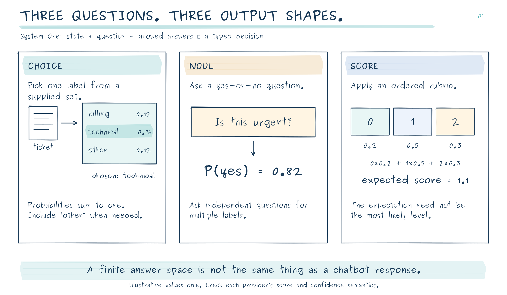
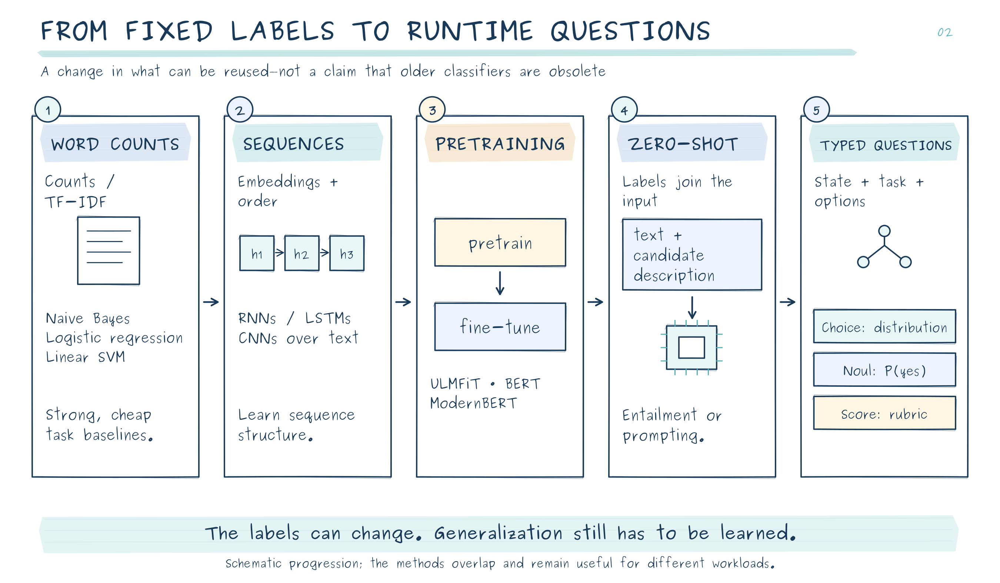
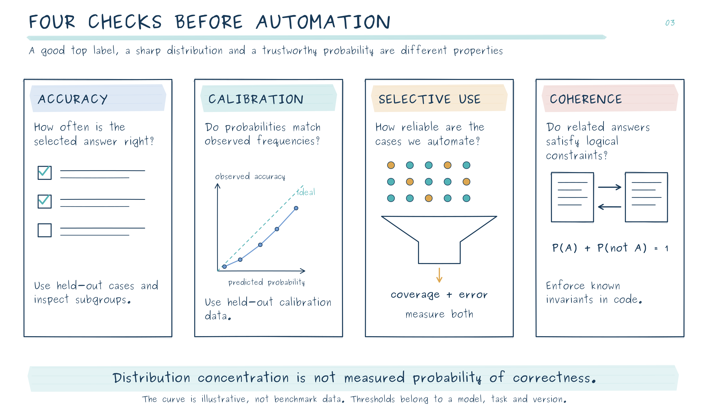
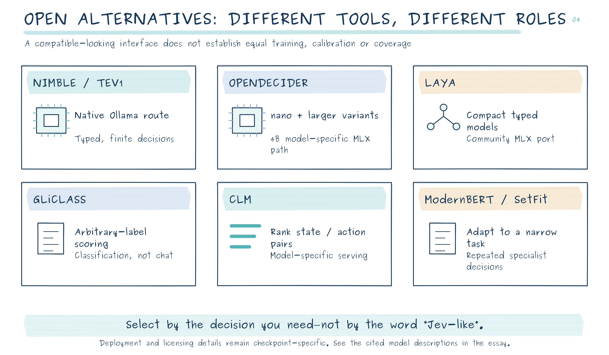
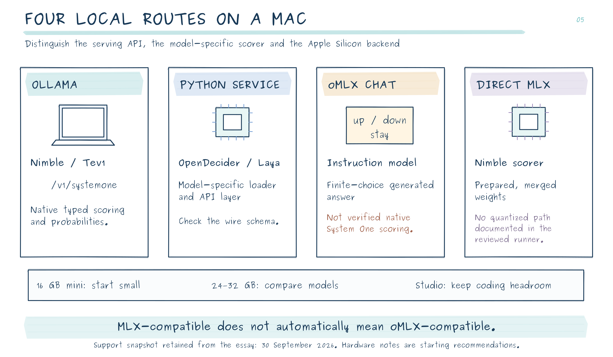
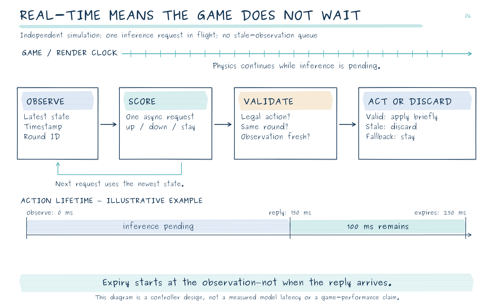
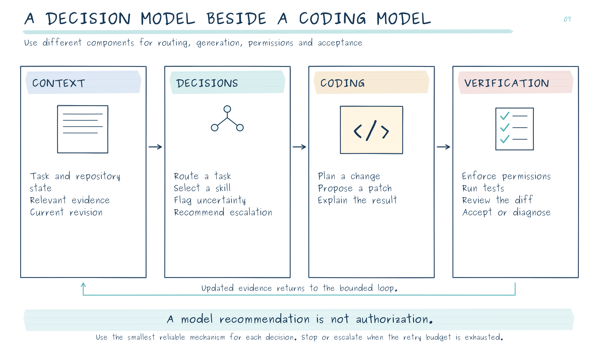

# Jev and the Return of the Classifier

## From text classification to local coding agents and real-time games—with Ollama, MLX and open-weight decision models

*Enrico Papalini · Evidence checked on 30 September 2026*

A coding agent does not spend its entire life writing code. Much of its work consists of smaller decisions: which skill to invoke, whether a retrieved file is relevant, whether a request needs clarification, whether another repair attempt is worthwhile. We often ask the same large language model to make these decisions and generate the eventual patch.

That is convenient. It is not necessarily a sensible allocation of intelligence, latency or memory.

In my previous article, the question was how to fit a larger model onto a smaller Mac. Here, I want to ask the complementary question: **which parts of an agentic workflow should not need that large model in the first place?**

Jev makes this question interesting again. Not because classification is new, but because a useful, reusable decision service could change the economics of the machinery surrounding a generative model. Sebastian Raschka's historical survey and Manjunath Janardhan's account of building OpenDecider provide two valuable starting points: one explains the intellectual lineage; the other exposes the practical difficulty of reproducing the result. [1](https://magazine.sebastianraschka.com/p/classifier-history-and-jev)[18](https://medium.com/@manjunath.shiva/i-built-an-open-rival-to-typesafes-jev-here-s-where-it-wins-and-where-it-doesn-t-dfdf018f5929)

There is now a particularly accessible local route. **Ollama 0.35 adds a native System One API for Nimble and Tev1**, so running a decision model no longer necessarily means assembling a Python inference service. That changes the installation story—not the need to evaluate the model. This expanded edition also distinguishes oMLX compatibility from MLX compatibility and ends with a real-time paddle-game experiment. [37](https://github.com/ollama/ollama/releases/tag/v0.35.0)

## What Jev actually is

Jev is TypeSafe AI's proprietary model for answering **typed questions about a supplied state**. The state might be a support ticket, a document, a structured record or an agent's recent activity. The questions and possible answers are supplied at request time. Instead of composing an explanation, the service returns decisions and probability distributions. TypeSafe calls this a *System One* model—a product category, not evidence that the system reproduces human cognition. [2](https://docs.typesafe.ai/introduction)

At this article's cutoff, the documented version is `jev-1.13.0`. It accepts text and structured textual input, not native images or audio. The listed price is $0.042 per million input tokens, with output tokens free. These are current vendor terms, not a permanent cost guarantee. Jev's weights are not publicly released for local deployment; running an open alternative is not the same as downloading Jev. [3](https://docs.typesafe.ai/models)[1](https://magazine.sebastianraschka.com/p/classifier-history-and-jev)

The interface has three principal forms.

**Choice** answers a mutually exclusive question: which team should handle this ticket, or which predefined workflow should run next? It returns probabilities across the supplied alternatives. The candidate set matters: a confident choice among inadequate options is still an inadequate decision. Include a meaningful “other” or “insufficient information” option when the task requires one. [4](https://docs.typesafe.ai/primitives/choice)

**Noul** asks a yes-or-no question and returns the estimated probability of “yes.” Several independent Noul questions can implement multi-label classification: a document can be both technical and urgent. Their probabilities do not have to sum to one across questions. [5](https://docs.typesafe.ai/primitives/noul)

**Score** evaluates ordered, descriptive levels. Importantly, Jev's `score` is a probability-weighted position on that scale, not necessarily the most likely level. With probabilities 0.2, 0.5 and 0.3 over levels 0, 1 and 2, the expected score is 1.1. That is an illustrative calculation, not a measured Jev response. A fractional score does not establish precise measurement of an underlying physical quantity. [6](https://docs.typesafe.ai/primitives/score)

The useful abstraction is therefore not “a small chatbot.” It is **a configurable decision function whose answer space is defined before inference**.



*Figure 1. Choice compares mutually exclusive options; Noul estimates a yes probability; Score returns an expected rubric level. The numbers are illustrative, not measured model outputs. Provider-specific response semantics are explained in the text.*

## How we arrived here: from fixed labels to runtime questions

The history is less a succession of obsolete algorithms than an expansion of what can be reused.

### First, reuse the representation

Bag-of-words systems convert documents into sparse vectors of word counts or TF-IDF values. Naive Bayes, logistic regression and linear support-vector machines then learn associations between those features and labels. They can be effective, inexpensive baselines. Their basic representation discards word order; adding n-grams restores some local structure at the cost of more features. [7](https://scikit-learn.org/stable/modules/feature_extraction.html)

Word embeddings made representations denser and more expressive. Recurrent networks processed sequences through an evolving hidden state; convolutional networks learned useful local patterns over adjacent tokens. These approaches improved the treatment of structure, but a classifier trained for sentiment still did not automatically become a classifier for customer intent. [1](https://magazine.sebastianraschka.com/p/classifier-history-and-jev)

### Then, reuse a pretrained language model

ULMFiT, published in 2018, helped establish the value of pretraining a language model and adapting it to downstream classification. BERT brought bidirectional transformer representations that could be fine-tuned with a classification head. ModernBERT, introduced in 2024, subsequently updated the encoder approach rather than declaring it obsolete. For stable, high-volume tasks, these remain relevant building blocks. [8](https://aclanthology.org/P18-1031/)[9](https://aclanthology.org/N19-1423/)[11](https://arxiv.org/abs/2412.13663)

This reduced the amount of task-specific training required. It did not eliminate the distinction between a pretrained representation and a trained decision rule. Loading a generic encoder with a newly initialized classification head does not create a competent universal classifier.

### Finally, make the labels part of the input

Zero-shot classification reframed the problem again. In an entailment-based approach, a candidate label becomes a textual hypothesis evaluated against the document. The set of labels can therefore change without resizing a task-specific output layer. This predates Jev by years. [10](https://aclanthology.org/D19-1404/)

Instruction-following language models made the interface even more flexible: describe a task, supply examples and ask for a label. But using an autoregressive model introduces machinery that a finite decision may not require. A classifier can compute scores without generating an explanation or repeatedly decoding tokens. Constrained generation can improve output formatting; it does not make the underlying computation or probability interpretation identical to a dedicated decision model. [1](https://magazine.sebastianraschka.com/p/classifier-history-and-jev)

**Jev's contribution should be judged at the product-and-generalization level:** how many unfamiliar decisions it handles usefully, how reliable its probabilities are, and how little integration work it requires. Neither dynamic labels nor classification heads were invented by its launch.



*Figure 2. The progression is a schematic of reuse: representations, pretrained language knowledge, candidate descriptions, and finally typed questions supplied at runtime. It is not a claim that older classifiers have become obsolete.*

## What we know about Jev—and what remains undisclosed

TypeSafe describes a specialized architecture, a parallel sampler and a training approach named **Reinforcement Learning for Calibrated Decisions**, or RLCD. The public material does not provide enough detail to reconstruct the architecture, training corpus or complete optimization procedure. Raschka's suggestion of a small encoder-like architecture is an educated hypothesis, not a disclosed specification. [12](https://typesafe.ai/blog/introducing-system-one-models-and-jev)[1](https://magazine.sebastianraschka.com/p/classifier-history-and-jev)

A plausible open implementation is easier to explain than to make broadly capable. A shared scorer receives the state, a question and a candidate description, producing one scalar per candidate. A softmax converts those scores into a distribution. The same scorer can evaluate two candidates or twenty without changing its parameters; more candidates can still mean more computation. However, the training distribution determines whether unfamiliar labels, domains and instructions are interpreted sensibly. A compatible API cannot supply that generalization by itself. [1](https://magazine.sebastianraschka.com/p/classifier-history-and-jev)

Calibration also has a history independent of Jev. The 2025 **Reinforcement Learning with Calibration Rewards** research, RLCR, adds an incentive for accurate confidence reporting to a correctness reward. This is related motivation, not evidence that RLCR and TypeSafe's proprietary RLCD are the same algorithm. Post-hoc methods such as temperature scaling offer another route: adjust probability sharpness using held-out data while leaving the predicted argmax class unchanged. [14](https://arxiv.org/abs/2507.16806)[13](https://proceedings.mlr.press/v70/guo17a.html)

This is the distinction that quick clones often obscure: **reproducing the request format is interface engineering; reproducing broad competence is a training and evaluation problem**.

The surrounding market is already changing. OpenAI announced a Decisions API at DevDay on 29 September 2026, with finite, user-defined answers and text or image context. It was announced in limited preview, not as a universally available or open-weight replacement. The broader trend is the separation of bounded decisions from unrestricted generation. [17](https://openai.com/index/devday-2026-recap/)

## Probabilities are the product—and the main integration risk

A label tells an application what the model prefers. A useful probability can help determine whether that preference should be acted on.

But four different properties are routinely mixed together.

**Accuracy** asks how often the selected answer is correct. **Calibration** asks whether predicted probabilities agree with observed frequencies. **Selective performance** asks how well the system behaves on the subset it chooses to automate. **Logical coherence** asks whether related answers satisfy constraints such as a proposition and its complement summing to one. These are not interchangeable objectives. [33](https://scikit-learn.org/stable/modules/calibration.html)[34](https://arxiv.org/abs/2609.33209)

An approximately calibrated 90% prediction means that, across an appropriate collection of comparable predictions, roughly 90% should be correct. It does not certify a particular decision. Nor does good overall calibration ensure good performance on an unusual programming language, an unfamiliar repository or an adversarial document.

TypeSafe itself documents difficulties involving arithmetic, counting, long distracting inputs and adversarial content. It also warns that separately asked questions can produce inconsistent probabilities. My engineering conclusion is straightforward: let a learned model interpret ambiguous language; let deterministic code enforce arithmetic, authorization and logical invariants. [16](https://docs.typesafe.ai/model-jaggedness/jev-1.13)



*Figure 3. Evaluate the selected answer, the probability estimates, the subset chosen for automation, and consistency across related questions. The calibration curve is illustrative. Distribution concentration is not itself a measured probability of correctness.*

### A compatibility trap worth checking before deployment

There are important differences even among similarly named response fields.

TypeSafe describes `confidence` as a summary of the distribution's concentration, not simply the probability of the winning option. OpenDecider's native implementation uses the largest option probability for its Choice confidence. Copying a threshold of 0.9 from one service to the other does not preserve its meaning or its error rate. [15](https://docs.typesafe.ai/confidence)[29](https://raw.githubusercontent.com/manjunathshiva/opendecider/main/opendecider/questions.py)

There is also a distinction **within OpenDecider**. In its Python library, a Score answer's `score` is the most likely level and `expected` is the weighted mean. Its current HTTP adapter deliberately translates this: on the wire, `score` is the expectation and `level` is the most likely level, matching Jev's Score convention. This translation is present in the server code; it is not an unresolved incompatibility. [29](https://raw.githubusercontent.com/manjunathshiva/opendecider/main/opendecider/questions.py)[30](https://raw.githubusercontent.com/manjunathshiva/opendecider/main/opendecider/serve.py)

My recommendation is to define an application-owned contract: retain the complete distribution, distinguish `top_probability`, `most_likely_level` and `expected_level`, and version the thresholds. Do not let a convenient field name become an undocumented safety policy.

Ollama makes this distinction inspectable in code. For Choice and Score, it computes `confidence = 1 - H(p) / log(K)`, clamped between zero and one, where `H(p)` is entropy and `K` is the number of alternatives. Uniform probabilities give zero; concentration on one option approaches one. It is **not** the winning probability or an empirically measured probability of correctness. Its Score output is the expected zero-based level. [45](https://raw.githubusercontent.com/ollama/ollama/v0.35.0/decision/systemone.go)

## The open-weight alternatives: related, not interchangeable

### Nimble and Tev1: decision checkpoints with an Ollama deployment path

**Nimble**, from Bespoke Labs, adapts Qwen3.5-9B for scoring finite alternatives. Its official implementation assigns candidate codes and reads their token scores rather than generating an explanatory answer. The project publishes the model and a native MLX scoring implementation; this is distinct from the packaged Ollama deployment. [50](https://raw.githubusercontent.com/bespokelabsai/nimble/main/README.md)

**Tev1**, from Together AI, offers experimental 4B and 0.8B variants derived from Qwen3.5. The training recipe combines labeled tasks with programmatic rules and routing examples. Its documented limitations include incompletely evaluated calibration, multilingual behavior and adversarial robustness. The smallest model is an attractive footprint experiment, not a guarantee of reliable game control. [52](https://raw.githubusercontent.com/togethercomputer/tev1/main/README.md)[40](https://ollama.com/library/tev1)

A release detail matters before redistribution: Tev1's code and documentation have a permissive license, but the experimental weight card says the fine-tuned weight license is still being finalized. Do not infer the weight terms from the code license or the base model's license. [53](https://huggingface.co/togethercomputer/Tev1-4B-experimental)

### OpenDecider: a practical starting point for a local decision service

OpenDecider offers a family rather than a single architecture. Its approximately **400M-parameter nano** model uses an Ettin encoder. Candidate markers allow it to score options in a shared pass. The **4B small** model adapts a Qwen backbone and reads candidate token probabilities rather than generating a prose answer. The ordinary small-candidate path is therefore not an autoregressive conversation; larger candidate sets can require different scoring machinery. [18](https://medium.com/@manjunath.shiva/i-built-an-open-rival-to-typesafes-jev-here-s-where-it-wins-and-where-it-doesn-t-dfdf018f5929)[19](https://github.com/manjunathshiva/opendecider)

The project also publishes 30B and 80B MoE variants. That is an update to the supplied article, which described the 80B as forthcoming. Their documented inference path is NVIDIA-oriented; their existence is not a verified native-Mac deployment. The 4B has explicit MLX 8-bit and 4-bit builds. The project publishes code and checkpoints under Apache-2.0, but a release license should not be confused with an independent audit of every upstream data right. [19](https://github.com/manjunathshiva/opendecider)[21](https://raw.githubusercontent.com/manjunathshiva/opendecider/main/README.md)

Training uses distillation from stronger teachers, with probability distributions rather than only hard labels. Some `-td` variants receive additional adaptation to the typed-decisions training split. Those suffixes matter when interpreting results: a domain-adapted checkpoint and a zero-shot checkpoint answer different evaluation questions. [18](https://medium.com/@manjunath.shiva/i-built-an-open-rival-to-typesafes-jev-here-s-where-it-wins-and-where-it-doesn-t-dfdf018f5929)

For a Mac-based experiment, I would start with nano, then compare the 4B MLX model on the decisions that actually matter to the application.

### Laya: compact typed decisions, with an independent MLX route

Laya provides non-autoregressive typed decisions using encoder backbones, including English and multilingual variants. Its official repository publishes the implementation and models; the separate **laya-mlx** project ports inference to Apple Silicon. That port is community work, not evidence that every new capability of the parent project is automatically supported. [23](https://github.com/NandhaKishorM/laya)[24](https://raw.githubusercontent.com/mizorewww/laya-mlx/main/README.md)

The port's documented English checkpoint is approximately 421M parameters; its multilingual checkpoint is approximately 322M. Its published M3 Max measurements are attractive—roughly 13.4 ms and 7.4 ms respectively for its test workload—but exclude model loading and are not Mac mini measurements. Input budgets are also modest for these ported checkpoints: inspect the exact model's limits before supplying a long agent trace. [24](https://raw.githubusercontent.com/mizorewww/laya-mlx/main/README.md)

Laya is worth testing when a compact decision model and multilingual coverage are priorities. Its practical value depends on the target distribution, not merely its fastest demonstration.

### GLiClass: arbitrary-label classification without pretending to be everything

GLiClass is a dedicated zero-shot classification framework that evaluates text against supplied labels. It is related to the GLiNER ecosystem, but **GLiNER's entity extraction and GLiClass's document classification are different tasks**. GLiClass is a useful open alternative when the actual requirement is label assignment rather than the full Jev-style bundle of typed decisions and calibration claims. [25](https://github.com/Knowledgator/GLiClass)

Its conventional Python inference route also makes it a reasonable CPU-first baseline. A fast label score should still be evaluated before being interpreted as an automation probability.

### Contrastive Language Models: especially interesting for ranking actions

The CLM project takes a different route: it learns representations for states and candidate actions that can be scored against one another. Separately reusable representations make candidate ranking and caching central to the design. That can be useful when an agent already has several possible actions or candidate outputs and needs to select among them. [26](https://github.com/Contrastive-LM/CLM)

The published reference setup uses an 8B backbone, an additional head and a vLLM-based serving path. The small size of the extra head is not the total model footprint. I did not verify a turnkey native-MLX deployment, so I would treat CLM as a more involved Mac porting exercise rather than the first installation to recommend. [26](https://github.com/Contrastive-LM/CLM)

### ModernBERT and SetFit: specialists still have a place

A fine-tuned ModernBERT model or a SetFit classifier may be the appropriate answer when the same narrow decision repeats at high volume and representative labels are available. SetFit is designed for efficient few-shot classification using sentence representations. These are not universal Jev replacements out of the box; they are tools for building a specialist whose boundaries are easier to define. [11](https://arxiv.org/abs/2412.13663)[27](https://huggingface.co/docs/setfit/index)

The choice is not simply proprietary versus open. It is also **general decision service versus deliberately specialized component**.



*Figure 4. Nimble/Tev1, OpenDecider, Laya, GLiClass, CLM and specialist encoders address related but different problems. Check the exact checkpoint, license, serving path and evaluation setting rather than assuming equal capability from an API name.*

## What the benchmarks establish—and what they do not

Raschka reports **96.47% IMDb test accuracy** for Jev's Choice interface. His later experiments report 92.33% for Laya and 82.90% for a CLM configuration. These are informative observations on sentiment classification, with his explicit caveat that Jev's training exposure is unknown. They do not establish a universal ranking for repository triage, security screening or agent control. [1](https://magazine.sebastianraschka.com/p/classifier-history-and-jev)

Janardhan's OpenDecider evaluation asks a different question. On 200 pooled general-decision examples, it reports **76.5% for OpenDecider-medium-td versus 73.0% for Jev**. On Laya's application battery, however, the reported result reverses: **77.4% for Jev versus 72.5% for the OpenDecider 30B**. The same account acknowledges substantial remaining gaps in phishing and jailbreak detection. These are creator-run measurements, not replications performed for this essay. [18](https://medium.com/@manjunath.shiva/i-built-an-open-rival-to-typesafes-jev-here-s-where-it-wins-and-where-it-doesn-t-dfdf018f5929)

The 3.5-point difference on 200 items corresponds to only **seven additional correct answers**. As an illustrative uncertainty check, the usual binomial approximation around 75% accuracy on 200 independent examples gives a 95% margin of roughly six percentage points for a single accuracy estimate. That is not a significance test for the paired difference: the actual pattern of disagreements is needed. A small benchmark supports investigation, not a sweeping “beats Jev” conclusion.

The typed-decisions benchmark introduces another complication. As Janardhan explains, its reference labels were derived from a teacher model, and some competitors were fine-tuned on its training split while Jev was evaluated zero-shot. High agreement can therefore reflect successful adaptation to the teacher and dataset—not independently established correctness on unfamiliar work. The teacher's reported repeat-agreement rate is a warning about the target, not a mathematical ceiling that no valid learner can exceed. [18](https://medium.com/@manjunath.shiva/i-built-an-open-rival-to-typesafes-jev-here-s-where-it-wins-and-where-it-doesn-t-dfdf018f5929)

Similarly, “we did not train on these evaluation datasets” generally describes the project's downstream training procedure. It does not prove that a large pretrained backbone never encountered related material. Hardware must also remain visible: a multi-GPU local result, a warm Mac inference call and a network API request are not controlled latency equivalents. [18](https://medium.com/@manjunath.shiva/i-built-an-open-rival-to-typesafes-jev-here-s-where-it-wins-and-where-it-doesn-t-dfdf018f5929)[20](https://raw.githubusercontent.com/manjunathshiva/opendecider/main/COMPARISON.md)

For a coding workflow, I would evaluate file relevance, skill selection, clarification decisions and escalation independently. A model that is useful on three of them should not inherit authority over the fourth.

Ollama adds another comparison: its published table reports mean accuracy across 13 human-labeled public datasets, comprising 3,880 decisions, of **75.7% for Nimble, 73.3% for Tev1 4B and 63.5% for Tev1 0.8B**, against **76.0% for Jev 1.13**. Nimble and Tev1 were run through Ollama; Jev's result comes from Bespoke's API evaluation. This is a classification benchmark, not a retro-game benchmark, and it does not establish that every quantized tag retains the same scores. [39](https://ollama.com/library/nimble)

## What fits on a Mac?

The encouraging difference from giant-model deployment is that a useful first experiment does not require a high-memory Studio.

OpenDecider's documentation reports **about 28 ms per question for nano on a 16 GB M4 Mac mini**, with approximately 2.0 GiB of reported memory use. Its unquantized 4B path is reported at about 280 ms and 8.9 GiB. These are project measurements for the stated setup, not guaranteed timings for arbitrary inputs or concurrent coding workloads. [21](https://raw.githubusercontent.com/manjunathshiva/opendecider/main/README.md)

The **4B MLX 8-bit model card** reports approximately 4.5 GB of inference memory on the author's M4 Max setup. The 4-bit variant offers a smaller footprint, but the calibration and accuracy of that exact quantization need their own evaluation. The project's unreleased 30B 4-bit MLX experiment is a useful warning: making a model fit did not preserve enough advantage to justify publishing that build. [22](https://huggingface.co/manjunathshiva/opendecider-small-mlx-8bit)[18](https://medium.com/@manjunath.shiva/i-built-an-open-rival-to-typesafes-jev-here-s-where-it-wins-and-where-it-doesn-t-dfdf018f5929)

My proposed starting points are therefore simple. On a **16 GB mini**, try nano first, alongside—not instead of—the memory needed by the editor, tests and coding model. On a **24–32 GB mini**, compare nano with the 4B MLX 8-bit build. On a **larger Studio**, use the extra memory to maintain a comfortable coding environment before assuming that a much larger decision model is necessary.

For an **M6 mini**, use the same validation sequence rather than extrapolating a token-rate or millisecond claim from an M4 Max or M3 Max. I have not run physical-Mac benchmarks for this essay.

A decision model also does not automatically inherit the caching machinery discussed in the previous article. A bidirectional encoder's score depends jointly on its inputs; arbitrary document representations cannot simply be reused as though they were a decoder's prefix KV cache. Where a project explicitly supports independently reusable representations, as CLM does, that is a specific architectural feature. [9](https://aclanthology.org/N19-1423/)[26](https://github.com/Contrastive-LM/CLM)

My preferred design is a **small decision service beside the coding server**, not a demand that one inference engine host every architecture and reproduce every decision head.

For the new Ollama route, the published downloads are **812 MB for `tev1:0.8b`**, **4.5 GB for `tev1:4b`**, and **9.5 GB for the default `nimble`**. A separate **`nimble:9b-q4_K_M`** tag is approximately **5.6 GB**; the default Nimble corresponds to its Q8 tag. These are package sizes, not peak process-memory measurements. Test quantization effects on the decision distribution as well as the selected label. [41](https://ollama.com/library/nimble/tags)[42](https://ollama.com/library/tev1/tags)

My starting choice for a 16 GB mini would be Tev1 0.8B to verify the pipeline, then a measured comparison with 4B. On a 24–32 GB mini, Nimble is a reasonable next experiment provided the editor and coding model still have room. A larger Studio makes simultaneous residency easier, but does not remove competition for memory bandwidth and compute. No timing here is an M6 mini benchmark.


## Ollama, oMLX and MLX are three different compatibility questions

**Ollama's support is native.** The 0.35.0 release introduces `/v1/systemone`, with typed Choice, Noul and Score answers. This runs the supported open checkpoints locally; it does not make TypeSafe's proprietary Jev weights available. [37](https://github.com/ollama/ollama/releases/tag/v0.35.0)

**For oMLX, I could not verify an equivalent native integration in the reviewed public code**, whose version is `0.7.0rc1`. The published server routes do not expose `/v1/systemone`, and I found no validated Nimble/Tev1 decision adapter. Support for their Qwen backbone, or for embeddings and reranking, is not the same as preserving their decision-scoring contract. This is a version-specific finding, not a claim that an adapter cannot be built. [46](https://github.com/jundot/omlx)[47](https://raw.githubusercontent.com/jundot/omlx/main/omlx/server.py)[49](https://raw.githubusercontent.com/jundot/omlx/main/omlx/_version.py)

What oMLX does expose is structured generation. Its chat schema supports a constrained choice such as `structured_outputs: {"choice": ["up", "down", "stay"]}`. A compatible instruction model can therefore return a finite action, but this remains a **generative baseline**, not native System One scoring with a verified candidate distribution. In the companion demo, that backend deliberately returns no invented probabilities. [48](https://raw.githubusercontent.com/jundot/omlx/main/omlx/api/openai_models.py)

**Nimble can also run directly on MLX without oMLX.** Follow Bespoke's model-preparation procedure, then instantiate `ParallelScorer` with the saved model configuration. Calling `ParallelScorer()` without arguments loads a different, 4B baseline—not Nimble. The documented MLX runner needs merged weights rather than an adapter folder and does not support quantized weights. Unquantized 9B weights alone require about 18 GB, before working memory and preparation overhead. [50](https://raw.githubusercontent.com/bespokelabsai/nimble/main/README.md)

That runner can reuse shared prefix computation across fields within a request. Do not transfer this implementation detail to every System One server: Ollama compiles a scoring row for each question, and one HTTP request containing many questions is not proof of one shared forward pass. [51](https://raw.githubusercontent.com/bespokelabsai/nimble/main/docs/PARALLEL_SCORING.md)[45](https://raw.githubusercontent.com/ollama/ollama/v0.35.0/decision/systemone.go)

There is also a separate project named **mlx-serve**, not oMLX, documenting Laya support through `/v1/decisions`. That is another native-MLX option to investigate, with its own schema and checkpoint requirements; changing an endpoint name alone is not a compatibility test. [56](https://raw.githubusercontent.com/ddalcu/mlx-serve/main/docs/api.md)

The resulting distinction is:

| Route | What the application receives | What it does not establish |
| --- | --- | --- |
| Ollama 0.35+ with Nimble/Tev1 | Native typed decisions and candidate probabilities | Jev's proprietary model or universal calibration |
| oMLX ordinary chat with finite choices | A generated action from a supported instruction model | A native System One scorer |
| Nimble's dedicated MLX runner | Model-specific candidate scores | Drop-in oMLX compatibility |
| OpenDecider/Laya service beside oMLX | Decisions through the service's own supported interface | Shared hardware isolation or identical wire semantics |

For this article's coding architecture, I would initially keep the division simple: **Ollama handles the small decision model; oMLX handles the larger coding model.** Alternatively, OpenDecider or laya-mlx can supply the decision component. Measure them together: two servers sharing a Mac are not two isolated GPUs.



*Figure 5. Native System One scoring, finite-choice text generation, and model-specific MLX inference are distinct capabilities. The support snapshot and hardware starting recommendations are those discussed in the article, not new performance measurements.*

## The simplest installation: Ollama's local decision API

### Update the running server, then download one model

Update the native macOS app to Ollama 0.35 or later and restart it. Check the running service as well as the command-line executable; a newer CLI talking to an older background process is not a successful server upgrade. On macOS, the app's update menu provides the restart path. [37](https://github.com/ollama/ollama/releases/tag/v0.35.0)[54](https://docs.ollama.com/faq)

```bash
ollama --version
curl --fail -sS http://127.0.0.1:11434/api/version
ollama pull tev1:0.8b
```

Start with a small checkpoint. The later comparisons are `ollama pull tev1:4b` and `ollama pull nimble`; there is no need to download or keep all three resident for the first test. The precise package sizes and tags are recorded above. [41](https://ollama.com/library/nimble/tags)[42](https://ollama.com/library/tev1/tags)

### Use System One, not the generic chat example

The generic model-library tabs may show `ollama run` or `/api/chat`. For this job, use **`/v1/systemone`**. Below is an original coding-triage request, with all three question types and a bounded residency period:

```bash
curl --fail-with-body --max-time 120 -sS \
  http://127.0.0.1:11434/v1/systemone \
  -H 'Content-Type: application/json' \
  -d '{
    "model": "tev1:0.8b",
    "keep_alive": "10m",
    "state": {
      "request": "Fix parse_records when given an empty list.",
      "evidence": "A supplied unit test fails with IndexError.",
      "constraint": "Do not change the public function signature."
    },
    "questions": {
      "route": {
        "type": "choice",
        "instructions": "Which workflow best matches this request?",
        "criteria": {
          "debugging": "Repair an existing code failure",
          "documentation": "Change explanatory text only",
          "clarification": "Ask for essential missing information"
        }
      },
      "has_reproduction": {
        "type": "noul",
        "instructions": "Is a concrete failing input identified?"
      },
      "change_scope": {
        "type": "score",
        "instructions": "How broad is the requested change?",
        "criteria": ["One isolated behavior", "Several components", "Public architecture"]
      }
    }
  }'
```

The schema follows Ollama's documented model API. The values returned by your installation—not an invented sample distribution—are the output to inspect. `keep_alive` keeps the model loaded between requests; it is not a guarantee of prefix-cache reuse, and it does not start background inference. [39](https://ollama.com/library/nimble)[54](https://docs.ollama.com/faq)

For a real-time controller, I would begin with **one action question**, not the three-question diagnostic request above. Keep Tev1's effective prompt budget in mind: its documentation specifies around **2,000 tokens**, despite the library header advertising a much larger base context. State, instructions and candidate descriptions consume that budget together. Stay within the trained 2–24-candidate range. [40](https://ollama.com/library/tev1)

### The native Python client already supports it

There is a documentation race worth avoiding. Some model-library text still says the Ollama Python client is unsupported, but **`ollama-python` 0.6.3 added System One**, including synchronous and asynchronous clients. Install the package version explicitly in an isolated environment. [43](https://github.com/ollama/ollama-python/releases/tag/v0.6.3)[44](https://raw.githubusercontent.com/ollama/ollama-python/v0.6.3/ollama/_client.py)

```bash
python3 -m venv .venv-ollama
source .venv-ollama/bin/activate
python -m pip install 'ollama==0.6.3'
```

```python
from ollama import Client

client = Client(host="http://127.0.0.1:11434", timeout=120)
response = client.systemone(
    model="tev1:0.8b",
    state="The installation guide contains a spelling mistake.",
    questions={
        "route": {
            "type": "choice",
            "instructions": "Which workflow should handle this?",
            "criteria": {
                "code": "Change program behavior",
                "docs": "Edit documentation",
                "clarify": "Request missing evidence"
            }
        }
    },
    keep_alive="10m",
)
print(response.model_dump())
```

This is a single response, not a token stream. An asynchronous client lets an application do other work while waiting; it does not make the model's decision instantaneous. TypeSafe's SDK remains an alternative when pointed at the local endpoint. A placeholder API key required by that SDK does not enable authentication on an otherwise unauthenticated Ollama loopback server. [44](https://raw.githubusercontent.com/ollama/ollama-python/v0.6.3/ollama/_client.py)[38](https://ollama.com/blog/ollama-now-supports-jev-style-decision-models)

### Keep residency and privacy explicit

Use `ollama ps` to inspect loaded models and `ollama stop MODEL` to release one. For a deliberately local-only app configuration, Ollama documents `OLLAMA_NO_CLOUD=1`; on macOS, set app environment variables with `launchctl setenv`, restart and verify the configuration. Initial model downloads still need a network connection. Keep the default loopback binding rather than exposing an unauthenticated inference service to a network. [54](https://docs.ollama.com/faq)

I would not reserve nearly all physical RAM independently in both Ollama and oMLX. Start the decision service alone, warm it, measure it, then repeat with the coding server actively generating. The second measurement is the one that represents an agentic workload.

## A Python-first route: OpenDecider and Laya

### 1. Start with an isolated environment

For the following example, use a native Apple Silicon Python installation; Python 3.11 or 3.12 is a conservative starting point. Check that `uname -m` reports `arm64`, then create an environment:

```bash
mkdir -p "$HOME/local-decider"
cd "$HOME/local-decider"
python3 -m venv .venv
source .venv/bin/activate
python -m pip install --upgrade pip
python -m pip install 'opendecider[mlx,serve]==0.2.0'
```

The package and optional MLX/server dependencies are published. Version 0.2.0 is the pinned release for this guide; the code below is based on its documented interfaces. Installing the package and first loading a checkpoint require network access. [28](https://pypi.org/project/opendecider/)

### 2. Ask a real, bounded coding question

Save this as `triage.py`. It recommends a route; it does not execute tools or modify the repository.

```python
import json
from opendecider import load

model = load("manjunathshiva/opendecider-nano")

state = {
    "request": "Fix the empty-input failure in parse_records.",
    "evidence": "The supplied test fails with IndexError on an empty list.",
    "constraint": "Do not change the public function signature."
}

questions = {
    "route": {
        "type": "choice",
        "instructions": "Which workflow best matches the request?",
        "criteria": {
            "debugging": "Diagnose and repair an existing failure",
            "documentation": "Change explanatory text without code changes",
            "clarification": "Request essential missing information"
        }
    },
    "has_reproduction": {
        "type": "noul",
        "instructions": "Does the state identify a concrete failing input?"
    }
}

result = model.system_one(state, questions)
answers = result["answers"]

if result.get("warnings") or any(
    answer.get("truncated", False) for answer in answers.values()
):
    raise RuntimeError("Input warning: inspect before relying on this result.")

print(json.dumps(answers, indent=2))
```

Run `python triage.py`. The expected workflow for this hand-written example is debugging, but no probability values are supplied here as alleged measured output. Inspect what your installation actually returns. The loader supports local execution and exposes input-truncation warnings; checking those warnings is part of the test. [31](https://raw.githubusercontent.com/manjunathshiva/opendecider/main/opendecider/__init__.py)

### 3. Compare the Apple-native 4B path

Change only the model identifier:

```python
model = load("manjunathshiva/opendecider-small-mlx-8bit")
```

This selects a model-specific MLX implementation. It is not equivalent to taking an ordinary Qwen checkpoint, prompting it to return JSON and assuming the resulting numbers reproduce OpenDecider. The published MLX checkpoint includes the adapted model used by this inference path. [22](https://huggingface.co/manjunathshiva/opendecider-small-mlx-8bit)

Keep the same held-out examples when comparing nano, 8-bit and 4-bit variants. Measure end-to-end decision latency after warm-up, and separately record cold load time and peak memory while the coding model is also resident.

### 4. Expose a private local endpoint

For an agent harness, a small HTTP service is often easier to integrate than embedding inference in the agent process. The current OpenDecider server implements `/v1/systemone`, bearer authentication and bounded request admission. Explicitly bind to loopback rather than accepting its all-interface default. [30](https://raw.githubusercontent.com/manjunathshiva/opendecider/main/opendecider/serve.py)

In the activated environment:

```bash
umask 077
mkdir -p "$HOME/.config/local-decider"
KEY_FILE="$HOME/.config/local-decider/api.key"
if [ ! -s "$KEY_FILE" ]; then
  python -c 'import secrets; print(secrets.token_hex(32))' > "$KEY_FILE"
fi
export OPENDECIDER_API_KEY="$(cat "$KEY_FILE")"

opendecider serve \
  --model manjunathshiva/opendecider-nano \
  --host 127.0.0.1 --port 8011 \
  --max-in-flight 4 --request-timeout-s 30
```

The CLI flags are documented; the concurrency and timeout values are proposed starting settings, not optimal values established by a load test. Port 8011 keeps the service separate from a coding server commonly configured on another port. [32](https://raw.githubusercontent.com/manjunathshiva/opendecider/main/opendecider/cli.py)

From another terminal, send a request:

```bash
export OPENDECIDER_API_KEY="$(cat "$HOME/.config/local-decider/api.key")"
curl --fail-with-body --max-time 40 -sS \
  http://127.0.0.1:8011/v1/systemone \
  -H "Authorization: Bearer $OPENDECIDER_API_KEY" \
  -H 'Content-Type: application/json' \
  -d '{
    "state": "A supplied unit test fails when parse_records receives [].",
    "questions": {
      "has_reproduction": {
        "type": "noul",
        "instructions": "Does the report identify a concrete failing input?"
      }
    }
  }'
```

Treat authentication failure, input truncation, timeout and an uncertain model answer as different conditions. None should silently become approval to run a tool. Keep credentials outside the repository and avoid logging sensitive source text unnecessarily.

### 5. Test a second implementation rather than trusting one family

For Laya's independent MLX port, create a separate environment and install `laya-mlx`. Its documented interface is:

```python
import laya_mlx as laya

agent = laya.load("aac6fef/laya-mlx")
result = agent.predict(
    "The task is to correct a typo in the installation guide.",
    {
        "route": {
            "type": "choice",
            "instructions": "Which workflow fits this task?",
            "criteria": ["debugging", "documentation", "clarification"]
        }
    }
)
print(result["answers"]["route"])
```

Use a short input first and check the selected checkpoint's context budget. Installation instructions, checkpoint names and this API shape are documented by the port. The example's output is deliberately not fabricated. [36](https://huggingface.co/aac6fef/laya-mlx)

### 6. Make local execution reproducible

Record the package version, checkpoint revision, backend, quantization, question schema and input limits. OpenDecider's loader accepts a model revision, so a moving repository need not silently change the evaluated system. After downloading every required asset and performing a successful warm-up, test again with Hugging Face offline mode enabled and network access disabled. An incomplete cache may still need a tokenizer, configuration or base-model dependency. [31](https://raw.githubusercontent.com/manjunathshiva/opendecider/main/opendecider/__init__.py)

The important test is not simply “the weights are on disk.” It is “this exact workflow runs without an external inference service.”

## Can these models play a retro game in real time?

**There is already a relevant public demonstration:** Ollama reports that Nimble 9B averaged **91 ms per decision** in its Pac-Man example on a **MacBook Pro M5 Max**, replayed at real-time speed. That is vendor-reported evidence for one game configuration. It is not a Mac mini measurement, does not provide a p95 latency, and does not establish that the model issues 60 decisions per second. [38](https://ollama.com/blog/ollama-now-supports-jev-style-decision-models)

The arithmetic is useful: a 91 ms serial decision takes roughly the time of five to six frames on a 60 Hz display. With no other overhead, its reciprocal is about eleven decisions per second. That is enough to make some game designs interesting, but the display clock and the decision clock must be different clocks.

### A game can advance in steps without being real-time

In a typical step-based environment, `env.step(action)` advances the simulation when the program calls it. An application can wait two seconds for an action, advance one step, and still eventually complete a game. Gymnasium's API documents this explicit step interface. A successful episode under that arrangement does not demonstrate control of a world that keeps moving during inference. [55](https://gymnasium.farama.org/api/env/)

For wall-clock play, the physics loop must continue while the request is pending. The useful question becomes: **is the returned action still relevant to the current state?** A model can be quick and accurate on an old screenshot yet be too late to save the paddle.

### Begin with symbolic state, not a screenshot

For a first experiment, I would instrument a game I control and supply positions, velocities, map cells and legal actions as compact JSON. That isolates the decision model from visual recognition. Nimble's released decision interface is text-only, even though its underlying model family has other capabilities. Tev1's packaged interface also uses textual or structured-text state. A screenshot is not automatically a valid input to this endpoint. [50](https://raw.githubusercontent.com/bespokelabsai/nimble/main/README.md)[40](https://ollama.com/library/tev1)

A screenshot-only setup needs a separate perception stage: capture the image, identify sprites and obstacles, track movement, then construct the state. Its errors and latency belong in the end-to-end result. Reading emulator memory can be useful for research, but report it as privileged state access rather than comparing it silently with a pixel-only agent.

### Keep the action space small—and meaningful

For a maze game, a decision at a junction can select a direction or a nearby goal. For Tetris, a decision can select among legal piece placements rather than repeatedly guessing which key to press. A deterministic controller then executes the chosen placement. When the legal set exceeds the API's candidate limit, any shortlisting policy becomes part of the algorithm and the benchmark. It can improve or restrict the model's apparent performance.

For Pong-like reflex control, I would include a simple non-model tracking baseline. A larger language model is not automatically an improvement over geometry or a small policy trained specifically for the game. Use a general decision model when interpreting goals, rules or variable tasks adds value—not merely because a paddle can be described in JSON.

A distribution over `up`, `down` and `stay` also is **not a distribution over winning**. It represents relative candidate scores under the model and prompt. Calibration for sentiment or ticket routing does not establish calibration for future game reward.

### A controller needs a freshness policy, not just a fast endpoint

My proposed architecture separates three responsibilities. The game renders and updates physics independently. A decision worker reads a fresh snapshot and permits at most one inference request in flight. An action gate checks the reply's sequence number, round identifier, allowed action and age before applying it.

The deadline starts at **observation time**. For example, when a 250 ms freshness budget receives a reply after 150 ms, the action has 100 ms of permitted lifetime left—not a fresh 250 ms lease. This prevents network or inference delay from extending an obsolete instruction.

Do not build a FIFO queue of old frames. When the worker becomes available, take the newest observation. Drop replies from a previous round or a paused run. Release held keys on expiration or failure. For the companion paddle game, the explicit fallback is `stay`; a different game may need a different safe fallback. Neutral action is not automatically the best game-playing action, but it makes failures observable instead of hiding them behind another controller.

A 10 Hz decision target allows approximately 100 ms per interval; 5 Hz allows 200 ms. These are planning budgets, not promised model latencies. Check the tail of the measured latency distribution, perception cost and actuation delay. A browser that renders at 60 FPS while applying one-second-old decisions has not solved the problem.



*Figure 6. The simulation does not wait for inference. Keep one request in flight, use the newest state, and discard stale or out-of-round replies. In this illustrative timeline, a reply at 150 ms has only 100 ms left in a 250 ms observation-age budget.*

### Run the companion Paddle Lab

The accompanying package contains an original browser paddle game and a **Python-standard-library local bridge**. It requires no ROMs, emulator, game account, paid API or third-party browser assets. The model controls only the in-page paddle. It cannot operate your keyboard globally or execute shell commands.

From the extracted package folder, with Ollama already running and `tev1:0.8b` downloaded, first warm the model using the supplied one-question request:

```bash
curl --fail-with-body --max-time 120 -sS \
  http://127.0.0.1:11434/v1/systemone \
  -H 'Content-Type: application/json' \
  --data-binary @examples_ollama/paddle_request.json

python3 realtime/server.py --backend ollama --model tev1:0.8b
```

Open `http://127.0.0.1:8765`, click **Warm up model**, then **Start / pause**. The default proposal is a maximum of five decisions per second and a 500 ms observation-age limit. These settings intentionally make a slow demonstration approachable; they are not the settings of Ollama's Pac-Man example. The HTTP failure timeout is longer than the freshness budget: while a request is pending, the game continues and an expired action becomes neutral.

Compare models by restarting the bridge with `--model tev1:4b`, `--model nimble`, or a specific quantized tag after downloading it. A tighter experiment is:

```bash
python3 realtime/server.py --backend ollama --model tev1:0.8b \
  --hz 10 --max-age-ms 250
```

This may discard more decisions. That is a result to record, not a reason to silently pause physics. On service errors, the demo disables new inference requests and falls back to `stay` until explicitly warmed again. It never sends a failed local request to a cloud model.

The app displays returns and misses, accepted and discarded replies, p50/p95 HTTP latency and independent render/decision rates. Its JSON export includes the seed, exact observations, decisions, errors, neutral-fallback time and any simulation time dropped because the browser itself stalled. Warm-up is excluded. Fill in the machine, RAM, runtime version and checkpoint digest before publishing results.

For a transparent comparison without any model, run:

```bash
python3 realtime/server.py --backend heuristic
```

This baseline simply tracks the ball's current vertical position; it has no hidden trajectory solver. Manual control is also available. Keep the same seeds and run lengths, then compare repeated runs rather than one attractive rally.

### Use oMLX as an explicit generative comparison

The same lab can call a normal instruction model already running in oMLX:

```bash
# Set this only when your local oMLX server requires a key.
export LOCAL_DECIDER_API_KEY="YOUR_LOCAL_SERVER_KEY"
python3 realtime/server.py \
  --backend omlx-chat --model local-small \
  --endpoint http://127.0.0.1:8000/v1/chat/completions
```

Replace `local-small` with a real loaded model ID. The bridge requests only `up`, `down` or `stay`, validates the complete response and rejects prose or truncation. `--constrain-output` additionally requests oMLX's supported structured-choice schema when that capability is installed. This deliberately compares **generation against scoring**; it does not claim that oMLX is running Nimble's specialized scorer. [48](https://raw.githubusercontent.com/jundot/omlx/main/omlx/api/openai_models.py)

An existing OpenDecider HTTP service can be tested through the bridge's `--backend systemone` option, an explicit `/v1/systemone` endpoint and the matching loaded model ID. Its authentication key stays in the bridge process, not in browser JavaScript. Native Laya/MLX implementations with a different wire schema need an adapter; similar model names do not make the schemas identical.

## From a working demo to a useful agent component

My proposed integration keeps responsibilities separate. The decision service recommends a skill or flags missing information. The generative model proposes a patch. The harness enforces permissions and a finite retry budget. Tests, static checks and review determine whether the change is acceptable.



*Figure 7. The decision model recommends a route or escalation; the coding model proposes a change. Permissions, tests and review remain separate responsibilities, with updated evidence returning to a bounded loop.*

I would begin in **shadow mode**: record recommendations without changing agent behavior. Build evaluation cases from real repositories, including ambiguous requests, multilingual text, long logs, missing evidence and malicious instructions embedded in retrieved content. Human-checked decisions should remain separate from the data used to fit thresholds.

Measure accuracy per task, probability quality and the error rate among the decisions selected for automation. A lower calibration error is not by itself a better operating policy; an uninformative predictor can look well calibrated while being useless for selecting work. Reliability diagrams, proper scoring rules and coverage-versus-error measurements answer complementary questions. [33](https://scikit-learn.org/stable/modules/calibration.html)

Treat security decisions particularly cautiously. A recent preprint on System One security evaluation reports that aggregate performance and confidence thresholds can conceal failures on particular attack families. It is early evidence, not a universal verdict, but it reinforces a sound design rule: a probabilistic classifier should not replace the operating system's permission boundary. [35](https://arxiv.org/abs/2609.33401)

Finally, changing the model, quantization, candidate descriptions or input distribution should trigger re-evaluation. A routing policy belongs to a particular system configuration, not to a product name.

## The real opportunity

Jev does not make classifiers new. It makes a long-standing engineering question more urgent: **how much generality can we obtain without paying for unrestricted generation?**

The open ecosystem already offers useful answers. Ollama makes Nimble and Tev1 available through a native typed endpoint. OpenDecider provides an accessible local service and explicit Mac paths. Laya offers compact typed models and a community MLX implementation. GLiClass addresses flexible classification; CLM explores reusable state-action scoring; specialist encoders remain reasonable where the task is stable. None needs to be a universal Jev replacement to be useful.

A game makes the integration lesson visible: a valid action can still be too late, and a confident action can still be wrong. The same applies when a coding agent is acting on a repository that has changed since its last observation.

For local coding, the most interesting architecture may therefore be neither one enormous model nor a collection of tiny models pretending to do everything. It may be a capable coding model surrounded by smaller decision components, each evaluated for a specific responsibility.

**The goal is not to make every decision with the largest model. It is to give each decision the smallest reliable mechanism—and to keep verification outside the model's confidence.**

---

*Method note: Evidence checked on 30 September 2026. This expanded edition preserves the historical essay and adds the Ollama/oMLX assessment and an original real-time lab. The companion implementation passed protocol, validation and simulation tests; its browser behavior was checked with synthetic responses, including delayed replies. No real decision checkpoint or physical-Mac game benchmark was run for this essay. Published model measurements remain attributed to their authors. The lab is a reproducible experiment, not a claim that every listed model plays it well.*

## Sources and further reading

1. [Sebastian Raschka — Language Models for Text Classification: From Bag-of-Words to Jev](https://magazine.sebastianraschka.com/p/classifier-history-and-jev)
2. [TypeSafe — Introduction](https://docs.typesafe.ai/introduction)
3. [TypeSafe — Current models](https://docs.typesafe.ai/models)
4. [TypeSafe — Choice](https://docs.typesafe.ai/primitives/choice)
5. [TypeSafe — Noul](https://docs.typesafe.ai/primitives/noul)
6. [TypeSafe — Score](https://docs.typesafe.ai/primitives/score)
7. [scikit-learn — Text feature extraction](https://scikit-learn.org/stable/modules/feature_extraction.html)
8. [Howard and Ruder — Universal Language Model Fine-tuning for Text Classification (2018)](https://aclanthology.org/P18-1031/)
9. [Devlin et al. — BERT: Pre-training of Deep Bidirectional Transformers for Language Understanding](https://aclanthology.org/N19-1423/)
10. [Yin, Hay and Roth — Benchmarking Zero-shot Text Classification: Datasets, Evaluation and Entailment Approach (2019)](https://aclanthology.org/D19-1404/)
11. [Warner et al. — ModernBERT (2024)](https://arxiv.org/abs/2412.13663)
12. [TypeSafe — Introducing System One Models and Jev](https://typesafe.ai/blog/introducing-system-one-models-and-jev)
13. [Guo et al. — On Calibration of Modern Neural Networks (2017)](https://proceedings.mlr.press/v70/guo17a.html)
14. [Beyond Binary Rewards: Training LMs to Reason About Their Uncertainty (2025)](https://arxiv.org/abs/2507.16806)
15. [TypeSafe — Confidence](https://docs.typesafe.ai/confidence)
16. [TypeSafe — Jev 1.13 jaggedness and known failure modes](https://docs.typesafe.ai/model-jaggedness/jev-1.13)
17. [OpenAI — DevDay 2026 recap](https://openai.com/index/devday-2026-recap/)
18. [Manjunath Janardhan — I Built an Open Rival to TypeSafe's Jev. Here's Where It Wins and Where It Doesn't](https://medium.com/@manjunath.shiva/i-built-an-open-rival-to-typesafes-jev-here-s-where-it-wins-and-where-it-doesn-t-dfdf018f5929)
19. [OpenDecider repository and documentation](https://github.com/manjunathshiva/opendecider)
20. [OpenDecider — Full comparison and benchmark limitations](https://raw.githubusercontent.com/manjunathshiva/opendecider/main/COMPARISON.md)
21. [OpenDecider — Installation and platform measurements](https://raw.githubusercontent.com/manjunathshiva/opendecider/main/README.md)
22. [OpenDecider-small MLX 8-bit model card](https://huggingface.co/manjunathshiva/opendecider-small-mlx-8bit)
23. [Laya — Official repository](https://github.com/NandhaKishorM/laya)
24. [laya-mlx — Independent Apple Silicon port](https://raw.githubusercontent.com/mizorewww/laya-mlx/main/README.md)
25. [GLiClass — Official repository](https://github.com/Knowledgator/GLiClass)
26. [Contrastive Language Models — Official repository](https://github.com/Contrastive-LM/CLM)
27. [SetFit — Official documentation](https://huggingface.co/docs/setfit/index)
28. [OpenDecider — PyPI package, release and HTTP/Python semantics](https://pypi.org/project/opendecider/)
29. [OpenDecider — Native typed-answer implementation](https://raw.githubusercontent.com/manjunathshiva/opendecider/main/opendecider/questions.py)
30. [OpenDecider — HTTP server and score wire adaptation](https://raw.githubusercontent.com/manjunathshiva/opendecider/main/opendecider/serve.py)
31. [OpenDecider — Model loader and truncation metadata](https://raw.githubusercontent.com/manjunathshiva/opendecider/main/opendecider/__init__.py)
32. [OpenDecider — Command-line interface](https://raw.githubusercontent.com/manjunathshiva/opendecider/main/opendecider/cli.py)
33. [scikit-learn — Probability calibration](https://scikit-learn.org/stable/modules/calibration.html)
34. [Beyond Calibration: Do a Typed-Decision Model's Probabilities Obey the Probability Axioms? (September 2026 preprint)](https://arxiv.org/abs/2609.33209)
35. [Evaluating System One Models for Agent Security Decisions: Reliability, Calibration, and Selective Automation (September 2026 preprint)](https://arxiv.org/abs/2609.33401)
36. [Laya-MLX English checkpoint — Model card and local inference example](https://huggingface.co/aac6fef/laya-mlx)
37. [Ollama — v0.35.0 release; native System One support](https://github.com/ollama/ollama/releases/tag/v0.35.0)
38. [Ollama — Jev-style decision models and the Pac-Man demonstration](https://ollama.com/blog/ollama-now-supports-jev-style-decision-models)
39. [Ollama — Nimble model and API guide](https://ollama.com/library/nimble)
40. [Ollama — Tev1 model, context limits and evaluation](https://ollama.com/library/tev1)
41. [Ollama — Nimble tags, quantizations and package sizes](https://ollama.com/library/nimble/tags)
42. [Ollama — Tev1 tags and package sizes](https://ollama.com/library/tev1/tags)
43. [Ollama Python — v0.6.3 adds System One](https://github.com/ollama/ollama-python/releases/tag/v0.6.3)
44. [Ollama Python — synchronous and asynchronous System One client implementation](https://raw.githubusercontent.com/ollama/ollama-python/v0.6.3/ollama/_client.py)
45. [Ollama 0.35.0 — candidate scoring and entropy-based confidence](https://raw.githubusercontent.com/ollama/ollama/v0.35.0/decision/systemone.go)
46. [oMLX — published serving capabilities](https://github.com/jundot/omlx)
47. [oMLX — current server routes reviewed for System One support](https://raw.githubusercontent.com/jundot/omlx/main/omlx/server.py)
48. [oMLX — chat and structured-output schemas](https://raw.githubusercontent.com/jundot/omlx/main/omlx/api/openai_models.py)
49. [oMLX — version of the reviewed code](https://raw.githubusercontent.com/jundot/omlx/main/omlx/_version.py)
50. [Bespoke Labs — Nimble, official model preparation and MLX runner](https://raw.githubusercontent.com/bespokelabsai/nimble/main/README.md)
51. [Bespoke Labs — parallel scoring and prefix reuse](https://raw.githubusercontent.com/bespokelabsai/nimble/main/docs/PARALLEL_SCORING.md)
52. [Together AI — Tev1 training and implementation](https://raw.githubusercontent.com/togethercomputer/tev1/main/README.md)
53. [Together AI — Tev1 4B experimental model card and weight-license notice](https://huggingface.co/togethercomputer/Tev1-4B-experimental)
54. [Ollama — FAQ: updates, local-only mode, binding and memory residency](https://docs.ollama.com/faq)
55. [Gymnasium — Environment step semantics](https://gymnasium.farama.org/api/env/)
56. [mlx-serve — separate project with a Laya decision endpoint](https://raw.githubusercontent.com/ddalcu/mlx-serve/main/docs/api.md)
