# Local LLM Inference on Apple Silicon

*A practical architecture and optimization guide*

Ollama, llama.cpp/Metal, oMLX, MLX-LM, MLX Swift LM, and Apple's native Foundation Models integration.

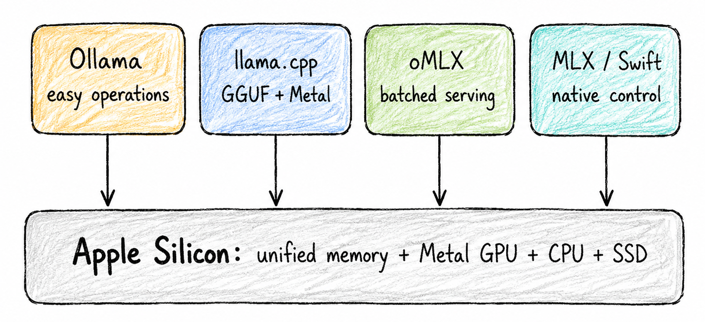

Researched against public project documentation available on 30 July 2026. Fast-moving command-line flags are version-sensitive: pin versions and verify with `--help` before production use.

# Purpose and scope

This guide explores the complete Mac-native inference spectrum rather than treating "local LLM on a Mac" as a single implementation. The same Apple Silicon machine can host at least four substantially different execution models:

- **Ollama**: the operationally easiest path, with model lifecycle, a local API, application integrations, automatic backend selection, and a compact set of global performance controls.
- **llama.cpp with Metal**: the most transparent and portable GGUF path, exposing detailed controls for offload, batching, KV-cache precision, prompt-cache persistence, metrics, slots, and speculative decoding.
- **oMLX**: a Mac-focused multi-request serving layer built around MLX, with continuous batching, block-based prefix sharing, Copy-on-Write cache blocks, multi-model management, and hot-RAM/cold-SSD KV-cache tiers [1].
- **Native MLX solutions**: MLX-LM for Python experimentation and custom inference, MLX Swift LM for native macOS applications, and the Apple Foundation Models framework when the system model or a conforming provider is the correct product abstraction [13, 14, 16, 17].

The purpose is not to select a universal winner. It is to map workload symptoms to physical limits, then select the smallest engine and optimization set that meets latency, concurrency, context, quality, privacy, and operational constraints.

> **The Mac-first operating rule.** Choose the engine only after specifying the workload: model
> format, total model bytes, prompt-length distribution, expected output length, repeated-prefix
> ratio, concurrency, quality tolerance, API compatibility, and whether inference is a server process
> or part of a native application. Benchmark on the actual Mac at thermal steady state.

# Theoretical introduction

## One request has two phases

An autoregressive request first processes the input prompt and then generates output tokens. These phases exercise the machine differently.

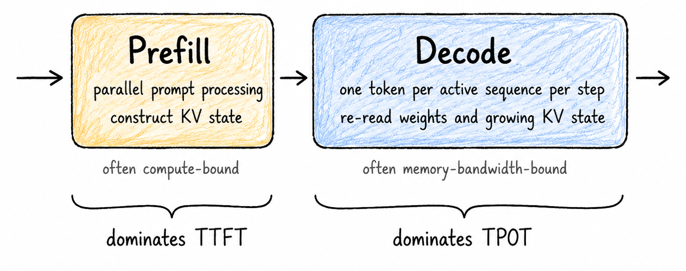

*Figure: Prefill and decode have different optimization targets.*

A useful latency decomposition is


and for N_o output tokens,


The four measurements that should appear on every local dashboard are:

- **TTFT**: Time from request submission to the first visible output token. It includes queueing and scheduling, not only prefill.
- **TPOT/ITL**: Mean or percentile time between output tokens after generation begins.
- **Throughput**: Aggregate prompt and output tokens processed per second across all active users.
- **Memory**: Peak resident memory, cache growth, swap use, and model coexistence pressure.

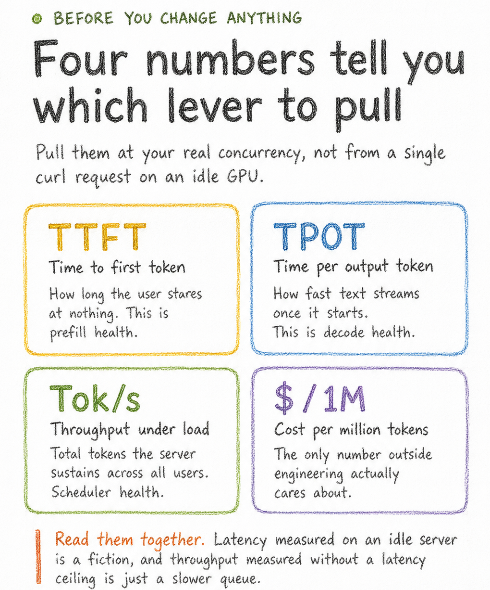

*Figure: A compact reminder of the optimization dashboard: TTFT, TPOT, throughput, and spend should be read together, with memory pressure tracked alongside them on Apple Silicon.*

## Why Apple unified memory changes the tuning problem

Discrete-GPU servers normally separate system RAM and device VRAM. Apple Silicon presents one unified physical memory pool to the CPU and GPU. This avoids explicit host-to-device model copies, but it also means model weights, KV state, Metal working buffers, the inference process, macOS, and every foreground application compete for the same finite pool.

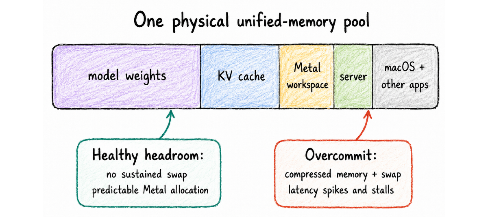

*Figure: On a Mac, model selection, context length, concurrency, and other applications all consume the same memory budget.*

A conservative capacity model is


For a conventional transformer, a rough unquantized KV estimate is


where B is the number of live sequences, L is cached tokens per sequence, n_ell is the number of layers, n_kv is the number of KV heads, d_h is head dimension, and b is bytes per stored element. Architectures with sliding windows, recurrent state, MLA, shared cache structures, or hybrid attention require model-specific accounting.

> **Do not confuse ``the model fits'' with ``the service is stable''.** A model that loads with one
> short prompt may still fail under a long prompt, a second concurrent sequence, another loaded model,
> a native IDE build, or a cache restoration. Leave material headroom and verify swap remains near
> zero during the full workload.

## Concurrency is a scheduler problem

At concurrency one, raw token speed dominates. Under multiple users, the server must interleave prefill and decode, allocate and reclaim KV blocks, isolate sequences, and prevent a large prompt from monopolizing execution. Continuous batching raises device utilization by admitting and removing requests dynamically. Chunked prefill divides large prompt work into scheduler-sized units so active decodes can continue between chunks.

These mechanisms matter even on one Mac because the GPU is shared by all requests. The important relationship is not "largest batch is fastest," but a constrained optimization:


# The Mac inference stack

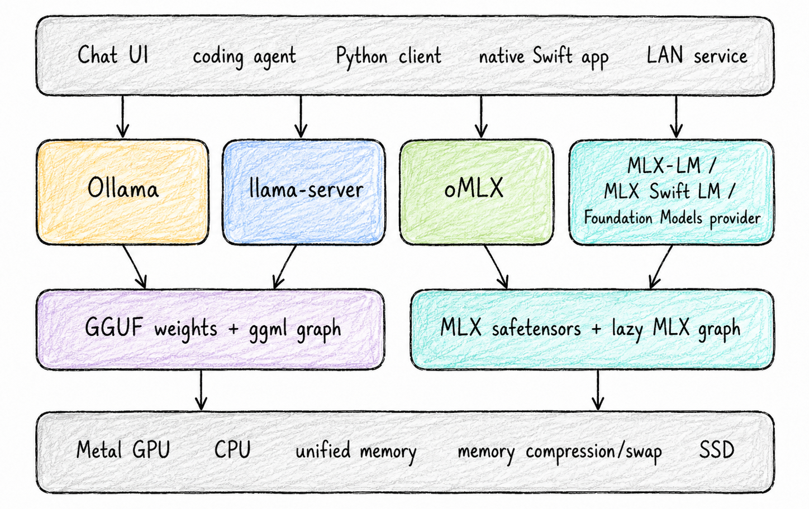

*Figure: Mac inference choices differ at the operational layer, model format, scheduler, and application boundary, while sharing the same physical machine.*

## What each stack optimizes for

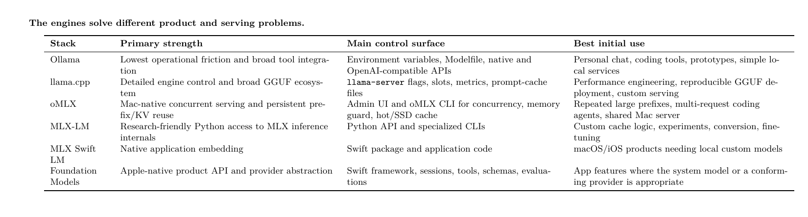

*Table: The engines solve different product and serving problems.*

# Technique-to-engine implementation matrix

The following matrix maps the techniques in the source carousel to real Mac implementations. "Partial" means that support depends on the selected engine path, model architecture, API layer, or current release.

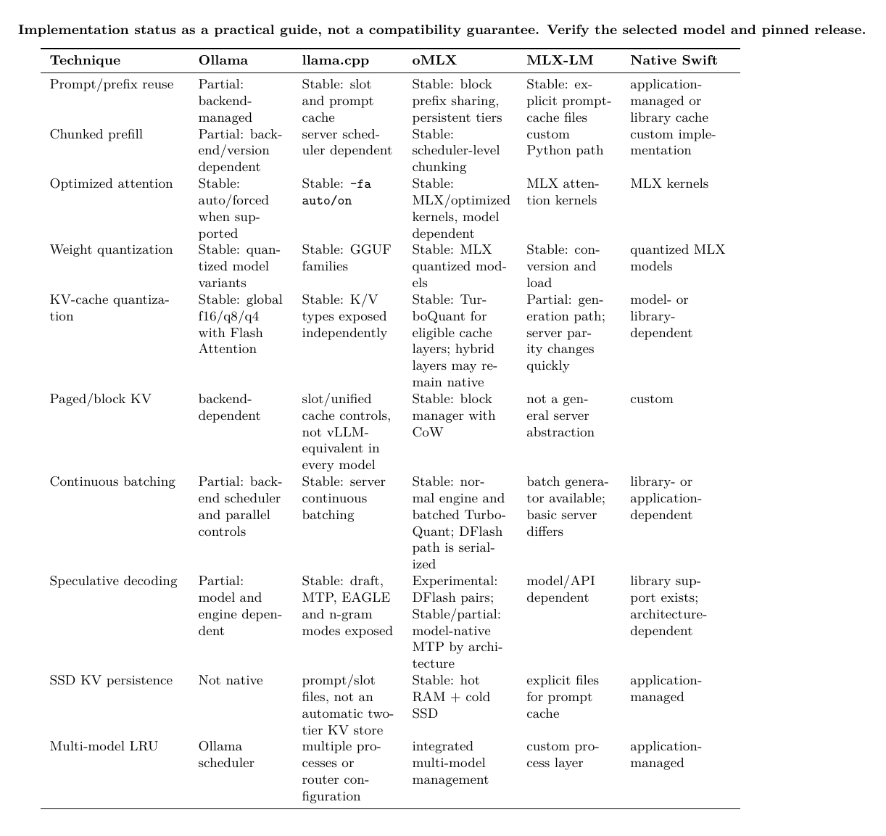

*Table: Implementation status as a practical guide, not a compatibility guarantee. Verify the selected model and pinned release.*

> **The same label can hide different semantics.** "Prompt cache," "paged cache," and "continuous
> batching" are not guaranteed to mean identical data structures or scheduling policies across
> engines. Compare observed behavior and metrics, not feature names alone.

# Ollama on macOS

## Why choose it

Ollama is the fastest route from a Mac to a stable local endpoint. It manages model pulls, templates, loading and unloading, a native API, an OpenAI-compatible API, and integrations with common tools. On macOS, Apple Silicon acceleration is included in the application. Ollama exposes concurrency, model residency, context, Flash Attention, and KV-cache precision through environment variables and request parameters [8, 9, 10].

## Install and verify

Install the current macOS application from the official distribution, start it, then verify the CLI and service:

```bash
ollama --version
ollama list
ollama ps
curl -s http://127.0.0.1:11434/api/tags | python3 -m json.tool
```

Pull and run a model appropriate to the machine:

```bash
ollama pull <model:quantization>
ollama run <model:quantization>
```

The exact model tag matters. Two tags with the same model family may use different parameter counts, quantization levels, context metadata, or backend implementations.

## Mac environment configuration

When Ollama runs as a macOS application, set persistent environment variables with `launchctl`, quit the menu-bar application, and restart it [9].

```bash
launchctl setenv OLLAMA_FLASH_ATTENTION 1
launchctl setenv OLLAMA_KV_CACHE_TYPE q8_0
launchctl setenv OLLAMA_CONTEXT_LENGTH 16384
launchctl setenv OLLAMA_NUM_PARALLEL 1
launchctl setenv OLLAMA_MAX_LOADED_MODELS 1
launchctl setenv OLLAMA_KEEP_ALIVE -1
```

Reset an override with, for example:

```bash
launchctl unsetenv OLLAMA_NUM_PARALLEL
```

> **Safe starting profile.** Begin with one loaded model, one parallel request, q8 KV cache, and a
> context that reflects the real workload rather than the model's advertised maximum. Increase
> parallelism only after measuring memory at the longest expected context. Ollama notes that memory
> demand grows with parallelism and context length [9].

## Context, residency, and queueing

Set context per request when the API supports it:

```bash
curl http://127.0.0.1:11434/api/generate -d '{
  "model": "<model>",
  "prompt": "Explain continuous batching in two paragraphs.",
  "stream": false,
  "keep_alive": "30m",
  "options": {"num_ctx": 16384, "temperature": 0.2}
}'
```

Use `ollama ps` to inspect loaded models and processor placement. Keep-alive removes repeated model-load latency, but a permanently resident large model reduces memory available to the rest of the system.

## Use Ollama's native timings

The final native API response includes nanosecond timing counters and token counts, including prompt evaluation and generation metrics [10]. Derive:


Client-observed TTFT must still be measured at the socket because server counters do not include all client, queueing, and streaming effects.

## What Ollama does not expose cleanly

Ollama intentionally hides many engine details. That is useful operationally but can make causality harder to establish. Use llama.cpp or a direct MLX stack when you need independent K/V cache types, explicit prompt-cache files, slot management, detailed scheduler controls, experimental speculative modes, or custom model internals.

Recent Ollama releases include evolving MLX-related build and engine work. Treat GGUF/llama.cpp-backed and MLX-backed execution as distinct paths: verify actual parallel-request behavior and metrics for the exact release instead of assuming feature parity.

# llama.cpp with Metal

## Why choose it

llama.cpp is the most controllable general-purpose GGUF implementation on macOS. Metal support is integrated, the server exposes an OpenAI-compatible endpoint, and current server options include continuous batching, multiple parallel slots, Flash Attention, K/V cache data types, RAM prompt cache, slot save/restore, metrics, and multiple speculative-decoding modes [11, 12].

## Build and identify the exact revision

```bash
git clone https://github.com/ggml-org/llama.cpp.git
cd llama.cpp
cmake -B build -DGGML_METAL=ON -DCMAKE_BUILD_TYPE=Release
cmake --build build --config Release -j

./build/bin/llama-server --version
./build/bin/llama-server --help > llama-server-help.txt
./build/bin/llama-bench --help > llama-bench-help.txt
```

Pin a commit for repeatable benchmarks. A release-to-release performance comparison without the exact revision, model checksum, and command line is not reproducible.

## A strong Mac server baseline

```bash
MODEL="$HOME/models/model.gguf"
CACHE_DIR="$HOME/.cache/llama-slots"
mkdir -p "$CACHE_DIR"

./build/bin/llama-server \
  -m "$MODEL" \
  -ngl all \
  -fa auto \
  -c 16384 \
  -np 1 \
  -cb \
  -ctk q8_0 \
  -ctv q8_0 \
  -cram 8192 \
  --cache-idle-slots \
  --slot-save-path "$CACHE_DIR" \
  --metrics \
  --host 127.0.0.1 \
  --port 8080
```

Meaning of the principal controls:

- `-ngl all`: request full Metal offload where supported and where the model fits.
- `-fa auto`: use Flash Attention when supported by the selected model and backend.
- `-c`: total context allocation policy; inspect current server help because slot/context semantics evolve.
- `-np`: maximum parallel slots.
- `-cb`: continuous batching.
- `-ctk/-ctv`: K and V cache storage types. q8 is a conservative first compression step.
- `-cram`: reusable prompt-cache capacity in RAM.
- `–slot-save-path`: persistence path for explicit slot snapshots.
- `–metrics`: enable server metrics for observability.

## Prompt reuse and slot persistence

Prompt reuse is valuable for coding agents because a large system prompt, tool schema, repository instructions, and stable conversation prefix may recur across requests. There are three distinct layers:

1. Automatic in-memory prefix reuse inside a live server slot.
2. A server RAM cache sized with `-cram`.
3. Explicit slot save/restore to disk through server endpoints and `–slot-save-path`.

Do not assume cache reuse merely because consecutive prompts look similar. Chat templates, timestamps, reordered tools, whitespace, or inserted messages can invalidate the shared prefix. Record the evaluated-token count and server logs for the second request.

## Concurrency and continuous batching

Increase slots one step at a time:

```bash
# Baseline
-np 1 -cb

# Then test
-np 2 -cb

# Only after measuring p95 latency and memory
-np 4 -cb
```

On unified memory, each active sequence expands cache demand. A configuration that improves aggregate throughput can reduce per-user stream speed or trigger swap. Keep both aggregate output tok/s and per-request TPOT in the benchmark.

## Speculative decoding

Current llama.cpp server builds expose several families, including a smaller draft model, model-native MTP/EAGLE paths where supported, and n-gram drafting [12]. A generic draft-model experiment is:

```bash
./build/bin/llama-server \
  -m "$TARGET_MODEL" \
  --spec-type draft-simple \
  --spec-draft-model "$DRAFT_MODEL" \
  --spec-draft-n-max 4 \
  -ngl all \
  --spec-draft-ngl all \
  -c 16384 -np 1 -cb -fa auto
```

The draft model also consumes memory and bandwidth. Speculation can lose at high batch occupancy because the target GPU work was already saturated. Keep it only when accepted draft tokens and end-to-end latency improve on the real workload.

# oMLX: Mac-native serving with tiered KV cache

## Why it is different

oMLX targets the gap between a simple single-user MLX server and a production-style local scheduler. Its architecture includes continuous batching, block-based KV management, prefix sharing with Copy-on-Write, multi-model management, and a hot RAM plus cold SSD cache that can restore matching prefixes across requests and restarts [1].

> **Version baseline used in this guide.** The configuration examples below target the latest stable
> oMLX release available on 30 July 2026, `v0.5.3`. The newer `v0.5.4.dev1` build is a pre-release and
> changes DFlash benchmarking and model coverage; do not mix results across those versions without
> recording the exact build [2].

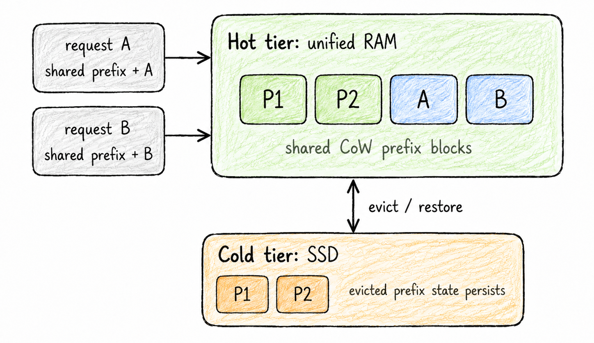

*Figure: oMLX uses a block-oriented hot/cold cache rather than recomputing every stable prefix.*

## Install

The project documents both Homebrew and source installs [1]:

```bash
brew tap jundot/omlx https://github.com/jundot/omlx
brew install omlx
omlx --version
```

Or from source in an isolated environment:

```bash
git clone https://github.com/jundot/omlx.git
cd omlx
python3 -m venv .venv
source .venv/bin/activate
pip install -e .
omlx --help
```

The current project baseline is Apple Silicon with macOS 15 or newer; source installations use supported Python 3.11–3.13 versions. Some optimized native kernels may require a complete Xcode installation when building from source, while packaged releases may include precompiled components. Verify the active kernel path and the exact oMLX version rather than assuming either one [1].

## A conservative server profile

```bash
MODEL_DIR="$HOME/models/mlx"
CACHE_DIR="$HOME/.omlx/cache"
mkdir -p "$MODEL_DIR" "$CACHE_DIR"

omlx serve \
  --model-dir "$MODEL_DIR" \
  --memory-guard safe \
  --paged-ssd-cache-dir "$CACHE_DIR" \
  --hot-cache-max-size 20% \
  --max-concurrent-requests 4
```

The exact memory-guard names and CLI surface can change, so capture `omlx –version` and `omlx serve –help` with benchmark results. Start below the desired concurrency, then increase only after a cold-cache and warm-cache test.

## When oMLX has a structural advantage

The largest benefit appears when requests share expensive prefixes: coding agents with stable repository instructions, tool schemas, long policy blocks, retrieval corpora reused across questions, or multiple sessions based on the same documents. The cold tier converts SSD capacity into avoided future prefill, but restoration still has I/O and materialization cost. Measure:

- cold first request;
- second request with an identical prefix;
- process restart followed by prefix restoration;
- prefix mutation near the beginning versus near the end;
- concurrent decode while a new long prompt is prefilling.

> **SSD cache is not free memory.** A persistent KV cache adds disk writes, index management,
> restoration latency, version compatibility, and privacy considerations. Bound its size, place it on
> an appropriate volume, and define deletion and encryption policies for sensitive prompts.

## DFlash: block-diffusion speculative decoding

### What DFlash is—and what it is not

DFlash, from Z Lab, is a *speculative decoding algorithm*; it is not a telemetry system, a cache quantizer, or another name for FlashAttention. A small, separately trained *block-diffusion draft model* proposes a block of candidate tokens in parallel. The target autoregressive model then verifies that block in one forward pass, accepts the longest valid prefix, rolls back rejected draft state, and repeats. The output is therefore governed by the target verifier, while the speedup depends on how many draft tokens are accepted per verification cycle rather than on the nominal draft-block length alone [4, 5].

The main physical objective is to reduce the number of sequential target-model decode steps. DFlash is most attractive when the target is expensive, the draft is substantially cheaper, and the acceptance length remains high. It can lose its advantage when the prompt is long, the target verification pass dominates, the draft checkpoint is poorly matched, or concurrent traffic would benefit more from continuous batching.

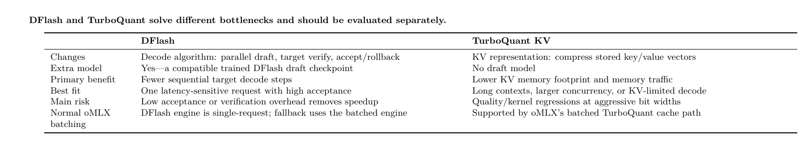

*Table: DFlash and TurboQuant solve different bottlenecks and should be evaluated separately.*

### What oMLX implements

In oMLX, DFlash is an experimental per-model engine backed by the MLX DFlash runtime. The short-context path loads both the target and draft, captures target hidden state during prefill, drafts a block (commonly 16 candidates), verifies it with the target, and emits accepted tokens. The documented stable integration serializes DFlash requests rather than using normal continuous batching. When an explicit context threshold is exceeded, oMLX can route the entire request to its normal `BatchedEngine` or `VLMBatchedEngine`, where paged KV, prefix sharing, continuous batching, and the normal SSD tier apply [3].

A DFlash target requires a matching draft checkpoint and compatible target-family integration. Select the pair from the oMLX model-settings UI rather than guessing a checkpoint from its name. The stable 0.5.3 line covers supported Qwen and Gemma 4 pairs; the 0.5.4 development release adds Laguna S-2.1 DFlash support, which is one reason results from the development build should be labelled separately [2].

Recent oMLX builds also expose a DFlash-private prefix cache. It is separate from the ordinary paged cache because a reusable snapshot must preserve not only target KV state but also DFlash draft/recurrent state. The L1 cache is in unified memory; the optional L2 cache uses the global oMLX SSD cache directory. Long-context fallback still uses the normal oMLX cache stack.

### Configure DFlash in oMLX 0.5.3

First start oMLX with a persistent cache directory if DFlash L2 snapshots or normal fallback SSD caching will be used:

```bash
mkdir -p "$HOME/.omlx/cache"
omlx serve \
  --model-dir "$HOME/models/mlx" \
  --paged-ssd-cache-dir "$HOME/.omlx/cache" \
  --hot-cache-max-size 20% \
  --max-concurrent-requests 4
```

Then open `http://localhost:8000/admin`, select the *target* model, and use *Model Settings → Advanced Settings → Experimental Features → DFlash*:

1. Enable DFlash and select the exact matching Z-Lab/dflash-mlx draft checkpoint offered by the UI.
2. Begin with draft quantization disabled. After a correctness and acceptance baseline, test 4-bit draft weights, 16-bit activations, and group size 64. This draft quantization is *not* TurboQuant KV.
3. Set an explicit DFlash context threshold, for example 4096 tokens, if long prompts should fall back to the regular batched engine. Older integration notes described an environment default of 4096; the stable per-model setting may be unset, so configure the threshold explicitly instead of relying on an implicit default.
4. Keep the in-memory DFlash prefix cache enabled. A conservative initial limit is four entries and 8 GiB. Enable DFlash SSD cache only after the L1 path and normal fallback path are correct.
5. Keep the initial draft window at 1024, sink at 64, and verification mode at `adaptive`; change one control at a time.
6. Save and reload the model. Confirm the log identifies the DFlash engine, the selected draft, and either DFlash execution or a context fallback.

For reproducible automation, the same per-model controls are persisted in `string /.omlx/model_settings.json`. The following is an illustrative 0.5.3 excerpt; the object key must exactly match the model identifier used by the local library:

```bash
{
  "version": 1,
  "models": {
    "<target-model-id>": {
      "dflash_enabled": true,
      "dflash_draft_model": "<matching-dflash-draft-id>",
      "dflash_draft_quant_enabled": false,
      "dflash_max_ctx": 4096,
      "dflash_in_memory_cache": true,
      "dflash_in_memory_cache_max_entries": 4,
      "dflash_in_memory_cache_max_bytes": 8589934592,
      "dflash_ssd_cache": false,
      "dflash_draft_window_size": 1024,
      "dflash_draft_sink_size": 64,
      "dflash_verify_mode": "adaptive"
    }
  }
}
```

Prefer the admin UI; direct file editing is version-sensitive. Stop or unload the model before editing, back up the file, and reload after the change.

### How to validate DFlash

Record target-only and DFlash runs with the same target revision, prompt, sampler, stop conditions, and output cap. At minimum capture total tokens/s, TPOT, draft acceptance ratio, average accepted tokens per cycle, cycle count, peak memory, and output equality for greedy decoding. Test a short prompt below the threshold, a long prompt above it, cancellation, a tool-call/JSON suite, and two simultaneous clients. Two clients are especially important because the DFlash path is serialized even though the fallback engine can batch requests. Treat the multi-fold speedups reported by the DFlash authors as research results on supported pairs, not as a guaranteed Mac result [4, 5].

> **DFlash compatibility boundary.** DFlash and native MTP are alternative speculative engines and
> should not be enabled together. Do not assume that the ordinary oMLX TurboQuant toggle is applied
> inside the DFlash engine: the DFlash target/draft runtime and its private snapshots form a separate
> cache path. Benchmark DFlash first with TurboQuant disabled, then benchmark TurboQuant on the normal
> batched engine as an independent experiment.

## TurboQuant KV: online compression of attention state

### The Google method

TurboQuant is an online, data-oblivious vector quantization method from Google Research. It first applies a random rotation that spreads outliers and makes high-dimensional coordinates follow a concentrated distribution, then applies near-optimal scalar quantizers. For inner-product preservation, the full method can add a second residual stage using a 1-bit Quantized Johnson–Lindenstrauss transform. In LLM serving, the relevant application is compressing the *dynamic KV cache*; it does not quantize model weights, and it is orthogonal to PagedAttention, which manages allocation and fragmentation rather than numeric precision [6, 7].

The paper reports quality-neutral results near 3.5 bits per channel on its evaluated models and tasks, with marginal degradation at 2.5 bits. These are study results, not a promise for every architecture, context distribution, tool schema, or Metal kernel. A production configuration must still re-run long-context retrieval and structured-output tests.

### oMLX's implementation boundary

oMLX uses the TurboQuant implementation supplied through the MLX/VLM cache stack and adds a batched wrapper so quantized cache state can participate in continuous batching and prefix-cache operations. Only compatible global `KVCache` layers are converted; rotating, sliding-window, recurrent, pooling, or other hybrid cache types may remain in their native representation. Consequently, memory reduction can be smaller than the simple ratio (16/b) suggested by the selected bit width.

The current per-model controls are:

- **`turboquant_kv_enabled`**: Enables the TurboQuant-derived KV cache path. Default: false.
- **`turboquant_kv_bits`**: Effective bit setting: 2, 2.5, 3, 3.5, 4, 6, or 8. Fractional settings use asymmetric integer codecs internally; in the 0.5.3 wrapper, 3.5 maps to 3-bit keys and 4-bit values. This mapping is an oMLX implementation detail, not the definition of the Google algorithm.
- **`turboquant_skip_last`**: Leaves the final eligible cache layer unquantized. The conservative default is true.

The exact codec path is version-specific: the Google paper defines both MSE-optimized and inner-product-corrected variants, while an oMLX/MLX build may use the supported MSE or product-state implementation for that model. Record the version and inspect conversion logs instead of assuming every theoretical TurboQuant stage is active.

### Configure TurboQuant KV in oMLX 0.5.3

Unload DFlash for the target model, open the model's admin settings, and enable *TurboQuant KV Cache*. Use the following staged sequence:

1. Run an unquantized KV baseline with the same model, context, prompt, and concurrency.
2. Enable 8-bit TurboQuant with `skip last` on. This is the least aggressive functional check.
3. Test 4-bit with `skip last` on. It is the practical compression baseline for long-context serving.
4. Test 3.5-bit only after 4-bit quality is acceptable; test 3, 2.5, or 2 bits only with a dedicated quality gate.
5. Save and reload the model. Confirm the server log reports how many cache layers were converted and which remained dense/native.
6. Repeat concurrency 1, 2, and 4; a setting that saves cache memory can still lose performance if packing/dequantization kernels dominate on that model or chip.

Equivalent persisted settings are:

```bash
{
  "version": 1,
  "models": {
    "<target-model-id>": {
      "turboquant_kv_enabled": true,
      "turboquant_kv_bits": 4.0,
      "turboquant_skip_last": true
    }
  }
}
```

Stable oMLX 0.5.2/0.5.3 contains important fixes for continuous-batch row compaction, mixed dense/TurboQuant prefix-cache restoration, cache-width signatures, and native-MTP compatibility. Use 0.5.3 or a deliberately tested later stable release rather than copying results from early 0.3/0.4 builds [2].

### Validation and combinations

Measure peak KV allocation separately from total process memory: weights and Metal workspaces can hide cache savings in a short benchmark. Use contexts large enough for KV to be material, verify a prefix-cache hit and a post-restart SSD restoration, and test early-, middle-, and late-context retrieval. For coding agents, add exact JSON/tool-call validity and deterministic repository questions.

TurboQuant can be combined with normal oMLX continuous batching and, in the stable line, supported native MTP paths after the relevant compatibility fixes. It should not be described as a DFlash option. DFlash draft quantization compresses the *draft model*; TurboQuant compresses the normal engine's *KV cache*. Evaluate the two modes as separate branches and choose from the measured bottleneck: DFlash for target-step latency, TurboQuant for KV capacity/bandwidth.

# MLX-LM: direct native Python control

## Why choose it

MLX is Apple's array framework designed for Apple Silicon, with unified-memory semantics and Python, C++, C, and Swift APIs. MLX-LM adds language-model loading, generation, quantization, prompt caching, batch generation, and fine-tuning [13, 14].

Choose MLX-LM when you need to modify the inference loop, inspect cache objects, add a custom verifier, prototype a speculative decoder, convert or fine-tune models, or create an experiment that a packaged server does not expose.

## Install and generate

```bash
python3 -m venv .venv-mlx
source .venv-mlx/bin/activate
python -m pip install --upgrade pip
pip install mlx-lm

mlx_lm.generate \
  --model mlx-community/<model>-4bit \
  --prompt "Explain the difference between TTFT and TPOT." \
  --max-tokens 256
```

## Convert and quantize a model

```bash
mlx_lm.convert \
  --hf-path <source-model-or-path> \
  --mlx-path "$HOME/models/mlx/<output-name>" \
  -q
```

Record the source revision, quantization settings, tokenizer files, and generated configuration. "4-bit" alone is not enough to reproduce conversion quality.

## Explicit prompt caching

MLX-LM documents an explicit reusable prompt-cache workflow [14]:

```bash
cat stable_context.txt | mlx_lm.cache_prompt \
  --model mlx-community/<model>-4bit \
  --prompt - \
  --prompt-cache-file stable_context.safetensors

mlx_lm.generate \
  --prompt-cache-file stable_context.safetensors \
  --prompt "\nNow answer the current question." \
  --max-tokens 256
```

This is excellent for deterministic experiments and repeated static corpora. It is not equivalent to a dynamic multi-user prefix tree or a server-managed hot/cold cache.

## Bound the live KV window

For generation tools that expose it, `–max-kv-size` creates a rotating fixed-size cache. Lower values reduce memory but remove older attention state and can damage quality on tasks that need early context [14].

```bash
mlx_lm.generate \
  --model mlx-community/<model>-4bit \
  --prompt-file long_prompt.txt \
  --max-kv-size 4096 \
  --max-tokens 512
```

Treat this as a quality/performance trade rather than a transparent memory optimization. Test retrieval from the beginning, middle, and end of the intended context.

## The basic MLX HTTP server

```bash
mlx_lm.server \
  --model mlx-community/<model>-4bit \
  --host 127.0.0.1 \
  --port 8080
```

The official documentation describes the server as a basic OpenAI-like API and explicitly does not recommend it as a production security boundary [15]. Feature parity between `mlx_lm.generate` and `mlx_lm.server` changes over time; for example, cache-window and KV-quantization controls have historically appeared in generation before the server. Verify the installed server help and avoid copying flags from an issue or unreleased pull request.

## A minimal custom Python generation loop

```python
from mlx_lm import load, generate

MODEL = "mlx-community/<model>-4bit"
model, tokenizer = load(MODEL)

prompt = tokenizer.apply_chat_template(
    [{"role": "user", "content": "Give three Mac inference tuning rules."}],
    tokenize=False,
    add_generation_prompt=True,
)

text = generate(
    model,
    tokenizer,
    prompt=prompt,
    max_tokens=256,
    verbose=True,
)
print(text)
```

For a reusable system, wrap this with explicit model loading, cancellation, timeout handling, deterministic test prompts, memory-pressure checks, and a versioned chat template.

# Native Swift paths

## MLX Swift LM for custom local models

MLX Swift LM is the native Swift package for LLM and VLM applications backed by MLX. It supports model loading through integration packages, multiple architectures, quantized models, fine-tuning, and evolving batch/speculative features [16].

A package declaration should pin a known compatible version rather than tracking the main branch:

```swift
// Package.swift fragment
.package(
    url: "https://github.com/ml-explore/mlx-swift-lm",
    .upToNextMajor(from: "3.31.3")
)
```

The exact modules and downloader/tokenizer integration are version-specific. Start from the current official examples, especially the basic evaluation and chat applications, then minimize the dependency set for the product.

A native application should separate:

1. model acquisition and checksum verification;
2. model loading and memory reservation;
3. session/cache ownership;
4. asynchronous token streaming;
5. cancellation and app lifecycle;
6. tool execution and permission boundaries;
7. telemetry that does not leak prompts.

## Apple Foundation Models framework

The Foundation Models framework provides a native Swift API for Apple's models and, in the 2026 platform generation, a provider abstraction for other language-model providers that conform to the framework protocol [17, 18]. This is an application architecture, not a replacement for a high-throughput local server.

Use it when the product benefits from native sessions, typed structured output, tools, availability handling, and Apple platform integration. Use MLX Swift LM or a local HTTP server when the application requires a specific downloaded model, model-family control, GGUF compatibility, or server-style concurrency.

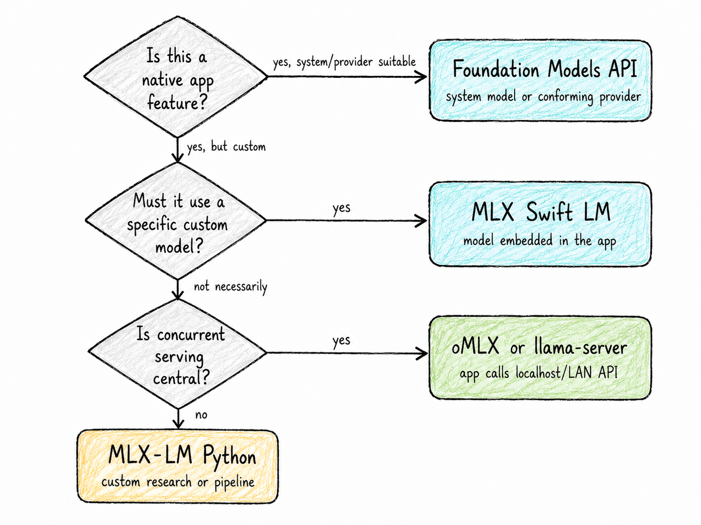

*Figure: Native API choice depends on the application boundary and model-control requirement.*

# Selecting the engine

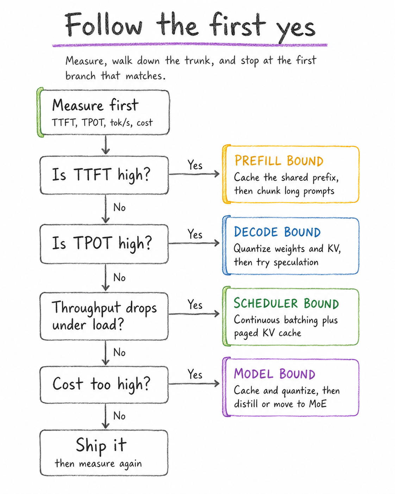

*Figure: Choose an engine from the workload, not from an isolated tokens-per-second screenshot.*

# Practical memory profiles

The following are conservative starting heuristics, not guarantees. Model architecture, quantization format, context, batch size, workspace, macOS version, and foreground applications can move the boundary substantially.

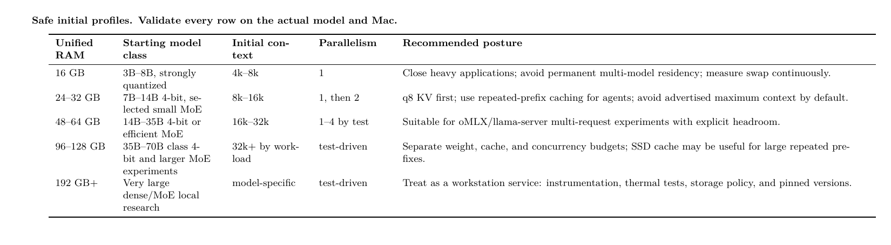

*Table: Safe initial profiles. Validate every row on the actual model and Mac.*

## Choosing quantization

Move down the precision ladder only when a measured constraint requires it:

1. Select a known-good weight quantization and evaluate task quality.
2. Use f16 KV for a correctness baseline when memory permits.
3. Test q8 KV as the first cache compression.
4. Test q4 or more aggressive/model-specific cache schemes only with long-context and tool-use evaluations.
5. Never compare speed while silently changing chat template, sampler, context, output length, or model revision.

# Workload recipes

## Single-user chat and coding assistant

**Start with Ollama** when integration speed matters. Keep one model loaded, one request in flight, enable supported Flash Attention, test q8 KV, and size context to the actual repository or conversation. Switch to llama.cpp when you need explicit cache evidence, slot snapshots, or speculative modes.

## Coding agent with a large stable prefix

The stable prefix may include system instructions, tool declarations, repository map, policy, and build/test commands. The order of preference is:

1. Remove duplicated or stale tokens.
2. Stabilize byte-identical prefix ordering.
3. Confirm cache hits from evaluated-token counts.
4. Use llama.cpp slot/prompt cache for one or a few sessions.
5. Use oMLX when persistent prefix reuse and concurrent requests are central.

For the user's DFlash/Headroom/Kowalski-style chain, treat the local model endpoint, memory guard, verifier, and agent supervisor as separate failure domains. A fast decoder does not compensate for uncontrolled context accumulation or repeated invalid tool calls.

## Small team sharing one Mac

Use oMLX or llama-server rather than a single-user CLI. Bind to localhost by default; when exposing to a LAN, place authentication and TLS in a reverse proxy, restrict firewall access, isolate model/cache directories, and avoid treating a development server as a security boundary.

Benchmark concurrency 1, 2, 4, and 8 with a latency ceiling. Stop increasing concurrency when p95 TPOT or TTFT violates the user experience, even if aggregate tok/s still rises.

## Native macOS application

Use the Foundation Models framework when its model/provider abstraction and platform semantics match the feature. Use MLX Swift LM for a pinned custom local model. Use a localhost oMLX/llama.cpp service when model lifecycle and inference should remain outside the application process.

# Benchmarking methodology

## What the companion benchmark measures

The included `benchmark_mac_backends.py` supports:

- Ollama's native streaming chat endpoint, including final server timings;
- OpenAI-compatible streaming endpoints from llama.cpp, oMLX, MLX-LM, and Ollama;
- concurrency, repeated prompts, warmup, output limit, timeout, and JSON output;
- client TTFT, total latency, approximate post-first-token rate, and aggregate throughput.

## Minimum test matrix

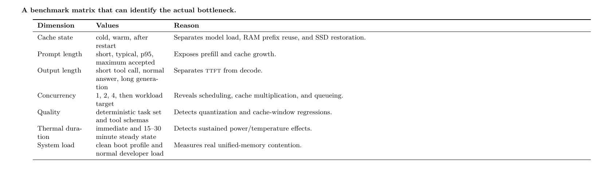

*Table: A benchmark matrix that can identify the actual bottleneck.*

## Run examples

Ollama native API:

```bash
python benchmark_mac_backends.py \
  --provider ollama \
  --base-url http://127.0.0.1:11434 \
  --model <ollama-model> \
  --prompts prompts.example.jsonl \
  --concurrency 1,2,4 \
  --repetitions 3 \
  --max-tokens 256 \
  --num-ctx 16384 \
  --output results-ollama.json
```

llama.cpp, oMLX, or MLX-LM OpenAI-compatible API:

```bash
python benchmark_mac_backends.py \
  --provider openai \
  --base-url http://127.0.0.1:8080/v1 \
  --model <served-model-name> \
  --prompts prompts.example.jsonl \
  --concurrency 1,2,4 \
  --repetitions 3 \
  --max-tokens 256 \
  --output results-openai.json
```

## Mac instrumentation

Run the included probe before and during the benchmark:

```bash
./mac_probe.sh > machine-state-before.txt
python benchmark_mac_backends.py ...
./mac_probe.sh > machine-state-after.txt
```

Useful built-in observations include `vm_stat`, `memory_pressure`, `sysctl vm.swapusage`, process resident memory, and system hardware reports. For controlled experiments, Apple's `powermetrics` can provide privileged power/thermal sampling; run it only when you understand the required privileges and sampler availability on the machine.

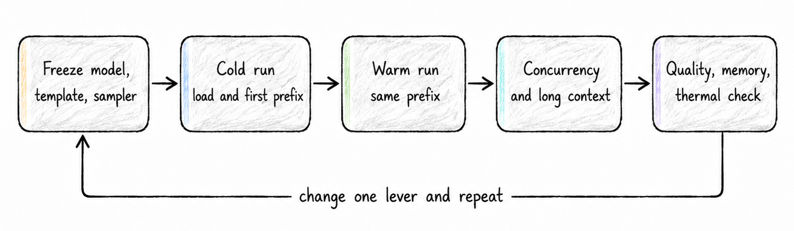

*Figure: The benchmark loop isolates one optimization at a time.*

# Symptom-to-first-move guide

The table in this section is the operational version of the visual cheat sheet in the cheat-sheet figure below: start from the observed symptom, test the smallest plausible lever first, and change only one variable at a time.

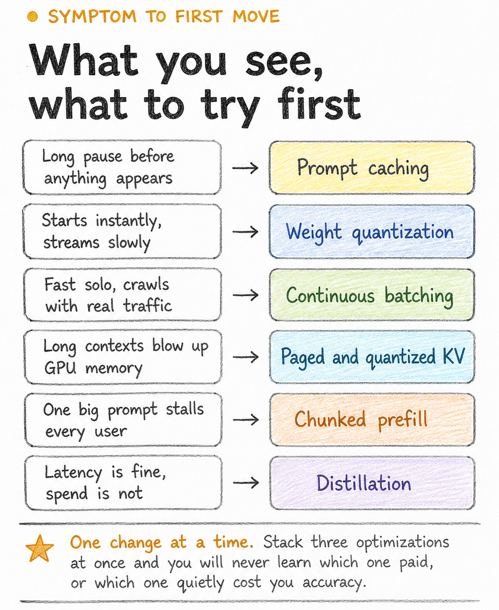

*Figure: A handwritten quick-reference plate that complements the detailed symptom table below.*

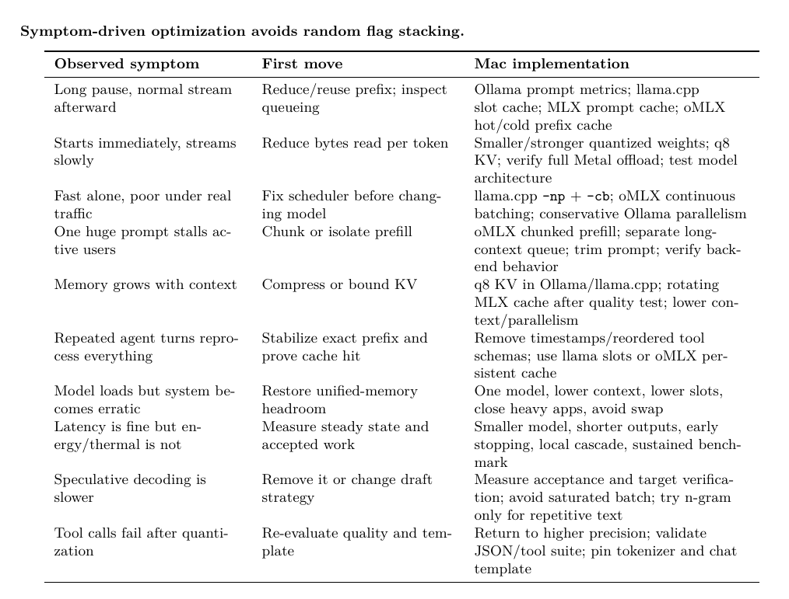

*Table: Symptom-driven optimization avoids random flag stacking.*

# Troubleshooting

## The process is using CPU instead of Metal

- Confirm the binary is arm64 and not running through an unintended translation path.
- For llama.cpp, inspect startup logs and use `–list-devices`; verify `-ngl all` is accepted.
- For Ollama, inspect `ollama ps` and application logs.
- For MLX, confirm imports and a supported Apple Silicon/macOS combination.

## The first request is much slower

Separate model download, model load, kernel compilation/warmup, cold prompt prefill, and queue startup. Run one explicit warmup, then report both cold and warm numbers. Do not hide the cold path when the product frequently unloads models.

## The second request is not faster

The prefix may differ byte-for-byte, the model may use a cache type that limits reuse, the request may land in a different slot, or the engine may have evicted state. Compare evaluated prompt tokens and enable appropriate server logs. Test with a minimal literal identical prefix before blaming the model.

## Memory pressure and swap appear

Reduce in this order: other resident models, parallel slots, context allocation, output reservation, KV precision, weight size. Moving directly to aggressive weight quantization can unnecessarily damage quality when the real problem is four cache replicas.

## Long-context quality degrades

Check whether a rotating cache, sliding-window architecture, RoPE scaling, cache quantization, or prompt truncation is active. Build a retrieval test that asks for facts near the start, middle, and end. A server accepting 128k tokens does not prove it can use all 128k reliably.

## Server flags have changed

These projects evolve weekly. Save version and help output with every benchmark:

```bash
ollama --version
llama-server --version
llama-server --help > help-llama.txt
omlx --version
omlx serve --help > help-omlx.txt
mlx_lm.server --help > help-mlx-server.txt
python -m pip freeze > python-lock.txt
```

# Production checklist

1. Pin engine revision, model revision, tokenizer, quantization, template, and command line.
2. Prove no sustained swap at p95 prompt length and target concurrency.
3. Measure cold, warm, and post-restart cache behavior.
4. Record p50/p95/p99 TTFT and total latency, not only average tok/s.
5. Add correctness tests for tool calls, structured output, long-context retrieval, and refusal/policy behavior.
6. Bind to localhost unless a documented network security layer is present.
7. Treat prompt/KV caches as sensitive data and define retention, deletion, and disk-encryption policy.
8. Bound queues, request size, output tokens, concurrent requests, and loaded models.
9. Implement cancellation and verify memory/cache cleanup after aborted requests.
10. Run a 30-minute sustained thermal test on the exact Mac enclosure and ambient conditions.
11. Re-run the suite after every engine or model update.
12. Optimize cost per accepted result, not token speed in isolation.

# Recommended staged adoption

1. **Operational baseline**: Ollama, one model, one request, representative prompts, native timing metrics.
2. **Transparent baseline**: same or equivalent model in llama.cpp; record prompt processing and generation rates with explicit Metal and cache settings.
3. **Agent prefix experiment**: stabilize the system/tool prefix; compare cold, warm, and restored cache behavior.
4. **Concurrent serving**: test llama.cpp slots and oMLX continuous batching at the same latency ceiling.
5. **Native specialization**: use MLX-LM or MLX Swift LM only when custom loop or product integration creates measurable value.
6. **Advanced decode**: add speculative decoding, more aggressive KV quantization, or experimental kernels last, one change at a time.

> **Bottom line.** On a Mac, the decisive optimization is usually not a mysterious kernel flag. It is
> matching model bytes, KV growth, prefix reuse, and scheduler policy to one unified-memory budget.
> Ollama minimizes operational work; llama.cpp maximizes explicit control; oMLX targets concurrent and
> cache-intensive Mac serving; MLX-LM and MLX Swift LM provide the native path when you need to own
> the inference loop or application boundary.

appendix

# Companion files

The bundle contains:

- **`benchmark_mac_backends.py`**: Dependency-free concurrent streaming benchmark for Ollama native and OpenAI-compatible APIs.
- **`mac_probe.sh`**: Captures hardware, memory pressure, swap, Metal/display information, and installed engine versions.
- **`profiles/ollama_mac.sh`**: Applies a conservative persistent macOS Ollama profile with `launchctl`.
- **`profiles/llamacpp_server.sh`**: Parameterized Metal server profile.
- **`profiles/omlx_server.sh`**: Parameterized oMLX memory/cache/concurrency profile.
- **`profiles/mlxlm_server.sh`**: Basic MLX-LM localhost server profile.
- **`prompts.example.jsonl`**: Mixed short, long-prefix, coding, and structured-output prompts.

# Version-capture template

```bash
mkdir -p run-metadata
(date; sw_vers; uname -a) > run-metadata/system.txt
./mac_probe.sh > run-metadata/probe.txt

ollama --version > run-metadata/ollama.txt 2>&1 || true
llama-server --version > run-metadata/llama.txt 2>&1 || true
omlx --version > run-metadata/omlx.txt 2>&1 || true
python -m pip freeze > run-metadata/python-freeze.txt 2>&1 || true

shasum -a 256 "$MODEL_FILE" > run-metadata/model.sha256
cp "$0" run-metadata/launch-command.sh
```

# References

1. oMLX project documentation. *LLM inference server with continuous batching and SSD caching for Apple Silicon*. GitHub repository and README, accessed 30 July 2026. <https://github.com/jundot/omlx>

2. oMLX. *Release v0.5.3 and release history*. GitHub releases, 22 July 2026; stable and pre-release status checked 30 July 2026. <https://github.com/jundot/omlx/releases>

3. oMLX. *DFlash MLX integration*. Experimental integration documentation, accessed 30 July 2026. <https://github.com/jundot/omlx/blob/main/docs/experimental/dflash_mlx_integration.md>

4. J. Chen, Y. Liang, and Z. Liu (Z Lab). *DFlash: Block Diffusion for Flash Speculative Decoding*. 2026. <https://arxiv.org/abs/2602.06036>

5. Z Lab. *DFlash: Block Diffusion for Flash Speculative Decoding*. Official implementation and supported-model list, accessed 30 July 2026. <https://github.com/z-lab/dflash>

6. A. Zandieh, M. Daliri, M. Hadian, and V. Mirrokni. *TurboQuant: Online Vector Quantization with Near-optimal Distortion Rate*. 2025. <https://arxiv.org/abs/2504.19874>

7. Google Research. *TurboQuant: Redefining AI efficiency with extreme compression*. 2026. <https://research.google/blog/turboquant-redefining-ai-efficiency-with-extreme-compression/>

8. Ollama. *macOS documentation*. Accessed 30 July 2026. <https://docs.ollama.com/macos>

9. Ollama. *Frequently Asked Questions*: macOS environment variables, scheduling, Flash Attention, and KV-cache quantization. Accessed 30 July 2026. <https://docs.ollama.com/faq>

10. Ollama. *API usage and metrics*. Accessed 30 July 2026. <https://docs.ollama.com/api/usage>

11. ggml-org. *llama.cpp*. GitHub repository, accessed 30 July 2026. <https://github.com/ggml-org/llama.cpp>

12. ggml-org. *llama.cpp server README*. Current server arguments for batching, cache types, metrics, slots, and speculative decoding, accessed 30 July 2026. <https://github.com/ggml-org/llama.cpp/blob/master/tools/server/README.md>

13. Apple Machine Learning Research. *MLX: An array framework for Apple Silicon*. GitHub repository, accessed 30 July 2026. <https://github.com/ml-explore/mlx>

14. Apple Machine Learning Research. *MLX-LM: Run LLMs with MLX*. GitHub repository and README, accessed 30 July 2026. <https://github.com/ml-explore/mlx-lm>

15. Apple Machine Learning Research. *MLX-LM HTTP Model Server*. Accessed 30 July 2026. <https://github.com/ml-explore/mlx-lm/blob/main/mlx_lm/SERVER.md>

16. Apple Machine Learning Research. *MLX Swift LM*. GitHub repository, accessed 30 July 2026. <https://github.com/ml-explore/mlx-swift-lm>

17. Apple. *Foundation Models framework documentation*. Accessed 30 July 2026. <https://developer.apple.com/documentation/foundationmodels>

18. Apple. *WWDC26 Apple Intelligence guide*. Accessed 30 July 2026. <https://developer.apple.com/wwdc26/guides/apple-intelligence/>

