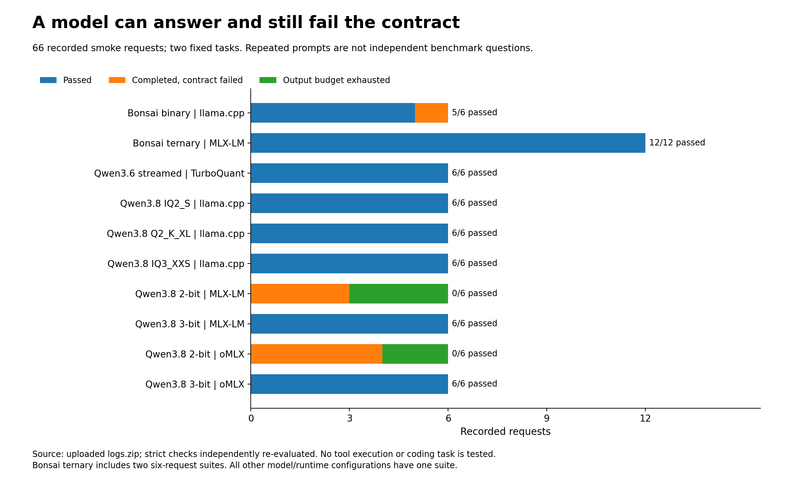
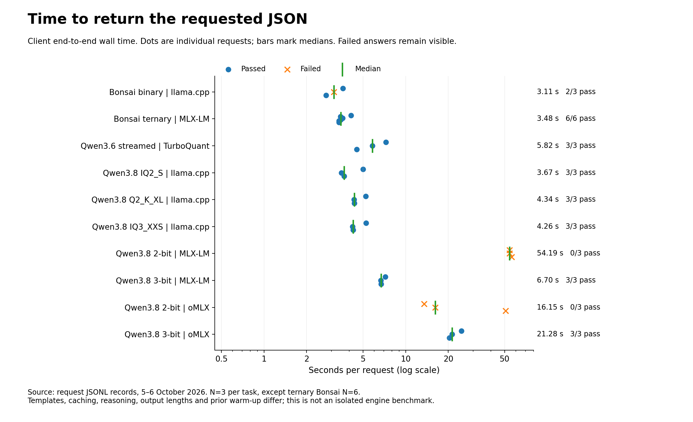
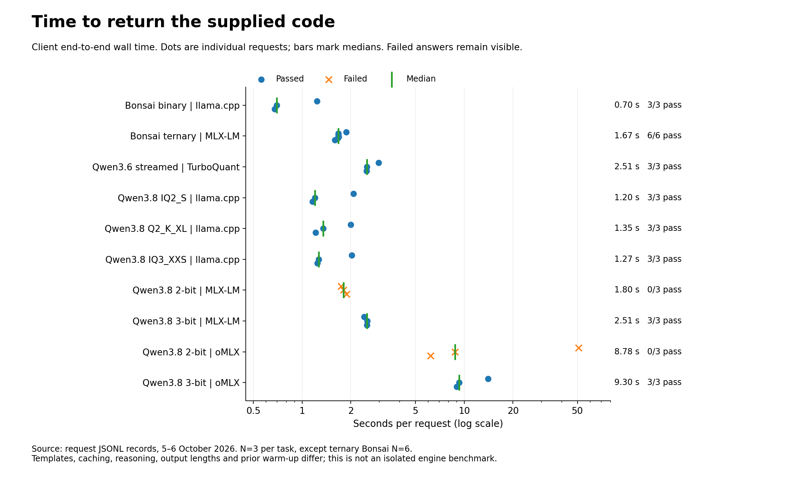
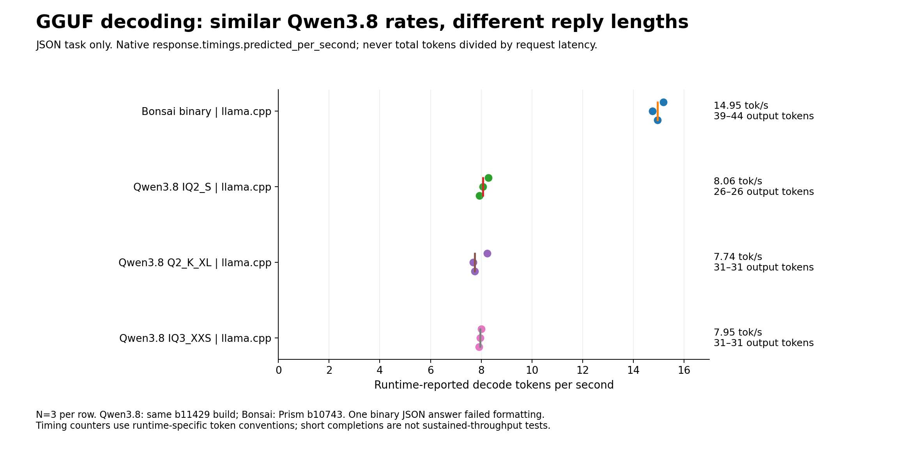
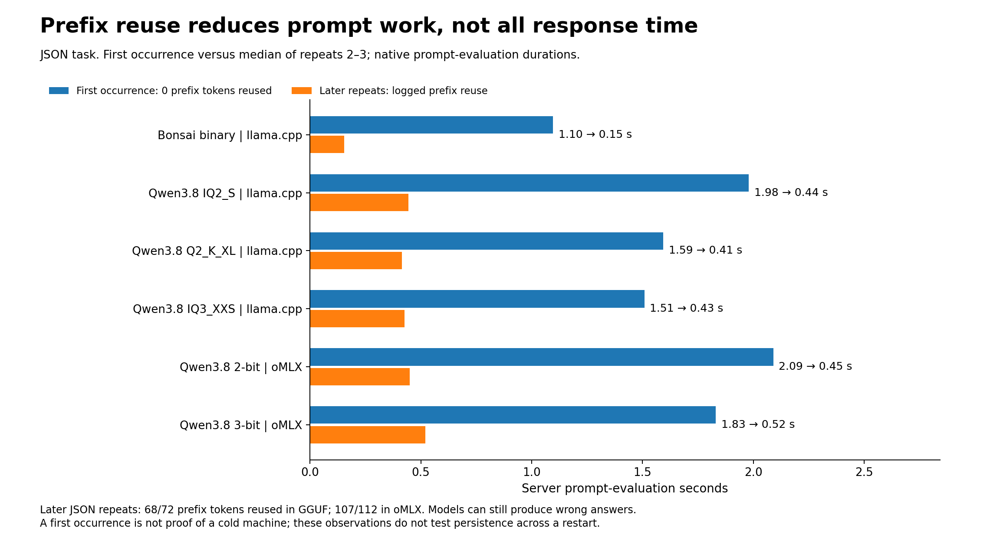
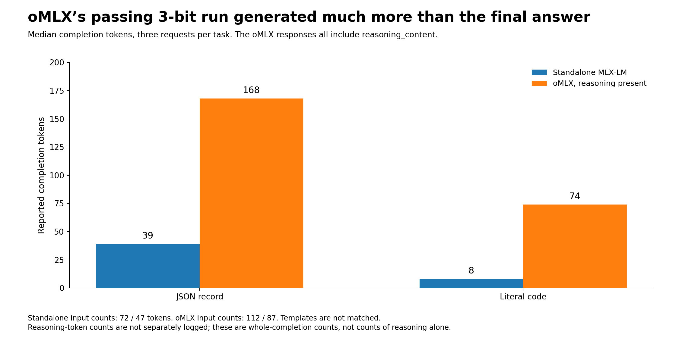
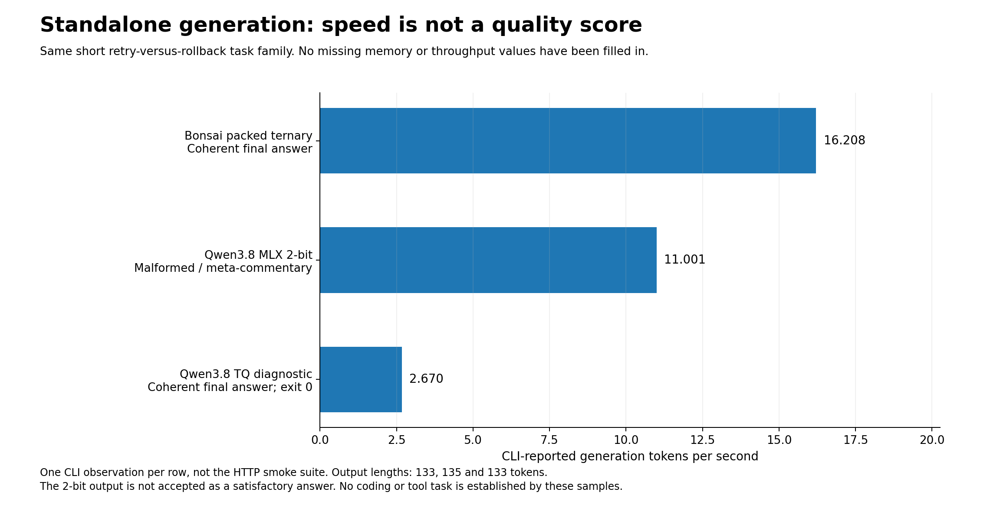
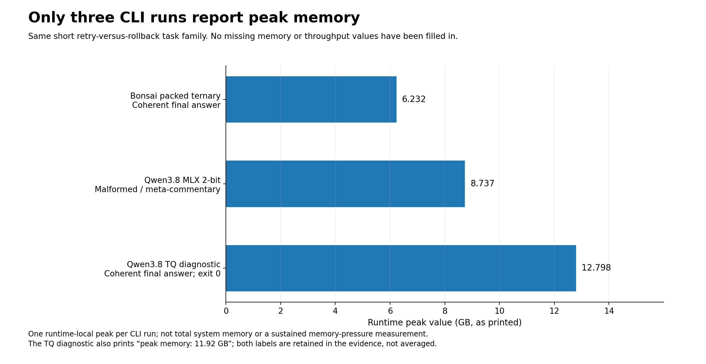

# Which Local LLM Should You Run on a 16 GB Mac mini?

## Bonsai, quantized Qwen3.6 and Qwen3.8: the models, the servers, the installation steps—and what ten tested configurations actually taught us

*Enrico Papalini · 6 October 2026*

The first surprise was that a 27-billion-parameter model could answer on a small Mac. The more useful surprise came later: two models described as “two-bit” could behave completely differently. One returned the requested data. Another spent almost a minute generating unusable text.

That is where a local-AI experiment stops being a screenshot and starts becoming engineering.

I wanted a model that could eventually support coding and agentic work on a **base M4 Mac mini with 16 GB of unified memory**. Not an M4 Pro. Not a Studio whose memory happens to fit the model several times over. The machine also has to remain a computer: there must be room for an editor, test processes and the operating system.

This article brings the experiment together: what the models are, why their compressed representations differ, which servers can execute them, how to install and run every text-model branch, and what the saved results support. It covers the measured language-model laboratory, not a ranking of the image, speech and translation workflows from the earlier workstation guide.

**My practical choice, at this stage, is packed ternary Bonsai through MLX-LM when 16 GB headroom is the priority. My preferred Qwen alternative is Qwen3.8 IQ2_S through llama.cpp/Metal.** Those are deployment choices for the next stage, not claims that either has won a repository-coding benchmark. The reasoning—and the qualifications—matter as much as the names. [Results and measurement scope](analysis/evidence.md#e1-scope)

## 1. The constraint is the working set, not the download

Apple specifies **120 GB/s memory bandwidth** for the base M4 and **16 GB unified memory** in this configuration. Unified memory avoids treating CPU RAM and GPU memory as two wholly separate pools, but it does not give the model a private 16 GB graphics card. [Apple specifications](https://support.apple.com/en-us/121555)

My budgeting model is simple:

```text
Working memory ≈ resident weights + active context + temporary workspace
                 + retained caches + macOS + development tools
```

This is an accounting model, not permission to add overlapping Activity Monitor counters. A file-backed allocation, a Metal allocation and a process-memory figure may describe overlapping parts of the same physical memory.

For idealized weight payload alone, a 27B model at four bits is about **13.5 decimal GB**, before scales, metadata, differently represented tensors and runtime state. That arithmetic explains the appeal of lower precision. It does not tell us whether the resulting model will follow an instruction.

Three distinctions govern the experiment. **Installed is not resident:** several downloaded checkpoints can share an SSD while only one runs. **A listening server is not a functioning generator:** an HTTP endpoint can remain alive after its generation worker dies. **A generated answer is not a passed task:** it may be truncated, incorrectly formatted or simply wrong. All three distinctions appeared during this laboratory. [Recorded setup incidents and gaps](analysis/evidence.md#e8-gaps)

The operating policy is therefore one heavy model, one active request and short prompts first. A nominal 4K context is an initial setting, not a claim that the supplied logs exercised 4,096 input tokens. Their test prompts were much shorter.

## 2. The models—and what “quantized” actually means

A quantization name is part of a model's identity. It is not a universal quality grade and it is not a promise that every server can load the file.

### Bonsai: binary and ternary are separate checkpoints

The binary reference is **Bonsai 27B `Q1_0`**, distributed as `Bonsai-27B-Q1_0.gguf`. The chosen file is about **3.8 GB**. The laboratory uses the PrismML-distributed llama.cpp runtime; it does not let a generic installer silently select a different Bonsai generation. This is a particular compressed model, not a switch that converts every downloaded model to one bit. [Original standalone procedure](sources/GUIDA_Mac_Mini_M4_16GB.md) · [Bonsai 1 runtime guide](https://raw.githubusercontent.com/PrismML-Eng/Bonsai-demo/74fab33d81d81a535525bd98c7a676b22d4dca46/Bonsai1_README.md)

The more interesting memory experiment is **`inductiveML/Ternary-Bonsai-27B-mlx-lossless-1.75bpw`**. Ternary weights use three values, conventionally represented as scaled versions of −1, 0 and +1. This checkpoint repacks already-ternary weights more densely and executes them with custom Metal kernels. “Lossless” describes that repacking; it does **not** mean the original full-precision model became ternary without any change in capability. The published package is approximately **5.89 GB**, and the custom Python/Metal implementation travels with it. [Packed ternary model card](https://huggingface.co/inductiveML/Ternary-Bonsai-27B-mlx-lossless-1.75bpw)

This explains an otherwise confusing comparison: a ternary model can have a two-bit storage variant and a denser packed variant without those becoming two unrelated quantizations. The representation and the kernels matter. A generic application that declines checkpoint-supplied code may not run this pack at all.

### Qwen3.6: a mixture of experts, with two ways to reduce residency

The Qwen3.6 branch is **35B-A3B**, a mixture-of-experts model. A subset of its experts participates in each token's routed computation. That reduces active computation, but the full model still has to be stored somewhere. “A3B” does not turn the checkpoint into a 3B download. [Qwen3.6 model card](https://huggingface.co/Qwen/Qwen3.6-35B-A3B)

The **resident asymmetric** conversion is `manjunathshiva/Qwen3.6-35B-A3B-tq3a-tqTe-down4-g64`, about **12.6 GB**. It uses three-bit attention, ternary expert up/gate projections and four-bit expert down projections. Allocating different precision to different projections is the method, not an inconsistency in the label. It needs the TurboQuant-aware loader. [Asymmetric checkpoint](https://huggingface.co/manjunathshiva/Qwen3.6-35B-A3B-tq3a-tqTe-down4-g64)

The **streaming** experiment uses a different conversion: `manjunathshiva/Qwen3.6-35B-A3B-tq3-g32`. Its selected download was approximately **16.945 GB** in the supplied run. The whole checkpoint lives on storage, while the runtime uses a **4 GB expert-cache budget**. That budget is not total model RAM. Shared components, active state and other allocations remain. [Checkpoint provenance](analysis/checkpoint-provenance.csv) · [Streaming checkpoint](https://huggingface.co/manjunathshiva/Qwen3.6-35B-A3B-tq3-g32)

**Expert streaming is not expert pruning.** The laboratory retains the native router's choice with `--max-active-experts 0`. Omitting that explicit setting would leave the reviewed wrapper's reduced-expert default in effect. A speedup achieved by changing which experts participate is a different experiment from caching the experts selected by the original router. [TurboQuant 0.28.0 wrapper](https://raw.githubusercontent.com/manjunathshiva/turboquant-mlx/v0.28.0/serve.py)

### Qwen3.8: the format matters more than the bit-count shorthand

Here Qwen3.8 means the **dense 27B model**, not “Qwen3, 8B” and not a much larger MoE sibling. There are no routed experts to stream in this dense-model recipe. The selected trials are text-only: no vision projector and no speculative draft are required. [Qwen3.8 model card](https://huggingface.co/Qwen/Qwen3.8-27B)

The principal choices were:

| Checkpoint or representation | Approximate published/selected payload | Intended runtime |
|---|---:|---|
| Bonsai 27B binary `Q1_0` | 3.8 GB | Prism llama.cpp / Metal |
| Bonsai 27B packed ternary, 1.75 bpw | 5.89 GB | MLX-LM with checkpoint code |
| Qwen3.6 35B-A3B asymmetric | 12.6 GB | TurboQuant resident loader |
| Qwen3.6 35B-A3B `tq3-g32` | 16.945 GB selected in the run | TurboQuant expert streaming |
| Qwen3.8 27B GGUF `UD-IQ2_S` | 8.37 GB | llama.cpp; optional Ollama import |
| Qwen3.8 27B GGUF `UD-Q2_K_XL` | 9.83 GB | llama.cpp |
| Qwen3.8 27B GGUF `UD-IQ3_XXS` | 10.935 GB selected in the run | llama.cpp |
| Qwen3.8 27B ordinary 2-bit MLX TextOnly | 8.43 GB | MLX-LM; optional oMLX |
| Qwen3.8 27B ordinary 3-bit MLX TextOnly | 11.8 GB | MLX-LM; optional oMLX |
| Qwen3.8 27B TurboQuant `tq3-mini-g64` | 12.40 GB | Separate VLM diagnostic runtime |

These are **file/package sizes, not peak-memory measurements**. GGUF importance-aware and mixed-precision formats, ordinary affine MLX quantization, TurboQuant codebooks and packed ternary storage are different representations. The suffix `IQ2_S` does not mean “the same thing as any MLX model labelled 2-bit.” [GGUF artifacts](https://huggingface.co/unsloth/Qwen3.8-27B-GGUF) · [MLX 2-bit](https://huggingface.co/lukaskremla/Qwen3.8-27B-2bit-MLX-TextOnly) · [MLX 3-bit](https://huggingface.co/lukaskremla/Qwen3.8-27B-3bit-MLX-TextOnly) · [Diagnostic checkpoint](https://huggingface.co/manjunathshiva/Qwen3.8-27B-tq3-mini-g64)

Two other optimizations act on different objects. **KV-cache quantization** compresses eligible attention state; it does not compress weights. **Prefix reuse** avoids recomputing an unchanged beginning of a request; it does not provide unlimited active context. Smaller prefill chunks can reduce temporary allocation peaks, but may cost time. The correct memory budget cannot be obtained by multiplying these techniques' advertised savings.

## 3. The server is part of the model you are evaluating

I used four serving approaches, plus an Ollama import and a CLI-only diagnostic. They are not interchangeable front ends around a guaranteed identical computation.

**llama.cpp/Metal** executes the GGUF branches. The three Qwen3.8 runs identify build **`b11429-d81235049`**; binary Bonsai identifies Prism build **`b10743-adfffbe41`**. The choice of binary, its kernels and its chat-template handling belong in the result. [Recorded runtime evidence](analysis/evidence.md#e5-timings)

**MLX-LM** serves ordinary MLX checkpoints and the custom packed Bonsai loader. The successful standalone records identify **MLX-LM 0.31.3 and MLX 0.32.0**. Its development server exposes the local API, but its command-line options differ from its generation command. In particular, the pinned server's `--max-tokens` is an output default, not a hard input-context ceiling. [Runtime fingerprints](analysis/profile-summary.csv) · [Pinned server implementation](https://raw.githubusercontent.com/ml-explore/mlx-lm/v0.31.3/mlx_lm/server.py)

**TurboQuant-MLX** wraps MLX-LM with its own weight loader, KV handling and optional expert streaming. The working text-server combination in the logs is **TurboQuant 0.28.0, MLX-LM 0.31.3 and MLX 0.32.3**. An earlier installation died because a newer server passed `trust_remote_code` to a wrapper that did not accept it. The HTTP listener still came up. This is why model discovery alone is not readiness. [Loader incident and recovered environment](analysis/evidence.md#e8-gaps)

**oMLX** adds model management, scheduling and tiered prefix caching around MLX inference. The original installation procedure referenced **0.7.0**, but the uploaded oMLX results do not contain an exact server version, complete settings export or checkpoint digest. Those missing fields prevent a clean causal comparison with standalone MLX-LM. oMLX's support for a TurboQuant **KV cache** also does not establish support for arbitrary TurboQuant **weight checkpoints**. [oMLX installation documentation](https://raw.githubusercontent.com/jundot/omlx/v0.7.0/README.md) · [oMLX evidence limits](analysis/evidence.md#e7-omlx)

**Ollama** is a convenient local model manager and API server. It can import a supported GGUF through a Modelfile. The conversation established import and residency under **0.35.1**, followed by an output-limit problem, but the uploaded archive lacks the native-Ollama response files. There is therefore no Ollama speed row in this comparison. Its absence is missing evidence, not a zero score. [Ollama import](https://docs.ollama.com/import) · [Missing native records](analysis/evidence.md#e8-gaps)

## 4. What was actually measured

The archive contains **64 files, 66 smoke-test responses, one separate readiness response and three nonempty standalone-generation logs**. The smoke tests cover ten model/runtime configurations and eleven six-request suites: packed ternary Bonsai has two suites. The reported machine is the base M4 mini with 16 GB; runtime fingerprints identify macOS 26.5.1 and Apple-GPU paths, but the archive does not independently inventory physical RAM. [Archive audit](analysis/evidence.md#e1-scope)

Every smoke request asks one of two fixed questions. The first requires exactly three JSON fields, including a numeric amount. The second asks for the current approved code, `harbor-mint-47`, from a short synthetic passage. Each suite repeats both questions three times with requested temperature **0.7**, a **512-token output ceiling** and non-streaming responses.

A pass means a completed response satisfied that exact contract. Markdown fences are not removed to improve a score after the fact. Truncated output fails. Repetition creates more observations, not more distinct problems. There are **no tool-format cases, repository edits, executed tests, long-context trials or multimodal benchmarks** in this upload. [Method and complete response ledger](analysis/evidence.md#e3-method)

Recomputing the verdicts from the saved answers reproduces all recorded results: **53 passed, 13 failed**, with five truncations. That is an audit of this small workload, not an estimate of general model accuracy.



*Figure 1. Counts of recorded outcomes, not a broad benchmark accuracy score. Packed ternary Bonsai has twice as many observations because two suites were saved.*

### The comparison that matters first: correct answers and elapsed time

The table includes failed attempts in its latency medians. Each task has three observations per configuration, except packed ternary Bonsai, which has six. [Recomputed profile summary](analysis/profile-summary.csv)

| Model / runtime | Checks passed | JSON median | Recall median |
|---|---:|---:|---:|
| Bonsai binary · llama.cpp | 5/6 | 3.11 s | 0.70 s |
| Bonsai packed ternary · MLX-LM | 12/12 | 3.48 s | 1.67 s |
| Qwen3.6 streamed · TurboQuant | 6/6 | 5.82 s | 2.51 s |
| Qwen3.8 IQ2_S · llama.cpp | 6/6 | 3.67 s | 1.20 s |
| Qwen3.8 Q2_K_XL · llama.cpp | 6/6 | 4.34 s | 1.35 s |
| Qwen3.8 IQ3_XXS · llama.cpp | 6/6 | 4.26 s | 1.27 s |
| Qwen3.8 MLX 2-bit · MLX-LM | 0/6 | 54.19 s | 1.80 s |
| Qwen3.8 MLX 3-bit · MLX-LM | 6/6 | 6.70 s | 2.51 s |
| Qwen3.8 MLX 2-bit · oMLX | 0/6 | 16.15 s | 8.78 s |
| Qwen3.8 MLX 3-bit · oMLX | 6/6 | 21.28 s | 9.30 s |

The strongest warning is **the tested ordinary 2-bit Qwen3.8 MLX path**. Its three JSON requests filled the entire output allowance with repetitive or malformed text. Its three recall requests answered `288`. The 2-bit oMLX alias also failed all six checks. That is enough to keep these configurations out of an unattended workflow, but not enough to assign the cause to quantization alone: tokenizer, template, conversion and numerical behavior were not independently isolated. The GGUF IQ2_S path passed all six checks. [Failure excerpts](analysis/evidence.md#e4-failures)

Binary Bonsai's failure is narrower. It returned the correct record inside a Markdown code fence. The data were right; the strict output contract was not. A deliberately designed parser or constrained-generation experiment might handle that differently. Neither earns a retrospective pass here.



*Figure 2. The horizontal axis is logarithmic. The 54-second MLX 2-bit outputs were not slow successes; they exhausted the token budget without satisfying the task.*



*Figure 3. A quick wrong code is still a wrong code. Latency must be interpreted beside the task outcome.*

The failures consumed **319.18 of 565.42 recorded request-seconds—56.5% of the total**—despite being only 13 of 66 requests. This is not a projected daily cost saving, but it illustrates a useful principle: a compressed model that cannot finish a small task can waste more time than a slower model that stops with the right answer. [Audit totals](analysis/audit.json)

### Decode speed is not the same as response latency

The llama.cpp responses contain native timing fields. For the JSON task, median decoder rates were **14.95 tokens/s for binary Bonsai**, **8.06 for Qwen3.8 IQ2_S**, **7.74 for Q2_K_XL**, and **7.95 for IQ3_XXS**. These short replies are not sustained-throughput tests. IQ2_S also produced a more compact JSON serialization—26 tokens rather than 31—so not all of its latency advantage came from decoder speed. [Native timing evidence](analysis/evidence.md#e5-timings)



*Figure 4. The Qwen profiles share a recorded server build; Bonsai uses the Prism build. Native token-count conventions are preserved rather than recomputed into an artificial common metric.*

The streaming Qwen3.6 API records provide complete answers and wall times, but no equivalent native decoder counter. Dividing completion tokens by the whole request time would mix prompt processing, possible loading and generation. I leave that rate unreported rather than inventing one.

### Caching helps—but does not equalize the workloads

Repeated GGUF JSON requests reused **68 of 72 prompt tokens**. For IQ2_S, prompt-evaluation time fell from about **1.98 seconds** on the first occurrence to a median **0.44 seconds** on later repeats. That is direct evidence of prefix reuse, not an inference from a faster stopwatch reading. It does not establish SSD persistence or survival across a server restart. [Cache observations](analysis/evidence.md#e6-cache)



*Figure 5. One first occurrence and two later repeats per configuration. This is not a cold-versus-warm machine benchmark.*

The standalone MLX servers were configured with one retained prompt-cache entry and alternated two tasks. Their responses report zero prefix hits in these suites. That does not prove that MLX cannot cache; nor does a cache hit prove that a model answered correctly.

oMLX's passing 3-bit configuration took **21.28 seconds for JSON** and **9.30 seconds for recall**, but it performed visibly different work. All six responses included `reasoning_content`. Median completion counts rose from **39 to 168 tokens** for JSON and **8 to 74** for recall, compared with standalone MLX-LM. The effective prompt counts differed too. “oMLX is several times slower” would be an unjustified engine-level conclusion from these unmatched workloads. [oMLX response analysis](analysis/evidence.md#e7-omlx)



*Figure 6. Same user questions, different generated workloads. Whole-completion counts are shown because there is no trustworthy independent reasoning-token breakdown.*

### The memory evidence is useful—and incomplete

Packed ternary Bonsai's standalone generation produced a coherent five-sentence explanation at **16.208 tokens/s**, with **`Peak memory: 6.232 GB`** printed by the runtime. The ordinary 2-bit MLX run printed **11.001 tokens/s and 8.737 GB**, but its answer was malformed meta-commentary. The TurboQuant Qwen3.8 diagnostic produced a coherent answer at **2.670 tokens/s**, with saved exit status zero and **12.798 GB** in the same capitalized peak field. [Original CLI excerpts](analysis/evidence.md#e9-cli)



*Figure 7. These CLI runs are separate from the HTTP smoke tests. A displayed speed does not rescue an unsatisfactory answer.*



*Figure 8. Values retain the runtime's printed labels. They are not whole-system RAM consumption, and they do not measure simultaneous compiler or browser workloads.*

The diagnostic also prints a second value, **11.92 GB**. Decimal/binary units plausibly explain the numerical relationship, but both original labels say GB, so the audit preserves both rather than claiming a verified conversion. No usable memory-pressure or swap time series exists in the archive. In particular, the configured 4 GB expert cache is not evidence that the complete streaming model used 4 GB.

These limitations are why my recommendation is practical rather than statistical. Packed ternary Bonsai combines successful short contracts with the strongest low-footprint CLI evidence in this dataset. That does not establish it as the most capable programmer, or prove a whole-system memory advantage over every unmeasured alternative.

## 5. Reproduce the laboratory from a clean Mac

The following is the complete text-model procedure. All commands refer to the code bundled with this article; no previous revision or separate setup chapter is required. The scripts keep downloads, installed environments and output records outside the manuscript itself where appropriate.

**Existing laboratory users should keep working environments and completed snapshots.** Do not recreate them merely to read this edition. The launch and compatibility clients are the working implementations from the tested package; this publication adds a revision-aware planning front end and clearer test commands.

### Prepare macOS, Python and the package

Complete macOS setup, install a stable system update appropriate to the runtimes, and use a native Apple Silicon Terminal. Back up important work. Keep Activity Monitor's Memory view open. Do not begin by disabling swap or altering system-wide GPU limits.

Install Apple's command-line tools and wait for the installation dialog to finish:

```bash
xcode-select --install
```

Install Homebrew through its official installer, first saving it for inspection:

```bash
curl --proto '=https' --tlsv1.2 -fsSLo "$HOME/Downloads/install-homebrew.sh" https://raw.githubusercontent.com/Homebrew/install/HEAD/install.sh
less "$HOME/Downloads/install-homebrew.sh"
/bin/bash "$HOME/Downloads/install-homebrew.sh"
```

Press `q` to leave `less`. Then initialize Homebrew in this shell and install the foundation. Follow Homebrew's printed instructions for making `shellenv` persistent; do not append duplicate lines on every run. [Homebrew installation](https://docs.brew.sh/Installation)

```bash
eval "$(/opt/homebrew/bin/brew shellenv)"
brew install python@3.11 git
uname -m
xcode-select -p
```

`uname -m` should report `arm64`. Extract the companion ZIP and move its **`M4_16GB_Model_Selection`** folder into `~/LocalAI`. Then:

```bash
cd "$HOME/LocalAI/M4_16GB_Model_Selection" &&
source scripts/lab_env.sh &&
mkdir -p "$LAB/models" "$LAB/plans" "$LAB/logs" outputs .venvs &&
"$PY" -m venv "$LAB/venv-tools" &&
"$LAB/venv-tools/bin/python" -m pip install -r config/requirements-lab-tools.txt &&
"$LAB/venv-tools/bin/python" -m pip check &&
"$PY" -m venv .venvs/core
```

`PACKAGE` is the publication directory; `LAB` is `~/LocalAI/qwen-bonsai-lab`. Source `scripts/lab_env.sh` from the publication root in **each new terminal**. It also enables pasted comments for the current zsh session without editing `.zshrc`. The text API helpers use the standard library; the planning environment adds Hugging Face Hub.

Record the machine and disk space:

```bash
system_profiler SPHardwareDataType SPSoftwareDataType > "$LAB/logs/machine.txt"
sysctl -n hw.memsize
sysctl vm.swapusage
df -h "$LAB"
"$LAB/venv-tools/bin/python" -m pip freeze > "$LAB/logs/tools-current.freeze.txt"
```

Plan one branch at a time. Installing all representations consumes far more storage than their active RAM requirements, particularly when importing a second copy into Ollama. The planner checks selected file sizes and free-space reserve before downloading; it does not certify memory fit.

### How downloads and tests work

`tools/plan_measured.py` selects the exact checkpoint revision recorded in the archived launch metadata. It delegates to the existing downloader's **plan** step, which does not load weights. Inspect the resulting plan before invoking **download**. Where the archive has no revision—resident Qwen3.6 and the CLI diagnostic—the script requires `--allow-unrecorded` and explicitly labels the download a new experiment. [Recorded revisions](config/measured-checkpoints.json)

Eight recorded model profiles have pinned revisions. Do not overwrite an existing snapshot with another revision to make a command succeed; the downloader refuses that. Existing users with complete matching downloads can skip planning/downloading entirely.

For every HTTP branch, **Terminal A runs one server; Terminal B tests that exact server while A remains running**. The new convenience command is:

```text
bash scripts/test_model.sh BASE_URL EXACT_MODEL_ID RUN_LABEL
```

It records discovery, requests a short `READY` answer, and only after that succeeds runs the original JSON/recall contracts three times. It saves a new timestamp-independent unique log directory per invocation. Six `PASS` checks mean those two contracts passed three times—not that a coding agent is certified. No generated code or tool call is executed. The added readiness gate is operational; it is not retrospectively counted among the 66 archived smoke records.

### A. Packed ternary Bonsai: my first choice for the 16 GB constraint

For a **new** ternary environment:

```bash
"$PY" -m venv "$LAB/venv-ternary" &&
"$LAB/venv-ternary/bin/python" -m pip install -r "$PACKAGE/config/requirements-lab-mlx.txt" &&
"$LAB/venv-ternary/bin/python" -m pip check
```

This preserves the recorded **MLX 0.32.0 / MLX-LM 0.31.3** top-level combination. It is not a lock of every transitive package. Keep the environment isolated from TurboQuant and from source-built forks.

Plan and inspect:

```bash
"$LAB/venv-tools/bin/python" "$PACKAGE/tools/plan_measured.py" bonsai-ternary --lab "$LAB"
cat "$LAB/plans/bonsai-ternary.json"
```

After reviewing it:

```bash
"$LAB/venv-tools/bin/python" "$PACKAGE/tools/checkpoint_fetch.py" download --plan "$LAB/plans/bonsai-ternary.json"
less "$LAB/models/bonsai-ternary/ternel_packed_model.py"
less "$LAB/models/bonsai-ternary/ternel_manifest.json"
```

**This checkpoint contains executable Python and Metal.** Review the downloaded revision and proceed only when you trust it. The pinned loader can execute checkpoint code without a separate trust dialog; the launcher's acknowledgment is not a security audit. [Checkpoint-code documentation](https://huggingface.co/inductiveML/Ternary-Bonsai-27B-mlx-lossless-1.75bpw)

In Terminal A, after that review:

```bash
"$LAB/venv-tools/bin/python" "$PACKAGE/tools/launch_lab.py" bonsai-ternary --lab "$LAB" --accept-checkpoint-code --preflight-only &&
"$LAB/venv-tools/bin/python" "$PACKAGE/tools/launch_lab.py" bonsai-ternary --lab "$LAB" --accept-checkpoint-code 2>&1 | tee "$LAB/logs/ternary-server-new.log"
```

After the server starts without a worker failure, Terminal B uses:

```bash
cd "$HOME/LocalAI/M4_16GB_Model_Selection" &&
source scripts/lab_env.sh &&
bash scripts/test_model.sh http://127.0.0.1:8081/v1 "$LAB/models/bonsai-ternary" bonsai-ternary
```

The public model ID is the **absolute local path**, not `bonsai-binary` or an assumed `default_model`. Stop Terminal A with Ctrl+C only after inspecting the results. The launch uses one prompt/decode request, a small prefill step and one retained prompt-cache entry. Keep prompts short; those settings are not a hard input-length quota.

### B. Binary Bonsai: the smallest reference, with a strict-format caveat

Plan and download its separate checkpoint:

```bash
"$LAB/venv-tools/bin/python" "$PACKAGE/tools/plan_measured.py" bonsai-binary --lab "$LAB"
cat "$LAB/plans/bonsai-binary.json"
"$LAB/venv-tools/bin/python" "$PACKAGE/tools/checkpoint_fetch.py" download --plan "$LAB/plans/bonsai-binary.json"
```

For a fresh runtime checkout, use the recorded Prism demo revision:

```bash
git clone --no-checkout https://github.com/PrismML-Eng/Bonsai-demo.git "$LAB/Bonsai-demo" &&
git -C "$LAB/Bonsai-demo" checkout --detach 74fab33d81d81a535525bd98c7a676b22d4dca46
less "$LAB/Bonsai-demo/scripts/download_binaries.sh"
less "$LAB/Bonsai-demo/scripts/common.sh"
```

The downloader removes quarantine attributes within its downloaded runtime directory and applies ad-hoc signing. Inspect that behavior before running it; do not disable Gatekeeper globally. Use the binary downloader, **not** the broader `setup.sh` that can select another Bonsai family. [Prism runtime procedure](https://raw.githubusercontent.com/PrismML-Eng/Bonsai-demo/74fab33d81d81a535525bd98c7a676b22d4dca46/Bonsai1_README.md)

```bash
bash "$LAB/Bonsai-demo/scripts/download_binaries.sh"
"$LAB/Bonsai-demo/bin/mac/llama-server" --version
cat "$LAB/Bonsai-demo/bin/mac/.llama_release"
```

Preserve a working existing checkout instead of cloning over it. Compare the installed runtime with the recorded Prism build before claiming an exact reproduction. Terminal A:

```bash
"$LAB/venv-tools/bin/python" "$PACKAGE/tools/launch_lab.py" bonsai-binary --lab "$LAB" --preflight-only &&
"$LAB/venv-tools/bin/python" "$PACKAGE/tools/launch_lab.py" bonsai-binary --lab "$LAB" 2>&1 | tee "$LAB/logs/binary-server-new.log"
```

Terminal B, after sourcing the environment:

```bash
bash "$PACKAGE/scripts/test_model.sh" http://127.0.0.1:8082/v1 bonsai-binary bonsai-binary
```

The measured result is 5/6 because of one fenced JSON response. Test any constrained-output or parsing modification separately rather than silently changing the original success criterion.

### C. Qwen3.8 GGUF: the clearest Qwen comparison

Install llama.cpp and record the resolved version:

```bash
brew install llama.cpp
llama-server --version > "$LAB/logs/llama-server-current-version.txt" 2>&1
llama-server --help > "$LAB/logs/llama-server-current-help.txt"
```

Homebrew is a moving installation channel. The archived measurement used **0.6.0, build 11429, commit `d81235049`**. A different installed version is a new comparison, even with identical weights. A passing flag preflight also does not prove that every checkpoint architecture works. [Recorded version](analysis/evidence.md#e5-timings)

For IQ2_S:

```bash
"$LAB/venv-tools/bin/python" "$PACKAGE/tools/plan_measured.py" qwen38-iq2s --lab "$LAB"
cat "$LAB/plans/qwen38-iq2s.json"
"$LAB/venv-tools/bin/python" "$PACKAGE/tools/checkpoint_fetch.py" download --plan "$LAB/plans/qwen38-iq2s.json"
```

Then Terminal A:

```bash
"$LAB/venv-tools/bin/python" "$PACKAGE/tools/launch_lab.py" qwen38-iq2s --lab "$LAB" --preflight-only &&
"$LAB/venv-tools/bin/python" "$PACKAGE/tools/launch_lab.py" qwen38-iq2s --lab "$LAB" 2>&1 | tee "$LAB/logs/qwen38-iq2s-server-new.log"
```

Terminal B:

```bash
bash "$PACKAGE/scripts/test_model.sh" http://127.0.0.1:8083/v1 qwen38-iq2s qwen38-iq2s
```

The launcher preserves the tested 4K context, small 128-token prompt-processing batches, one request slot, Flash Attention and non-thinking template arguments. It prints the actual command. Inspect the GPU-layer placement rather than assuming that a response necessarily used the intended Metal path.

For **Q2_K_XL**, stop IQ2_S, then plan, inspect and download its own files:

```bash
"$LAB/venv-tools/bin/python" "$PACKAGE/tools/plan_measured.py" qwen38-q2xl --lab "$LAB"
cat "$LAB/plans/qwen38-q2xl.json"
"$LAB/venv-tools/bin/python" "$PACKAGE/tools/checkpoint_fetch.py" download --plan "$LAB/plans/qwen38-q2xl.json"
```

Its launch in Terminal A and test in Terminal B are:

```bash
"$LAB/venv-tools/bin/python" "$PACKAGE/tools/launch_lab.py" qwen38-q2xl --lab "$LAB" --preflight-only &&
"$LAB/venv-tools/bin/python" "$PACKAGE/tools/launch_lab.py" qwen38-q2xl --lab "$LAB" 2>&1 | tee "$LAB/logs/qwen38-q2xl-server-new.log"
```

```bash
bash "$PACKAGE/scripts/test_model.sh" http://127.0.0.1:8083/v1 qwen38-q2xl qwen38-q2xl
```

For **IQ3_XXS**, separately plan, inspect and download:

```bash
"$LAB/venv-tools/bin/python" "$PACKAGE/tools/plan_measured.py" qwen38-iq3xxs --lab "$LAB"
cat "$LAB/plans/qwen38-iq3xxs.json"
"$LAB/venv-tools/bin/python" "$PACKAGE/tools/checkpoint_fetch.py" download --plan "$LAB/plans/qwen38-iq3xxs.json"
```

This tighter branch needs its acknowledgment on **both** preflight and launch:

```bash
"$LAB/venv-tools/bin/python" "$PACKAGE/tools/launch_lab.py" qwen38-iq3xxs --lab "$LAB" --accept-tight-memory --preflight-only &&
"$LAB/venv-tools/bin/python" "$PACKAGE/tools/launch_lab.py" qwen38-iq3xxs --lab "$LAB" --accept-tight-memory 2>&1 | tee "$LAB/logs/qwen38-iq3xxs-server-new.log"
```

```bash
bash "$PACKAGE/scripts/test_model.sh" http://127.0.0.1:8083/v1 qwen38-iq3xxs qwen38-iq3xxs
```

That flag acknowledges the experiment; it does not alter macOS limits. A `--dry-run` merely prints the command and returns before that acknowledgment gate. All three profiles share port 8083, but their aliases and log names differ. Run them sequentially. All three eventually passed the archived short contracts; the earlier IQ3 launch refusal was a recovered setup incident, not an out-of-memory measurement.

### D. Qwen3.6 streaming: keep the working loader combination

For a new dedicated text-runtime environment:

```bash
"$PY" -m venv "$LAB/venv-tq" &&
"$LAB/venv-tq/bin/python" -m pip install -r "$PACKAGE/config/requirements-lab-tq.txt" &&
"$LAB/venv-tq/bin/python" -m pip check &&
"$LAB/venv-tq/bin/python" -I "$PACKAGE/tools/check_tq_loader_contract.py"
```

The requirements retain **TurboQuant 0.28.0 / MLX-LM 0.31.3**. The checker reads the installed loader-call interface without loading a model. Keep a known-working environment unchanged. If the checker detects the old `trust_remote_code` keyword mismatch, do not add a trust flag: that does not repair a Python signature.

The narrowly targeted recovery, only for that incompatible text environment after saving its `pip freeze`, is:

```bash
"$LAB/venv-tq/bin/python" -m pip freeze --all > "$LAB/logs/tq-before-conditional-repair.txt"
"$LAB/venv-tq/bin/python" -m pip install --index-url https://pypi.org/simple --only-binary=:all: --no-deps --force-reinstall --require-hashes -r "$PACKAGE/config/requirements-mlx-lm-wheel.txt" &&
"$LAB/venv-tq/bin/python" -m pip check &&
"$LAB/venv-tq/bin/python" -I "$PACKAGE/tools/check_tq_loader_contract.py"
```

Do not run this repair in the separate VLM environment or when the text combination is already working. It restores the released wheel, not a guessed editable checkout. Stop if package checks fail. [Recorded mismatch and successful fingerprints](analysis/evidence.md#e8-gaps)

For streaming, plan/download the recorded `qwen36-stream` revision:

```bash
"$LAB/venv-tools/bin/python" "$PACKAGE/tools/plan_measured.py" qwen36-stream --lab "$LAB"
cat "$LAB/plans/qwen36-stream.json"
"$LAB/venv-tools/bin/python" "$PACKAGE/tools/checkpoint_fetch.py" download --plan "$LAB/plans/qwen36-stream.json"
```

Terminal A:

```bash
"$LAB/venv-tools/bin/python" "$PACKAGE/tools/launch_lab.py" qwen36-stream --lab "$LAB" --expert-cache-gb 4 --preflight-only &&
"$LAB/venv-tools/bin/python" "$PACKAGE/tools/launch_lab.py" qwen36-stream --lab "$LAB" --expert-cache-gb 4 2>&1 | tee "$LAB/logs/qwen36-stream-server-new.log"
```

Check for the **streaming loader**, `cache_budget=4.0 GB`, `max_active_experts=0`, eight-bit KV and the correct checkpoint path. Some loading messages appear at the first request. A printed configuration line alone is not proof that loading succeeded. Terminal B:

```bash
bash "$PACKAGE/scripts/test_model.sh" http://127.0.0.1:8080/v1 "$LAB/models/qwen36-stream" qwen36-stream
```

No extra wired-cap increase is part of this streaming recipe. Its measured six passes justify a harder-task trial, not the claim that it outperforms resident Qwen3.6: the successful resident run's performance data are missing.

### E. Resident asymmetric Qwen3.6: optional, tighter, not numerically ranked

This uses the same **text** environment, but a different checkpoint. Stop streaming first. Since the archive lacks its successful launch revision, use an existing tracked snapshot or explicitly plan a new experiment:

```bash
"$LAB/venv-tools/bin/python" "$PACKAGE/tools/plan_measured.py" qwen36-asym --lab "$LAB" --allow-unrecorded
cat "$LAB/plans/qwen36-asym.json"
"$LAB/venv-tools/bin/python" "$PACKAGE/tools/checkpoint_fetch.py" download --plan "$LAB/plans/qwen36-asym.json"
"$LAB/venv-tq/bin/turboquant-plan" --model "$LAB/models/qwen36-asym" --ram-gb 16 --context 8192 --kv-bits 8
```

The planner estimates an 8K scenario; it is not a memory-fit test. Check the loader contract and launcher preflight before any system adjustment:

```bash
"$LAB/venv-tq/bin/python" -I "$PACKAGE/tools/check_tq_loader_contract.py" &&
"$LAB/venv-tools/bin/python" "$PACKAGE/tools/launch_lab.py" qwen36-asym --lab "$LAB" --accept-tight-memory --preflight-only
```

The source recipe includes an **optional, temporary wired-cap exception** for the tight resident configuration. It is not the recommended first installation or a mechanism that adds RAM. Save work, stop other heavy workloads and keep the initial value for this session. A previous session's snapshot may not be the current baseline. The helper only reads/saves; it cannot reconstruct an original limit after it has already been changed. [Source procedure](sources/GUIDA_Mac_Mini_M4_16GB.md)

```bash
bash "$PACKAGE/scripts/wired_memory.sh" save "$LAB"
```

Only after inspecting the saved/current values and deliberately accepting reduced system headroom:

```bash
bash "$PACKAGE/scripts/wired_memory.sh" saved-value "$LAB" >/dev/null &&
sudo sysctl -w iogpu.wired_limit_mb=13824
```

Do not put that command in a startup file, disable swap, or guess another key when this one is unavailable. Readers unwilling to make this exception should retain the roomier models or streaming branch. Start the resident server in A:

```bash
"$LAB/venv-tools/bin/python" "$PACKAGE/tools/launch_lab.py" qwen36-asym --lab "$LAB" --accept-tight-memory 2>&1 | tee "$LAB/logs/qwen36-resident-server-new.log"
```

Test in B:

```bash
bash "$PACKAGE/scripts/test_model.sh" http://127.0.0.1:8080/v1 "$LAB/models/qwen36-asym" qwen36-asym
```

After stopping the server—or after a launch failure—restore the valid saved cap **if you changed it**:

```bash
ORIGINAL_WIRED_LIMIT="$(bash "$PACKAGE/scripts/wired_memory.sh" saved-value "$LAB")" &&
sudo sysctl -w "iogpu.wired_limit_mb=$ORIGINAL_WIRED_LIMIT" &&
sysctl -n iogpu.wired_limit_mb
```

The user reported this branch working. Without its successful response records and whole-system measurements, it does not receive a fabricated place in the numerical ranking.

### F. Ordinary Qwen3.8 MLX: keep the passing and failing paths distinct

Create a separate ordinary-MLX environment, not the custom Bonsai or TurboQuant environment:

```bash
"$PY" -m venv "$LAB/venv-mlx" &&
"$LAB/venv-mlx/bin/python" -m pip install -r "$PACKAGE/config/requirements-lab-mlx.txt" &&
"$LAB/venv-mlx/bin/python" -m pip check
```

The **3-bit path passed** the archived contracts. Plan/download its recorded revision:

```bash
"$LAB/venv-tools/bin/python" "$PACKAGE/tools/plan_measured.py" qwen38-mlx3 --lab "$LAB"
cat "$LAB/plans/qwen38-mlx3.json"
"$LAB/venv-tools/bin/python" "$PACKAGE/tools/checkpoint_fetch.py" download --plan "$LAB/plans/qwen38-mlx3.json"
cat "$LAB/models/qwen38-mlx3/config.json"
```

Inspect the configuration. The ordinary-MLX launcher refuses unexpected custom `model_file` or `auto_map` declarations rather than treating them as ordinary quantized weights. Terminal A:

```bash
"$LAB/venv-tools/bin/python" "$PACKAGE/tools/launch_lab.py" qwen38-mlx3 --lab "$LAB" --accept-tight-memory --preflight-only &&
"$LAB/venv-tools/bin/python" "$PACKAGE/tools/launch_lab.py" qwen38-mlx3 --lab "$LAB" --accept-tight-memory 2>&1 | tee "$LAB/logs/qwen38-mlx3-server-new.log"
```

Terminal B:

```bash
bash "$PACKAGE/scripts/test_model.sh" http://127.0.0.1:8084/v1 "$LAB/models/qwen38-mlx3" qwen38-mlx3
```

To reproduce or diagnose the **failed 2-bit configuration**, stop the 3-bit server and prepare its separate checkpoint:

```bash
"$LAB/venv-tools/bin/python" "$PACKAGE/tools/plan_measured.py" qwen38-mlx2 --lab "$LAB"
cat "$LAB/plans/qwen38-mlx2.json"
"$LAB/venv-tools/bin/python" "$PACKAGE/tools/checkpoint_fetch.py" download --plan "$LAB/plans/qwen38-mlx2.json"
```

Launch it without the tight-memory acknowledgment:

```bash
"$LAB/venv-tools/bin/python" "$PACKAGE/tools/launch_lab.py" qwen38-mlx2 --lab "$LAB" --preflight-only &&
"$LAB/venv-tools/bin/python" "$PACKAGE/tools/launch_lab.py" qwen38-mlx2 --lab "$LAB" 2>&1 | tee "$LAB/logs/qwen38-mlx2-server-new.log"
```

```bash
bash "$PACKAGE/scripts/test_model.sh" http://127.0.0.1:8084/v1 "$LAB/models/qwen38-mlx2" qwen38-mlx2
```

This is a diagnostic route, not my recommendation. If the readiness question fails, stop there and retain the output; there is no obligation to regenerate six failures. The recorded historical verdicts remain unchanged.

### G. oMLX: an optional managed-server comparison

Install the official oMLX macOS application for the chosen release. **0.7.0 is the documented starting recipe, not a verified version attribution for the archived oMLX timings.** Record the actual version and export model settings before testing. Stop any app-managed server before starting a foreground process. [oMLX release](https://github.com/jundot/omlx/releases/tag/v0.7.0)

Expose only ordinary MLX models to this experiment. For a fresh directory, create a link to one downloaded checkpoint; do not point the scanner at every custom weight format:

```bash
mkdir -p "$LAB/omlx-models"
ln -s "$LAB/models/qwen38-mlx3" "$LAB/omlx-models/qwen38-mlx3"
```

If that name already exists, inspect it rather than overwriting it. If the installed scanner does not follow the link, select the real directory in its interface. Store an API secret outside the source tree:

```bash
umask 077
mkdir -p "$HOME/.config/local-llm"
KEY_FILE="$HOME/.config/local-llm/omlx.key"
if [ ! -s "$KEY_FILE" ]; then openssl rand -hex 32 > "$KEY_FILE"; fi
export OMLX_API_KEY="$(cat "$KEY_FILE")"
export PATH="$HOME/.omlx/bin:$PATH"
omlx serve --help
```

In Terminal A, begin with the documented conservative policy:

```bash
omlx serve --host 127.0.0.1 --port 8000 \
  --model-dir "$LAB/omlx-models" --memory-guard safe \
  --hot-cache-max-size 1GB \
  --paged-ssd-cache-dir "$LAB/omlx-prefix-cache" \
  --paged-ssd-cache-max-size 10GB --max-concurrent-requests 1
```

**The safe guard may refuse the 3-bit checkpoint on 16 GB.** The logs do not include the guard that admitted the historical run, so this cannot be described as an exact reproduction of that memory policy. Do not disable safeguards just to obtain a graph. A refusal means this conservative recipe does not admit the model; use the passing standalone path or preserve and separately document an already-working configuration. The missing oMLX settings are a real reproducibility limit. [Configuration controls](https://raw.githubusercontent.com/jundot/omlx/v0.7.0/README.md) · [Measurement gaps](analysis/evidence.md#e8-gaps)

If the model is admitted, give it the alias `qwen38-mlx3`, set a 4K context and one request, and disable speculative decoding and expert offload for this dense model. For a new non-thinking comparison, set `enable_thinking=false` and `preserve_thinking=false` through the supported template settings, then inspect actual responses. That changes the historical reasoning workload and must be labelled a new run.

In Terminal B, load the same key and test:

```bash
export LOCAL_AI_API_KEY="$(cat "$HOME/.config/local-llm/omlx.key")"
bash "$PACKAGE/scripts/test_model.sh" http://127.0.0.1:8000/v1 qwen38-mlx3 qwen38-omlx3
```

To investigate the failed two-bit alias, stop/unload the 3-bit model, expose the downloaded `qwen38-mlx2` directory instead and assign that exact alias. Its explicit test is:

```bash
bash "$PACKAGE/scripts/test_model.sh" http://127.0.0.1:8000/v1 qwen38-mlx2 qwen38-omlx2
```

Do not combine their records into one “oMLX score.” The original single oMLX log contained both models, which is why the analysis groups by model ID and endpoint rather than filename alone.

### H. Ollama: import the same IQ2_S file, then prove generation

Stop llama.cpp and all other heavy model servers. Install the native Ollama application; **0.35.1** is the version recorded during the troubleshooting. This is a fixed experiment reference, not a claim that it will always be the preferred release. Start the app once to establish the CLI, then quit its server before the foreground launch.

```bash
export PATH="/Applications/Ollama.app/Contents/Resources:$PATH"
ollama --version
.venvs/core/bin/python scripts/set_local_only.py
bash scripts/start_ollama.sh
```

The script starts one local-only server on **11434**. Leave it running in Terminal A. In Terminal B, create the import definition:

```bash
cat > "$LAB/Qwen38-IQ2S.Modelfile" <<EOF
FROM $LAB/models/qwen38-iq2s/Qwen3.8-27B-UD-IQ2_S.gguf
PARAMETER num_ctx 4096
PARAMETER num_predict 1024
PARAMETER temperature 0.7
PARAMETER top_p 0.8
PARAMETER top_k 20
PARAMETER min_p 0
PARAMETER repeat_penalty 1.0
EOF
ollama create qwen38-local-iq2s -f "$LAB/Qwen38-IQ2S.Modelfile"
ollama show qwen38-local-iq2s:latest --template
ollama list
```

Check the imported template and advertised capabilities, but do not confuse them with verified performance. The helper's model lookup is exact: use **`qwen38-local-iq2s:latest`** when that is the installed name. `ollama ps` shows residency, not merely downloads. Loading can happen on the first request; a manual `ollama run` warm-up is not required. [Ollama import](https://docs.ollama.com/import) · [Chat API](https://docs.ollama.com/api/chat)

Use the new evidence-preserving probe for one short answer:

```bash
.venvs/core/bin/python tools/ollama_probe.py \
  --model qwen38-local-iq2s:latest \
  --prompt "Reply with READY and nothing else." --output-tokens 64
```

After a complete answer, try the longer fixture:

```bash
.venvs/core/bin/python tools/ollama_probe.py \
  --model qwen38-local-iq2s:latest \
  --input fixtures/chat-task.txt --ctx 4096 --output-tokens 1024
```

The earlier **512-token** allowance truncated this fixture. Increasing it to 1,024 is a proposed diagnostic, not a recorded success. The probe saves the raw request, response, final content and completion fields **before** deciding whether the response completed. Keep the 4K context fixed. If it loops or reaches the limit again, inspect the partial output rather than doubling limits indefinitely. `keep_alive: 0` unloads after the response; disappearing from the resident list afterward is expected. [Ollama response fields](https://docs.ollama.com/api/chat)

The Ollama run uses temperature zero in this diagnostic, whereas the measured HTTP smoke suites requested 0.7. Do not add its timings to the table as though it were the same test. No native-Ollama generation performance is claimed until its saved records are available.

### I. Qwen3.8 TurboQuant “mini”: reproduce only as a diagnostic

This is a **CLI-only branch**, not another API listener. It produced one satisfactory short answer, but at 2.670 tokens/s with a large reported runtime peak. It is not my default for 16 GB coding.

Use a separate VLM environment. The source procedure pinned TurboQuant's 0.28.0 VLM extra; the recorded diagnostic environment also listed MLX-VLM 0.7.6, MLX-LM 0.32.0 and MLX 0.32.3. Do **not** copy its newer MLX-LM dependency into the fixed TurboQuant text server. The bundled `config/recorded-vlm.freeze.txt` preserves the resolved evidence; it is not represented as a portable cross-machine lock. [Environment distinction](analysis/evidence.md#e8-gaps)

```bash
"$PY" -m venv "$LAB/venv-tq-vlm" &&
"$LAB/venv-tq-vlm/bin/python" -m pip install -r "$PACKAGE/config/requirements-lab-tq-vlm.txt" &&
"$LAB/venv-tq-vlm/bin/python" -m pip check
"$LAB/venv-tq-vlm/bin/python" -m turboquant_mlx.generate_vlm --help
"$LAB/venv-tq-vlm/bin/python" -m pip freeze > "$LAB/logs/vlm-current.freeze.txt"
```

Use an existing complete tracked snapshot, or explicitly prepare a new diagnostic:

```bash
"$LAB/venv-tools/bin/python" "$PACKAGE/tools/plan_measured.py" qwen38-tq-diagnostic --lab "$LAB" --allow-unrecorded
cat "$LAB/plans/qwen38-tq-diagnostic.json"
"$LAB/venv-tools/bin/python" "$PACKAGE/tools/checkpoint_fetch.py" download --plan "$LAB/plans/qwen38-tq-diagnostic.json"
```

The archive does not contain this checkpoint's exact revision, so a fresh download is a new diagnostic.

The historical source recipe proposed a temporary **14 GiB wired ceiling**, but the supplied successful local run does not document its actual sysctl history. Following that source recipe is therefore not proof of reproducing its memory state. Most readers should skip the cap experiment. Deliberate investigators must first save and verify the original value using the resident procedure above, then may apply:

```bash
bash "$PACKAGE/scripts/wired_memory.sh" saved-value "$LAB" >/dev/null &&
sudo sysctl -w iogpu.wired_limit_mb=14336
```

Run once, preserving pipeline failure status:

```bash
(
  set -o pipefail
  "$LAB/venv-tq-vlm/bin/python" -m turboquant_mlx.generate_vlm \
    --model "$LAB/models/qwen38-tq-diagnostic" \
    --prompt 'Explain the difference between retry and rollback in five sentences.' \
    --max-tokens 512 --prefill-step-size 256 \
    2>&1 | tee "$LAB/logs/qwen38-tq-diagnostic-new.log"
  GENERATION_STATUS=$?
  printf '%s\n' "$GENERATION_STATUS" > "$LAB/logs/qwen38-tq-diagnostic-new.exit-code.txt"
  exit "$GENERATION_STATUS"
)
```

Restore the saved wired limit immediately after the process exits, including on failure, if you changed it. Inspect the final answer and status; a nonempty log or exit zero alone is insufficient. There is **no** `test_model.sh` endpoint for this command. No automatic retry should turn a killed cold load into an apparently successful warm benchmark.

## 6. Make the winner earn a coding workload

The original aim remains coding and agentic work. The recorded tests establish a necessary first step, not the destination. Before allowing a model to change files, use new JSON records, changed labels, ambiguous inputs, distractors and cases that should trigger a request for clarification. A model that has passed two fixed questions has not demonstrated general tool selection.

For the selected Bonsai deployment, an optional **tool-format-only** test is available:

```bash
"$LAB/venv-tools/bin/python" "$PACKAGE/tools/compat_lab.py" \
  --base-url http://127.0.0.1:8081/v1 --timeout 300 smoke \
  --model "$LAB/models/bonsai-ternary" --repeats 3 --with-tools \
  --out "$LAB/logs/bonsai-ternary-tool-format-new.jsonl"
```

This asks for a `lookup_order` call and validates its structure; **it never executes it**. The historical archive contains no result for this extension. A passing JSON test does not authorize a tool, and a tool-shaped answer does not authorize deployment.

The bundled coding fixture supplies a deliberately faulty `clamp` function, a task and external tests. Copy it to a disposable directory, request a proposal and inspect it before applying anything:

```bash
cd "$PACKAGE"
mkdir -p outputs/coding-lab
cp fixtures/coding/* outputs/coding-lab/
"$LAB/venv-tools/bin/python" "$PACKAGE/tools/compat_lab.py" \
  --base-url http://127.0.0.1:8081/v1 --timeout 300 chat \
  --model "$LAB/models/bonsai-ternary" --input fixtures/coding/prompt.txt \
  --output-tokens 900 --out outputs/coding-proposal.md
```

After reviewing and manually applying the intended change, run the tests outside the model:

```bash
cd "$PACKAGE/outputs/coding-lab"
"$PY" -m unittest -v
```

Do not let it rewrite the acceptance tests. Permit one additional repair with the actual failure output, then stop. For a fair comparison, repeat from a fresh disposable copy under IQ2_S and use its port **8083** and alias **`qwen38-iq2s`**. Count completed, accepted tasks and total elapsed time. Preserve diffs, test output and failures.

When an agent harness is introduced, keep its tools narrowly scoped, secrets outside the worktree and a finite retry budget. A green test is evidence; it is not a substitute for review or an operating-system sandbox. This follows the supplied **standalone-before-Kowalski** principle without claiming that this package has integrated or validated Kowalski. [Original acceptance framing](sources/GUIDA_Mac_Mini_M4_16GB.md)

To verify offline use, finish downloads and warm required assets, stop the application, disconnect Wi-Fi and Ethernet, restart and repeat the selected tests. The supplied launchers set offline flags where appropriate. This demonstrates disconnected operation of that workflow; it is not an audit of all network behavior after reconnection.

## 7. The selection: keep one default, not every interesting model

There is no honest way to turn two repeated short tasks into a definitive ranking of coding intelligence. There is, however, enough evidence to make a useful deployment decision.

**For my 16 GB default, I would keep packed ternary Bonsai on MLX-LM.** It passed all **12 recorded checks**, returned the JSON task in a median **3.48 seconds**, and supplied a separate coherent CLI sample at **16.208 tokens/s** with **6.232 GB** reported peak memory. That combination gives it the strongest case here when preserving room for the rest of the Mac is the priority. Its trade-off is the custom loader: the code must be trusted, the working environment should be preserved, and a generic GUI cannot be assumed compatible. This is a chosen operating point, not proof of broad superiority. [Bonsai observations](analysis/profile-summary.csv) · [CLI evidence](analysis/evidence.md#e9-cli)

**For the Qwen comparison, I would keep Qwen3.8 IQ2_S on llama.cpp.** It passed **6/6**, used a smaller artifact than the other tested Qwen GGUF choices, and returned recall in a median **1.20 seconds**. Q2_K_XL and IQ3_XXS also passed, but this dataset demonstrates no additional task-quality benefit from their extra storage. A harder coding suite could reverse that decision; the present one does not justify spending more memory automatically. Its whole-system peak remains unmeasured. [Qwen GGUF observations](analysis/profile-summary.csv)

Binary Bonsai remains a useful smallest-footprint reference, but its strict-format miss prevents treating it as already interchangeable with the selected structured-output path. Streaming Qwen3.6 and standalone 3-bit Qwen3.8 MLX are worthwhile next-stage candidates; neither has demonstrated enough added task value here to displace the default. Resident Qwen3.6 needs its successful performance records before comparison. The 2-bit ordinary-MLX configurations need diagnosis, not another agent integration. oMLX's 3-bit run needs matched thinking/template settings before the server is judged. Native Ollama still needs complete recorded responses. The TurboQuant mini diagnostic proves one generation, not an attractive daily operating point.

I would store the two selected checkpoints on disk but **run only one at a time**. Before declaring the default comfortable, I would test it with the actual editor and compiler open, record memory pressure and swap, and expand context gradually. No chart in this article substitutes for those absent measurements.

**The best model on a 16 GB Mac is not the largest one that starts. It is the smallest dependable configuration that finishes the work you actually need—and leaves enough computer behind to verify it.**

---

### Reproducibility and publication notes

All numerical comparisons derive from the supplied **5–6 October 2026 `logs.zip`**, reprocessed in Python. The article includes all eight original performance plots and the normalized data, provenance and analysis scripts. No new model inference was run while preparing this consolidated edition. Recorded measurements, user-reported functionality, proposed procedures and missing evidence are distinguished throughout.

The **single companion package** contains this Markdown article, a self-contained HTML reading edition with embedded images, the PNG/SVG originals, runnable code and fixtures. It does not bundle model weights, private keys or the original raw log archive. Normalized response records replace local home-directory names with `$HOME`; inspect new data before publishing it. The article's local evidence links work after extraction. When publishing on Medium, insert the supplied PNG files at the existing image positions; Markdown text alone does not upload image assets.

To regenerate the numerical tables and figures from the original archive, use a separate analysis environment—not a model environment:

```bash
python3 -m venv .venvs/analysis
.venvs/analysis/bin/python -m pip install -r analysis/requirements.txt
.venvs/analysis/bin/python analysis/analyze_logs.py /path/to/logs.zip --out analysis
.venvs/analysis/bin/python analysis/plot_results.py --data analysis --out figures
```

Replace `/path/to/logs.zip` with the real path. Changed data require editorial review of the conclusions; rerunning plotting code does not make an old recommendation true of a new experiment.
